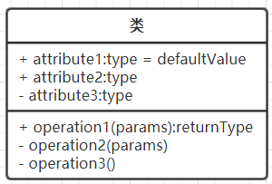
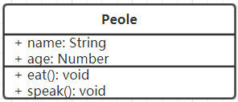
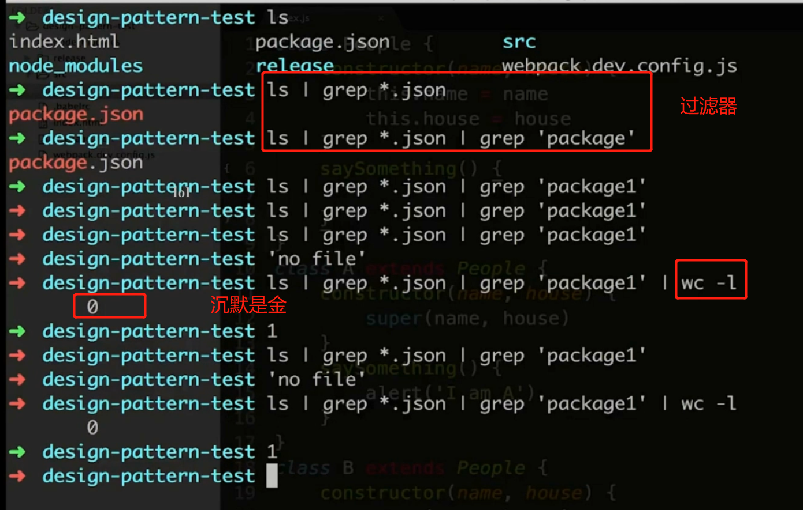
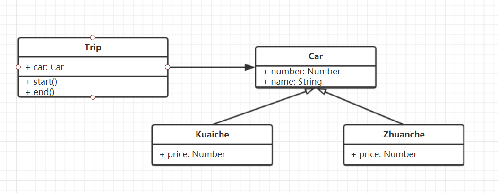
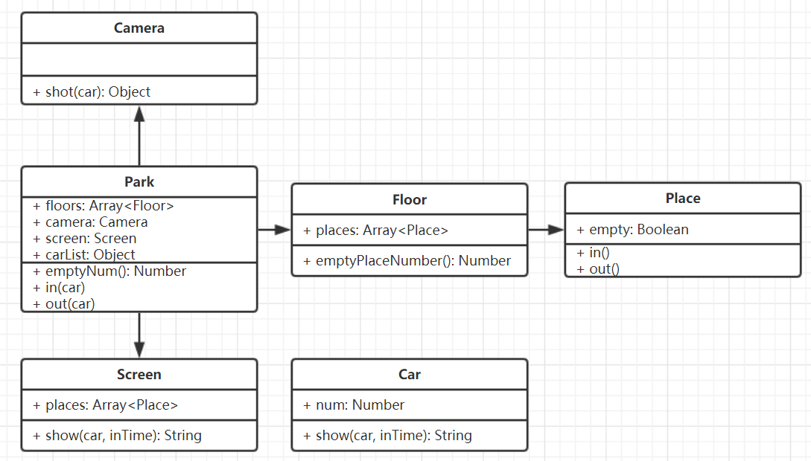
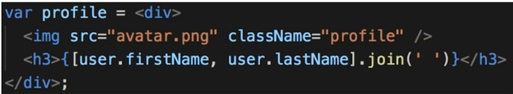
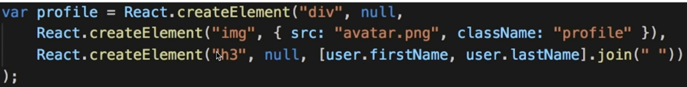
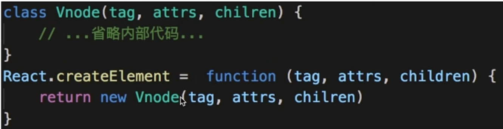
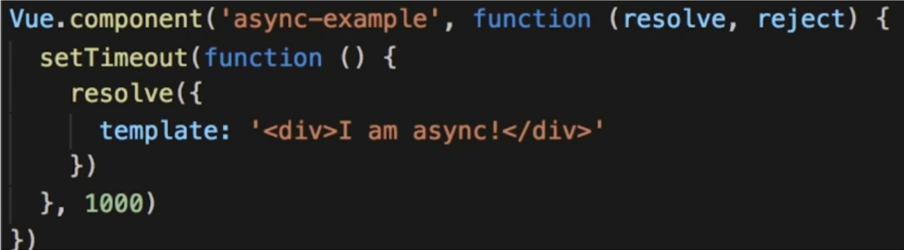
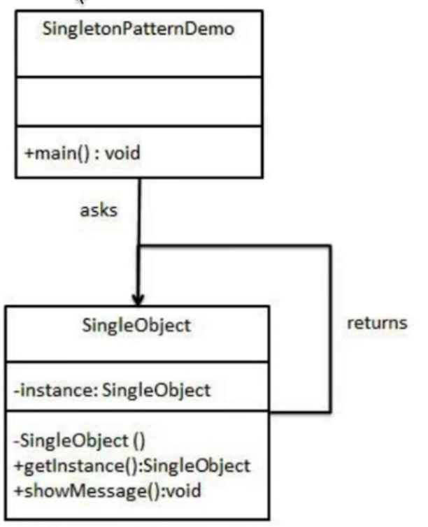

# js 设计模式

## 导学

一名合格工程师必备的条件：前端开发有一定的设计能力

论工程师	的设计能力

- 3年工作经验，面试必考设计能力
- 称为项目技术负责人，设计能力是必要基础
- 从写好代码，到做好设计，设计模式是必经之路

前端学习设计模式的困惑

- 网上的资料都是针对 java 等后端语言的
- 看懂概念，但是不知道怎么用，看完就忘
- 现在的 JS 框架，刀子都用了那些设计模式

课程概述

- 做什么？——讲解 JS 设计模式
- 哪些部分？——面向对象，设计原则，设计模式
- 技术？——面向对象，UML类图，ES6

知识点介绍

- 面向对象
  - ES6 class 语法
  - 三要素
  - UML 类图
- 设计原则
  - 何为设计？
  - 5 大设计原则
  - 从设计到模式
- 设计模式
  - 分优先级讲解
  - 结合核心技术
  - 综合框架应用
- 综合应用
  - 设计方案
  - 代码演示
  - 设计模式对应

课程安排

- 面向对象
  - 使用 webpack 和 babel 搭建 ES6 编译环境
  - ES6 class 面向对象的语法
  - 面向对象三要素：继承、封装、多态
- 设计原则
  - 通过《LINUX/UNIX设计哲学》理解何为设计
  - 5 大设计原则分析和理解，以及代码演示
  - "设计模式" ->从"设计"到"模式"
- 设计模式
  - 概述：创建型、结构型、行为型
  - 常用设计模式，详细讲解，结合经典使用场景
  - 非常用设计模式，理解概念，示例演示
  - 有主有次，掌握重点
- 综合示例
  - 用 jQuery 实现一个简单的购物车
  - 设计分析，画 UML 类图
  - 代码演示
  - 总结使用的 7 种设计模式

课程收获

- 面向对象思想，UML 类图
- 5 大设计原则，23中设计模式
- 能应对前端面试中相关的面试题
- 提升个人设计能力

## **第2章 面向对象**

讲解javascript中的面向对象的概念，包括 ES6 class 语法、UML 类图、以及面向对象三要素

### 搭建开发环境

- 初始化 npm 环境
- 安装 webpack
- 安装 webpack-dev-server
- 安装 babel

**初始化 npm 环境**

```shell
npm init -y
```

**安装 webpack**

在本项目开发环境下安装 webpack，并保存依赖

```shell
npm install webpack webpack-cli --save-dev
```

配置 webpack

根目录创建 webapck.dev.config.js

指定入口文件和出口文件

```js
module.exports = {
  entry: './src/index.js',
  output: {
    path: __dirname, // __dirname 指当前目录
    filename: './release/bundle.js'
  }
}
```

package.json 中指定打包命令行

`npm run dev`时，执行 webpack 命令，配置文件为 webpack.dev.config.js，模式为  development

```shell
"scripts": {
    "dev": "webpack --config ./webpack.dev.config.js --mode development"
  },
```

这时，运行 `npm run dev`，可以完成基本的打包操作。

**安装 webapck-dev-server**

在开发环境下安装 webpack-dev-server 和 html-webpack-plugin，并保存依赖

```shell
npm install webpack-dev-server html-webpack-plugin --save-dev
```

配置 webpack-dev-server

webpack.dev.config.js 添加配置

```js
const path = require('path')
const HtmlWebpackPlugin = require('html-webpack-plugin')

module.exports = {
  ...,
  plugins: [
    new HtmlWebpackPlugin({
      template: './index.html' // 最终渲染模板文件
    })
  ],
  devServer: {
    contentBase: path.join(__dirname, './release'), // 监听目录
    open: true, // 自动打开浏览器
    port: 9000 // 端口
  }
}
```

package.json 脚本命令调整,webpack 改为 webpack-dev-server

```shell
"scripts": {
    "dev": "webpack-dev-server --config ./webpack.dev.config.js --mode development"
  },
```

这时，运行 `npm run dev`，当我们修改js代码，webpack会帮助我们实时修改打包后的文件

**安装 babel**

```shell
npm install babel-core babel-loader@7 babel-polyfill babel-preset-es2015 babel-preset-latest --save-dev 
```

根目录创建 .babelrc 配置文件

```json
// .babelrc
{
  "presets": ["es2015", "latest"],
  "plugins": [] 
}
```

配置 webpack.dev.config.js

```js
module.exports = {
  module: {
    rules: [{
      test: /\.js?$/,
      exclude: /(node_modules)/,
      loader: 'babel-loader'
    }]
  },
}
```

这时，命令行运行`npm run dev`，就可以编译 es6 语法了。

### 面向对象

- 面向对象的概念
- 三要素：继承 封装 多态
  - 继承，子类继承父类
  - 封装，数据的权限和保密
  - 多态，同一接口不同实现
- JS 的应用举例
- 面向对象的意义

**什么是面向对象**

类即模板

```js
// 类，即模板
class People {
  constructor(name, age) {
    this.name = name
    this.age = age
  }
  eat() {
    alert(`${this.name}, eat sth`)
  }
  speak() {
    alert(`My name is ${this.name}, age ${this.age}`)
  }
}
```

对象（实例）

```js
// 创建实例
let zhang = new People('zhang', 20)
zhang.eat()
zhang.speak()
// 创建实例
let wang = new People('wang', 21)
wang.eat()
zhang.speak()
```

**面向对象-继承**

People 是父类，公共的，不仅仅服务于 Student

继承可将公共方法抽离出来，提高复用，减少冗余

```js
// 父类
class People {
  constructor(name, age) {
    this.name = name
    this.age = age
  }
  eat() {
    alert(`${this.name}, eat sth`)
  }
  speak() {
    alert(`My name is ${this.name}, age ${this.age}`)
  }
}
// 子类继承父类
class Student extends People {
  constructor(name, age, number) {
    super(name, age) // name 和 age 有高级类处理
    this.number = number
  }
  study() {
    alert(`${this.name} study`)
  }
}

let xiaoming = new Student('xiaoming', 10, 'A1')
xiaoming.study()
alert(xiaoming.number)
xiaoming.eat()

let xiaohong = new Student('xiaohong', 11, 'A2')
xiaohong.study()
```

**面向对象-封装**

- public 完全开放
- protected 对子类开放
- private 对自己开放
- (ES6 尚不支持，可用 typescript 演示)，在线ts代码运行,http://www.typescriptlang.org/play/

特点

- 减少耦合，不该外露的不外露
- 利用数据、接口的权限管理
- ES6 目前不支持，一般认为 _ 开头的属性是 private

```typescript
class People {
    name
    age
    protected weight // 受保护的属性，只有自己或子类可以访问
  constructor(name, age) {
    this.name = name
    this.age = age
  }
  eat() {
    alert(`${this.name}, eat sth`)
  }
  speak() {
    alert(`My name is ${this.name}, age ${this.age}`)
  }
}
// 子类继承父类
class Student extends People {
    number
    private girlfriend
  constructor(name, age, number) {
    super(name, age) // name 和 age 有高级类处理
      this.number = number
      this.girlfriend = 'xiaoli'
  }
  study() {
    alert(`${this.name} study`)
    }
    getWeight() {
      alert(`weight ${this.weight}`)
  }
}

let xiaoming = new Student('xiaoming', 10, 'A1')
xiaoming.getWeight()
// alert(xiaoming.weight) // 报错，weight是protected，只能在类及子类中访问
// alert(xiaoming.girlfriend) // 报错，girlfriend是私有属性，只能在类内访问
```

**面向对象-多态**

- 同一个接口，不同表现
- JS 应用极少
- 需要结合 java 等语言的接口、重写、重载等功能

特点

- 保持子类的开放性和灵活性
- 面向接口编程
- (JS 引用极少，了解即可)

```js
class People {
  constructor(name) {
    this.name = name
  }
  saysomething() {

  }
}

class A extends People {
  constructor(name) {
    super(name)
  }
  saysomething() {
    alert('I am A')
  }
}

class B extends People {
  constructor(name) {
    super(name)
  }
  saysomething() {
    alert('I am B')
  }
}

let a = new A('a')
a.saysomething()
let b = new B('b')
b.saysomething()
```

**JS 应用类型**

- jQuery 是一个 class
- $('p') 是 jQuery 的一个实例

```js
class jQuery {
  constructor (selector) {
    let slice = Array.prototype.slice
    let dom = slice.call(document.querySelectorAll(selector))
    let len = dom ? dom.length: 0
    for (let i = 0; i < len; i++) {
      this[i] = dom[i]
    }
    this.length = len
    this.selector = selector || ''
  }
  append (node) {

  }
  addClass (name) {

  }
  html (data) {

  }
  // 此处省略 N 个 API
}

window.$ = function (selector) {
  return new jQuery(selector)
}
// 由于加载顺序的问题，暂时写在一个文件中
let $p = $('p')
console.log($p)
console.log($p.addClass)
```

**为何使用面向对象？**

- 程序执行：顺序、判断、循环——结构化
- 面向对象——数据结构化
- 对于计算机，结构化才是最简单的
- 编程应该 简单 & 抽象

### UML 类图

- Unified Modeling Language 统一建模语言
- 类图，UML 包含很多种图，和本课相关的是类图
- 关系，主要讲解泛化和关联

**画图工具**

- MS Office visio
- https://www.processon.com/

**类图**



```js
// 类，即模板
class People {
  constructor(name, age) {
    this.name = name
    this.age = age
  }
  eat() {
    alert(`${this.name}, eat sth`)
  }
  speak() {
    alert(`My name is ${this.name}, age ${this.age}`)
  }
}
```



 **关系**

- 泛化，表示继承
- 关联，表示引用

```js
class People {
  constructor (name, house) {
    this.name = name
    this.house = house
  }
  saySomething () {
    
  }
}
class A extends People {
  constructor (name, house) {
    super(name, house)
  }
  saySomethin () {
    alert('I am A')
  }
}
class B extends People {
  constructor (name, house) {
    super(name, house)
  }
  saySomething () {
    alert('I am B')
  }
}
class House {
  constructor (city) {
    this.city = city
  }
  showCity () {
    alert(`house in ${this.city}`)
  }
}
let aHouse = new House('beijing')
let a = new A('a', aHouse)
let b = new B('b')
b.saySomething()
```

A 和 B 继承了 People，用空心箭头表示；People 引用了 House，用实心箭头表示。


### 总结

- 搭建开发环境： npm init、webpack、babel
- 面向对象：概念、三要素、应用举例、意义
- UML类图：类图、关系、示例

## 第 3 章 设计原则

- 何为设计
- 五大设计原则 solid
- 从设计到模式
- 介绍 23 种设计模式

### 何为设计

按照哪一种思路思路或标准来实现功能

功能相同，可以有不同设计方案来实现

伴随着需求增加，设计的作用才能体现出来

《UNIX/LINUX设计哲学》

- 准则1：小即是美
- 准则2：让每个程序只做好一件事
- 准则3：快速建立原型
- 准则4：舍弃高效率而取可移植性
- 准则5：采用纯文本来存储数据
- 准则6：充分利用软件的杠杆效应（软件复用）
- 准则7：使用 shell 脚本提高杠杆效应和可移植性
- 准则8：避免强制性的用户界面
- 准则9：让每个程序都成为过滤器
- 小准则
  - 允许用户定制环境
  - 尽量使操作系统内核小而轻量化
  - 使用小写字母并尽量简短
  - 沉默是金
  - 各部分之和大于整体
  - 寻求 90% 的解决方案

沉默是金+过滤器的例子

****

### S O L I D 五大设计原则

- S——单一职责原则
- O——开放封闭原则
- L——李氏置换原则
- I——接口独立原则
- D——依赖倒置原则

**S——单一职责原则**

- 一个程序只做好一件事
- 如果功能过于复杂就拆分开，每个部分保持独立

**O——开放封闭原则**

- 对扩展开放，对修改封闭
- 增加需求时，扩展新代码，而非修改已有代码
- 这是软件设计的终极目标

**L——李氏置换原则**

- 子类能覆盖父类
- 父类能出现的地方子类就能出现
- JS 中使用较少(弱类型 & 继承使用较少)

**I——接口独立原则**

- 保持接口的单一独立，避免出现“胖接口”
- JS 中没有接口(typescript 例外)，使用较少
- 类似单一职责原则，这里更关注接口

**D——依赖倒置原则**

- 面向接口编程，依赖于抽象而不依赖与具体
- 使用方只关注接口而不关注具体类的实现
- JS 中使用较少(没有接口 & 弱类型)

**总结**

- S O 体现较多，详细介绍
- L I D 体现较少，但是要了解其用意

### 用 promise 演示

- 单一职责原则： 每个 then 中的逻辑只做好一件事
- 开放封闭原则： 如果新增需求，扩展 then

```js
function loadImg (src) {
  let promise = new Promise((resolve, reject) => {
    let img = document.createElement('img')
    img.onload = function () {
      resolve(img)
    }
    img.onerror = function () {
      reject('图片加载失败')
    }
    img.src = src
  })
  console.log(promise)
  return promise
}

let src = 'https://img2.mukewang.com/5a9fc8070001a82402060220-100-100.jpg'
let result = loadImg(src)

result.then(img => {
  alert(`width: ${img.width}`)
  return img
}).then(img => {
  alert(`height: ${img.height}`)
}).catch(ex => {
  alert(ex)
})

```

### 设计模式简介

- 设计
- 模式
- 分开
- “从设计到模式”

### 23种设计模式介绍

- 创建型
- 组合型
- 行为型

**创建型**

- 工厂模式(工厂方法模式，抽象工厂模式，建造者模式)
- 单例模式
- 原型模式

**结构型**

- 适配器模式
- 装饰器模式
- 代理模式
- 外观模式
- 桥接模式
- 组合模式
- 享元模式

**行为型-1**

- 策略模式
- 模板方法模式
- 观察者模式
- 迭代器模式
- 职责链模式
- 命令模式

**行为型-2**

- 备忘录模式
- 状态模式
- 访问者模式
- 中介者模式
- 解释器模式

### 面试真题1

> 考察面向对象和设计能力

打车时，可以打专车或者快车。任何车都有车牌号和名称。不同车价格不同，快车每公里 1 元，专车每公里 2 元。行程开始时，显示车辆信息。行程结束时，显示打车金额（假定行程就 5 公里）。

- 画出 UML 类图
- 用 ES6 语法写出该示例



```js
// 车 父类
class Car {
  constructor (number, name) {
    this.number = number
    this.name = name
  }
}
// 快车
class Kuaiche extends Car {
  constructor (number, name) {
    super(number, name)
    this.price = 1
  }
}
// 专车
class Zhuanche extends Car {
  constructor (number, name) {
    super(number, name)
    this.price = 2
  }
}

// 行程
class Trip {
  constructor (car) {
    this.car = car
  }
  start () {
    console.log(`行程开始，名称：${this.car.name}, 车牌号：${this.car.number}`)
  }
  end () {
    // console.log(`行程结束，金额：${this.car.price * 5}`)
    console.log(`行程结束，金额：${this.car.price * 5}`)
  }
}

// 测试
let car = new Zhuanche(100, '桑塔纳')
let trip = new Trip(car)
trip.start()
trip.end()
```

### 面试真题2

某停车场，分 3 层，每层 100 车位。每个车位都能监控到车辆的驶入和离开。车辆进入前，显示每层的空余车位数量。车辆进入时，摄像头可识别车牌号和事件。车辆出来时，出口显示器显示车牌号和停车时长。

- 画出 UML 类图



```js
// 车辆
class Car {
	constructor(num) {
		this.num = num
	}
}
// 摄像头
class Camera {
  shot(car) {
    return {
      num: car.num,
      inTime: Date.now()
    }
  }
}
// 出口显示屏
class Screen {
  show(car, inTime) {
    console.log('车牌号', car.num)
    console.log('停车时间', Date.now() - inTime)
  }
}
// 停车场
class Park {
	constructor(floor) {
    this.floors = floors || []
    this.camera = new Camera()
    this.screen = new Screen()
    this.carList = {} // 存储摄像头拍摄返回的车辆信息
  }
  in(car) {
    // 通过摄像头获取信息
    const info = this.camera.shot(car)
    // 停到某个停车位
    const i = parseInt(Math.random() * 100 % 100)
    const place = this.floors[0].places[i]
    place.in()
    info.place = place
    // 记录信息
    this.carList[car.num] = info
  }
  out(car) {
    // 获取信息
    const info = this.carList[car.num]
    // 将停车位清空
    const place = info.place
    place.out()
    // 显示时间
    this.screen.show(car, info.inTime)
    // 清空记录
    delete this.carList[car.num]
  }
  emptyNum() {
    return this.floors.map(floor => {
      return `${floor.index} 层还有 ${floor.emptyPlaceNum()} 个空闲车位`
    }).join('\n')
  }
}
// 层
class Floor {
  constructor(index, places) {
    this.index = index
    this.places = places || []
  }
  emptyPlaceNum(){
    let num = 0
    this.places.forEach(p => {
      if (p.empty) {
        num = num + 1
      }
    })
    return num
  }
}
// 车位
class Place {
  constructor() {
    this.empty = true
  }
  in() {
    this.empty = false
  }
  out() {
    this.empty = true
  }
}

// 测试
// 初始化停车场
const floors = []
for (let i = 0; i < 3; i++) {
  const places = []
  for (let j = 0; j < 100; j++) {
    places[j] = new Place()
  }
  floors[i] = new Floor(i + 1, places)
}
const park = new Park(floors)
// 初始化车辆
const car1 = new Car(100) 
const car2 = new Car(200)
const car3 = new Car(300)

console.log('第一辆车进入')
console.log(park.emptyNum())
park.in(car1)
console.log('第二辆车进入')
console.log(park.emptyNum())
park.in(car2)
console.log('第一辆车离开')
park.out(car1)
console.log('第二辆车离开')
park.out(car2)

console.log('第三辆车进入')
console.log(park.emptyNum())
park.in(car3)
console.log('第三辆车离开')
park.out(car3)
```

### 总结

- 何为设计《UNIX/LINUX设计哲学 》
- SOLID 五大设计原则
- 从设计到模式
- 介绍 23 种设计模式

## 第 4 章 工厂模式

工厂模式是我们最常用的实例化对象模式，本章介绍工厂模式的基本概念，以快餐店汉堡作为生活实例加深理解，讲解并绘制了UML类图，最后列举了JS中的常见使用场景，如 jquery中的$，React.createElement，vue 异步组件等

### 工厂模式

- 将 new 操作单独封装
- 遇到 new 时，就要考虑是否该使用工厂模式

### 示例

- 买汉堡，直接点餐、取餐，不会亲手做
- 商店要“封装”做汉堡的工作，做好直接给买者

### UML 类图


### 代码演示

```js
class Product {
  constructor(name) {
    this.name = name
  }
  init() {
    alert('init')
  }
  fun1() {
    alert('fun1')
  }
  fun2() {
    alert('fun2')
  }
}
class Creator {
  create(name) {
    return new Product(name)
  }
}
// 测试
let creator = new Creator()
let p = creator.create('p1')
p.init()
p.fun1()
```

### 应用场景

- jQuery-$('div')
- React.createElement
- vue 异步组件

**jQuery**

`$('div')` 和 `new $('div')`有何区别？

- 第一，书写麻烦，jQuery 的链式操作将成为噩梦
- 第二，一旦 jQuery 名字变化，将是灾难性的

```js
class jQuery {
  constructor (selector) {
    let slice = Array.prototype.slice
    let dom = slice.call(document.querySelectorAll(selector))
    let len = dom ? dom.length: 0
    for (let i = 0; i < len; i++) {
      this[i] = dom[i]
    }
    this.length = len
    this.selector = selector || ''
  }
  append (node) {

  }
  addClass (name) {

  }
  html (data) {

  }
  // 此处省略 N 个 API
}

window.$ = function (selector) {
  return new jQuery(selector)
}
// 由于加载顺序的问题，暂时写在一个文件中
let $p = $('p')
console.log($p)
console.log($p.addClass)
```

- 聊一聊阅读经典 lib 源码的意义
  - 如何实现功能
  - 如何设计
- 聊一聊创新和拿来主义
  - 站在巨人的肩膀上

**React.createElement**







**vue 异步组件**



设计原则验证

- 构造函数和创建者分离
- 符合开放封闭原则

## 第 5 章 单例模式

单例模式的核心结构中只包含一个被称为单例的特殊类。概念、UML类图仍是必须，本章使用的场景是 jquery中只有一个$，redux 和 vuex 的 store，一个系统中只有一套登录逻辑

### 介绍

- 系统中被唯一使用
- 一个类只有一个实例

### UML 类图演示

说明

- 单例模式需要用到 java 的特性( private )
- ES6 中没有 (typescript 例外)
- 只能用 java 代码来演示 UML 图的内容



JS中使用单例模式

```js
class SingleObject {
  login () {
    console.log('login...')
  }
}
// getInstance 是静态方法，即只有一个方法，不随 new 增加
SingleObject.getInstance = (function () {
  let instance
  return function () {
    if (!instance) {
      instance = new SingleObject()
    }
    return instance
  }
})()

// 测试： 注意这里只能使用静态函数 getInstance, 不能 new SingleObject !!!
let obj1 = SingleObject.getInstance()
obj1.login()
let obj2 = SingleObject.getInstance()
obj2.login()

console.log('obj1 === obj2', obj1 === obj2) // 两者必须完全相等
```

### 场景(jq的$和登录框逻辑)

- jQuery 只是一个 $
- 模拟登录框
- 其他
  - 购物车(和登录框类似)
  - vuex 和 redux 中的 store

**jQuery**

```js
// jQuery 只有一个 `$`
if (window.jQuery != null) {
  return window.jQuery
} else {
  // 初始化...
}

```

**模拟登录框**

```js
class LoginForm {
  constructor () {
    this.state = 'hide'
  }
  show () {
    if (this.state === 'show') {
      alert('已经显示')
      return
    }
    this.state = 'show'
    console.log('登录框显示成功')
  }
  hide () {
    if (this.state === 'hide') {
      alert('已经隐藏')
      return
    }
    this.state = 'hide'
    console.log('登录框隐藏成功')
  }
}

LoginForm.getInstance = (function () {
  let instance
  return function () {
    if (!instance) {
      instance = new LoginForm()
    }
    return instance
  }
})()

// 测试
let login1 = LoginForm.getInstance()
login1.show()

let login2 = LoginForm.getInstance()
login2.hide()

console.log('login1 === login2', login1 === login2)
```

**其他**

- 购物车(和登录框类似)
- vuex 和 redux 中的 store

**设计原则验证**

- 符合单一职责原则，只实例化唯一的对象
- 没法具体开发封闭原则，但是绝不违反开放封闭原则

### 总结

- 介绍和示例
- UML 类图和演示
- 经典使用场景


