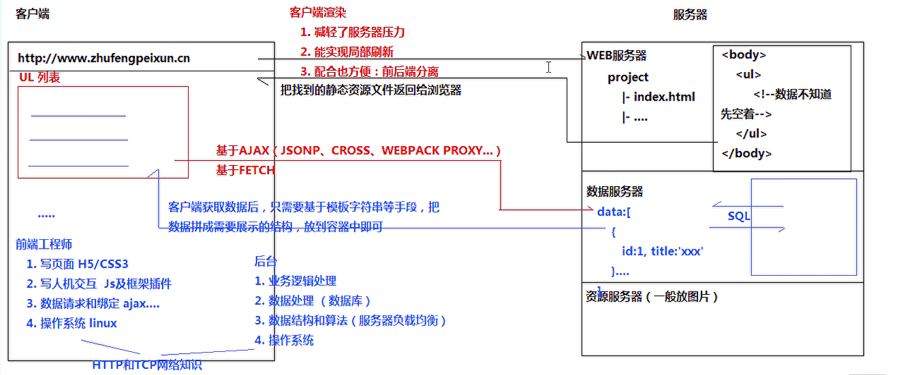
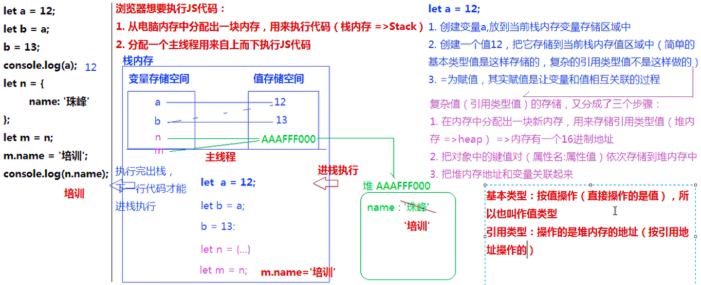
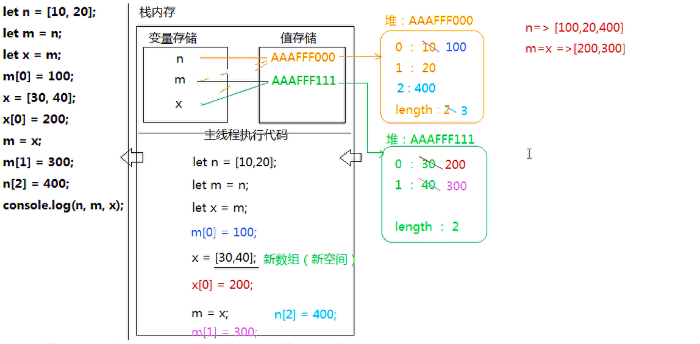
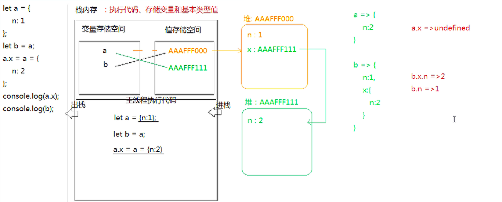

# js 基础整理

## 前端发展史

### WEB1.0时代：静态网页

### WEB2.0时代：动态网页的崛起（服务端渲染时代 ）

- 问题1：服务器压力过大
- 问题2：同步非异步刷新，页面中某一个数据想要更改，只能重新刷新整个页面（全局刷新）
- 问题3：不利于团队协作开发

### ajax时代：前后端分离的雏形，异步渲染大显神通（客户端渲染时代）

- 导致后期，跨域策略请求方案（JSONP、IFRAME、CORS、DOMAIN、POXY、SCOKET..）以及FETCH等新通信方案的不断崛起。



### node 崛起：JS 成为最为热门全栈开发技术

前端侵占移动端APP市场

- 原生APP（Native App）
  - 优势：
    - 性能好
    - 功能强大（可以调用手机软件硬件）
  - 弊端：
    - 不能跨平台、成本大
    - 不能同步
- Web App（H5页面）==>响应式布局开发
  - 优势：
    - 跨平台
    - 及时更新
  - 弊端：
    - 性能相对不好
    - 功能没有那么强大
- 混合开发

前端未来发展预估

- 小程序是企业产品的重要组成部分
- iOS和安卓开发逐步被淘汰
- VR/AI最终转为B端（JS，尤其是webGL、canvas、three.js等是3D虚拟交互的主要实现技术） 
- H5游戏/小游戏的热度会提高（白鹭JS引擎 ）
- NODE.js还会迎来下一个高潮

## 需要的技术栈

当下前端开发的技术体系

1.HTML5+CSS3。

2.JS 包括E6核心原理

JS堆栈内存、闭包作用域、浏览器词法解析（V8渲染机制原理） 、面向对象和this处理（主要是独立封装组件和插件，研究常用类库的源码）

ES6基础语法（包括class类的继承封装和多态） 、ES6中的Promise(及 Promise A+规范)、Generator生成器函数等深入用法

同步异步编程（包括运行机制和微任务、宏任务，以及实战应用）

常用的编程思想和设计模式：函数的防抖和节流、柯理化函数、惰性函数、单例设计模式、发布订阅模式、Promise 设计模式等

DOM性能优化（重排和重绘的优化）、DOM事件

前端编程常规算法：去重、冒泡排序、插入排序、快速排序、递归等

3.ajax和http

技术要点：ajax原理、ajax异步解决方案（promise）、axios(包括自己封装promise版ajax库)、fetch及封装处理、jquery中的ajax操作和库的封装等

跨域解决方案及实现原理：jsonp、cors、webpack proxy(socket.io)、document.domain、window.name+iframe、postMessage等

HTTP报文（常用的响应请求头实战应用技巧）、HTTP（TCP）传输流程（包括三次握手四次挥手及TCP底层协议）、HTTP1和HTTP2的区别、HTTP和HTTPS的区别等

 HTTP相关优化手段是性能提高的重要方法（如：304缓存、DNS缓存、减少HTTP传输次数和大小、HTTPS的加密等 ） 

4.框架开发

vue全家桶：vue(MVVM实现的原理以及一些语法实现的原理)、vue-router(HASH路由实现的原理)、vuex(掌握原理)、axios、vue-cli(需要能够修改脚手架的webpack配置项)、iview/vux/vue element 等常用框架的使用

react全家桶：create-react-app（能够修改webapck的配置项）、react(掌握虚拟DOM渲染原理，掌握DOM-DIFF原理，掌握iNDEX索引对比机制，掌握MVC实现的原理)、react-dom/react-native、react-router、react-redux/dva/mobx（掌握原理，自己可以基于原生JS写一套类似的插件、发现里面的一些不足点）、antd(最好可以自己封装一些基础的组件)等

5.辅助技能

webapck:掌握常用的脚手架使用和修改，会一些基础的webpack搭建

Git

Node：掌握基础的API、掌握express/koa/egg等框架、可以编写伪API，可以基于node做跨域处理等

Canvas：可视化，需掌握canvas/webGL/d3等，对数学结构、算法有要求 

## 浏览器的内核和控制台

浏览器内核分类：

webkit/gecko/presto/trident

常用的浏览器

- webkit内核（V8引擎）
  - 谷歌Chrome
  - Safari
  - Opera >=V14
  - 国产浏览器
  - 手机浏览器
  - ...
- Gecko
  - 火狐FireFox
- Presto
  - Opera < V14
- Trident
  - IE
  - IE EDGE 开始使用双内核（其中包含 chrome迷你）

谷歌浏览器的控制台（F12/Fn+F12）

- Elements: 查看结构样式，可以修改这些内容
- Console：查看输出结果和报错信息，是JS调试的利器
- Sources：查看项目源码
- Network：查看当前网站所有资源的请求信息（包括和服务器传输的HTTP报文信息）、加载时间等（根据加载时间进行项目优化）
- Application：查看当前网站的数据存储和资源文件（可以盗图）

## js看书顺序

js高程->阮一峰es6->你不知道的js->js权威指南

### js组成

JavaScript 是有三部分组成：

- ECMAScript（ES）：描述了改语言的语法和基本对象
- DOM：文档对象模型，描述处理网页内容的方法和接口
- BOM，浏览器对象模型，描述与浏览器进行交互的方法和接口 

## JavaScript中的变量和数据类型

**创建变量的几种方式**：var、let、const、声明函数function、创建类class、ES6模块导入import、Symbol创建唯一值

```js
let n = Symbol(100)
let m = Symbol(100)
```

**命名规范**：

- 严格区分大小写
- 使用数字、字母、下划线、$、数字不能作为开头
- 使用驼峰命名法
- 常用的缩写：add/insert/create/new（新增）、update(修改)、delete/del/remove/rm(删除)、sel/select/query/get（查询）、info（信息）...
- 不能使用关键字和保留字

**数据类型分类：**

- 基本数据类型：
  - 数字number：常规数字和NaN
  - 字符串string：所有用单引号、双引号、反引号包起来都是字符串
  - 布尔boolean：true/false
  - 空对象指针null、未定义undefined

引用数据类型：

- 对象数据类型object：{}普通对象、[] 数组对象、/.../ 正则对象、Math数学函数对象、日期对象...
- 函数数据类型function

**数字**

数字：正常数字和NaN

Nav和任何值（包括自己）都不相等：NaN!=NaN。

判断一个值是否为非有效数字：isNaN([val])

> 在使用isNaN进行检测时，首先会验证检测的值是否为数字类型，若不是，先基于Number()，把值转换为数字类型，然后再检测

```js
isNaN(10) //false
isNaN('AA') // true
isNaN('10') // false 注意 Number('10')=>10 isNaN(10)=>false
```

**转换为数字类型**

- Number([val])
- parseInt/parseFloat([val],[进制])，对于字符串来说，它是从左到右依次查找有效数字字符，直到遇到非有效数字字符，停止查找（不管后面是否还有数字），把找到的当作数字返回。
- == 进行比较时，可能要出现把其他类型值转换为数字

```js
// 字符串转数字，Number() 把字符串转换为数字，只要字符串中包含任意一个非有效数字字符（第一个点除外）结果都是NaN，空字符串会变为数字零。
Number('12.5') // 12.5
Number('12.5px') // NaN
Number('12.5.5') // NaN
Number(' ') // 0
// 布尔转数字
Number(true) // 1
Number(false) // 0
isNaN(false) // false
// null->0 undefined->NaN
Number(null) // 0
Number(undefined) // NaN
// 把引用类型转换为数字，是先把他基于toString方法转换为字符串，然后再转换为数字
Number({name: '10'}) // NaN
Number({}) // NaN，()/{xxx:'xxx'}.toString()=>'[object Object]'=>NaN
Number([]) // 0，[].toStirng()=>''
Number([12]) // 12，[12].toStirng()=>'12'
Number([12, 23]) // NaN，[12,23].toString()=>'12,23'

let str = '12.5px'
Number(str) // NaN
parseInt(str) // 12
parseFloat(str) // 12.5
parseFloat('width:12.5px') // NaN
parseFloat(true) // NaN，非数字类型转字符串，再根据查找规则，'true'=>NaN
```

**string字符串数据类型**

所有用单引号、双引号、反引号（撇 ES6模板字符串）包起来的都是字符串

**转字符串**

- [val].toString()
- 字符串拼接

```js
let a = 12
a.toString() // '12'
(NaN).toStirng() // 'NaN'

// null和undefined是禁止直接toString的
// (null).toString // 报错
// 但是和undefined一样转换为字符串的结果就是 'null' 'undefined'

// 普通对象.toString()的结果是 “[object Object]” => Object.prototype.toString方法不是转换为字符串的，而是用来检测数据类型的

// 字符串拼接
// 四则运算法则中，除加法外，其余都是数学计算，只有加法可能存在字符串拼接（一旦遇到字符串，则不是数学运算，而是字符串拼接）
'10' + 10 // '1010'
'10' - 10 // 0
'10px' - 10 // NaN

let a = 10 + null + true + [] + undefined + '啦啦' + null + [] + 10 + false
/*
	10 + null -> 10 + 0 10
	10 + true -> 10 + 1 -> 11
	11 + [] -> 11 + '' -> '11' 空数组变为数字，先要经历变为空字符串，遇到字符串，直接变为字符串拼接
	...
	'11undefined啦啦null10false'
*/
console.log(a) '11undefined啦啦null10false'
```

**布尔数据类型**

只有两个值 true/false

**转布尔**

只有 0、NaN、''、null、undefined 五个值转换成false，其余都转换为true。

- Boolean([val])
- !/!!
- 条件判断

```js
Boolean(0) // false
Boolean('') // false
Boolean(' ') // true
Boolean(null) // false
Boolean(undefined) // false
Boolean([]) // true
Boolean([1, 2]) // true
Boolean(-1) // true

// !:取反（先转为布尔，然后取反）
// !!：取反再取反，相当于转换为布尔 <=> Boolean
!1 // false
!!1 // true

// 如果条件只是一个值，不是 ==/===/!=/>= 等这些比较，是要把这个值先转换为布尔类型，然后验证真假
if(1) {} // true
if('3px' + 3){} // true,'3px3'=> true
 if('3px' - 3){} // false，NaN - 3 => NaN => false
```

**null / undefined**

null和undefined都代表是没有

null：意料之中（一般都是开始不知道值，我们手动先设置为null，后期再给赋予值操作）

```js
let num = null // let num = 0 一般最好用null作为初始空值，因为零不是空值，它在栈内存中有自己的存储空间（占了位置）
num = 12
```

undefined：意料之外（不是我能决定的）

```js
let num; // 创建一个变量没有赋值，默认值是undefined
num = 12;
```

**object对象数据类型-普通对象**

> {[key]:[value],...} 任何一个对象都是由零到多组键值对（属性名：属性值）组成的（且属性名不能重复）

  ```js
let person = {
  name: 'xxx',
  age: 10,
  height: '185CM',
  weight: '80KG',
  1: 100
}
// 获取属性名对应的属性值
// =>对象.属性名
// =>对象[属性名] 属性名是数字或字符串格式的
// =>如果当前属性名不存在，默认的属性值是undefined
// =>如果属性名是数字，则不能使用点的方式获取属性值
person.name
person['age']
person.sex //=>undefined
person[1]
person.1 //=>SyntaxError:语法错误
// 设置属性名属性值
// =>属性名不能重复，如果属性名已经存在，不属于新增属于修改属性值
person.GF = 'yyy'
person['GF'] // 'yyy'
person.name = 'zzz'
// 删除属性
// =>真删除：把属性彻底干掉
delete person[1]
// =>假删除：属性还在，值为空
person.weight = null
console.log(person)


  ```

> 数组是特殊的对象数据类型

```js
/*
	数组是特殊的对象
	1. 我们中括号中设置的属性值，它的属性名是默认生成的数字，从零开始递增，而且这个数字代表每一项的位置，我们把其称为“索引”=>从零开始，连续递增，代表每一项位置的数字属性名
	2. 天生默认一个属性名 lenfth，存储数组的长度
*/
let ary = [12, '哈哈', true, 13]
console.log(ary)
ary.length
ary['length']
ary[1]
// 第一项索引0 最后一项索引 ary.length -1
ary[0]
ary[ary.length - 1]
// 向数组末尾追加内容
ary[ary.length] = 100
```

**JS中数据类型检测**

> 有且只有4中方法

- typeof [val]：：用来检测数据类型的运算符
- instanceof：用来检测当前实例是否隶属于某个类
- constructor：基于构造函数检测数据类型（也是基于类的方式）
- Object.prototype.toString.call()：检测数据类型最好的方法

```js
/*
	基于typeof检测出来的结果
	1. 首先是一个字符串
	2. 字符串中包含对应的类型
	局限性
	1. typeof null => "object" 但是null并不是对象
	2. 基于typeof无法细分出当前值是普通对象还是数组对象等，因为只要是对象数据类型，返回的结果都是"object"
*/
typeof 1 // 'number'
typeof NaN // =>'number'
typeof '12' // 'string'
typeof true // 'boolean'
typeof null // "object"
typeof undefined // "undefined"
typeof {} // "object"
typeof [] // "object"
typeof /^/ // "object"
typeof function(){} // "function"
// 面试题
console.log(typeof typeof typeof []) // 从右到左计算，"string"，因为typeof检测的结果都是字符串，所以只要两个及以上同时检测，最后结果必然是"string"
```

## 堆栈内存（stack & heap）

- 浏览器渲染JS的机制
- 数据类型之间的区别
- 经典面试题联系
- 数据类型的检测

```js
let a = 12
let b = a
b  = 13
console.log(a) // 12

let n = {
  name: 'xxx'
}
let m = n
m.name= 'yyy'
console.log(n.name) // 'yyy'
```

浏览器想要执行JS代码：

1.从电脑内存中分配出一块内存，用来执行代码（栈内存=>Stack）

2.分配一个主线程用来自上而下执行JS代码

栈内存：包含变量存储空间、值存储空间、主线程



```js
let n = [10, 20]
let m = n 
let x = m
m[0] = 100
x = [30, 40]
x[0] = 200
m = x
m[1] = 300
n[2] = 400
// 画图
console.log(n, m, x) // n=>[100,20,400] m=x=>[200,300]
```



写出下面结果输出的答案（阿里面试题）

```js
let a = {
  n: 1
}
let b = a
a.x = a = {
  n: 2
}
console.log(a.x)
console.log(b)
```



 ## JS中的操作语句：判断、循环

**判断**

> 条件成立做什么？不成立做什么？

- if/else if/else
- 三元运算符
- switch case

1. if/else

```js
if(条件){
	条件成立执行
} else if(条件2){
  条件2成立执行
}
...
else{
以上条件都不成立
}
```

2. 三元运算符：简短if/else的特殊处理方式

> 条件?条件成立处理的事情：不成立处理的事情
>
> 1.如果处理的事情比较多，我们用括号包起来，每一件事情都用逗号分隔
>
> 2.如果不需要处理事情，可以使用null/undefined占位

```js
let a = 10
// 三元
a > = 10 ? console.log('呵呵') : console.log('哈哈')
// 正常
if (a >= 10) {
  console.log('呵呵')
} else {
  console.log('哈哈')
}

// 注意事项
let a = 10
// 正常
if (a > 0 && a < 20) {
  a++; // =>a+=1 a=a+1 =>自身累加1
  console.log(a)
}
// 三元
a > 0 && a < 20 ? (a++, console.log(a)) : null

// 练习(正常不会这么写)
let a = 10
// 正常
if (a > 0) {
  if (a < 10) {
    a++
  } else {
    a--
  }
} else {
  if (a > -10) {
    a += 2
  }
}
// 三元
a > 0 ? (a < 10 ? a++ : a--) : (a > -10 ? a += 2 : null)

```

3. switch case

> 一个变量在不同值情况下的不同操作
>
> 1.每一种case情况结束后最好都加上break
>
> 2.default等价于else，以上都不成立干的事情
>
> 3.每一种case情况的比较用的都是==="绝对相等"

```js
let a = 10
if (a == 1) {
  console.log('呵呵')
} else if (a == 5) {
  console.log('呵呵1')
} else if (a == 10) {
  console.log('呵呵1')
} else {
  console.log('呵呵2')
}

switch (a) {
  case 1:
    console.log('呵呵')
    break;
  case 5:
    console.log('呵呵1')
    break;
  case 10:
    console.log('呵呵2')
    break;
  default:
    console.log('呵呵3')
} 

// 不加break，当前条件成立执行完成后，后面条件不论是否成立都要执行，知道遇到break为止（不加break可以实现变量在某些值的情况下做相同的事情）
let a = 1 
switch (a) {
  case 1:
    a++;
  case 5:
    a += 2
    break;
  default:
    a--;
}
console.log(a) // 4
// 当变量在某几个情况时，可以这么写
let a = 1 
switch (a) {
  case 1:
  case 5:
    a += 2
    break;
  default:
    a--;
}
console.log(a)


let a = '5'
switch (a) {
  case 1:
    console.log('呵呵')
    break;
  case 5:// => 此处 '5' case 5 => false
    console.log('哈哈')
    break;
  default:
    console.log('嘻嘻') // 最终结果
}
a = '5'
if (a == 1) {
  console.log('呵呵') //=>'5' == 5 =>true
} else if (a == 5) {
  console.log('昂昂') //  最终结果
} else {
  console.log('嘻嘻')
}
```

**== VS ===**

==：相等（如果左右两边数据值类型不同，是默认先转换为相同的类型，然后比较）

'5'==5 =>true

===：绝对相等（如果类型不一样，肯定不相等，不会默认转换数据类型）

'5'===5 => false

项目中为了保证业务的严禁，推荐使用 ===

**循环**

> 重复做某些事情就是循环

- for循环
- for in循环
- for of循环（ES6新增）
- while
- do while

for循环

```js
/*
	1.创建循环初始值
	2.设置（验证）循环执行的条件
	3.条件成立执行循环体中的内容
	4.当前循环结束执行步长累计操作
*/
for(var i=0;i<5;i++){
  console.log(i) // 0 1 2 3 4
}
console.log(i) // 5


for (var i=10;i>4;i-=2){
  if (i < 7) {
    i++
  } else {
    i--
  }
}
console.log(i) // 4

// 循环体中的两个关键词
// continue：结束当前这轮循环（continue后面的代码不再执行），继续执行下一轮循环
// break：强制结束整个循环（break后面代码也不再执行），而且整个循环啥也不干直接结束

// 以下输出几次？分别是多少？
if(var i = 0;i < 10; i++) {
  if (i >= 2) {
    i += 2
    continue
  }
  if (i >= 6) {
    i--
    break
  }
  i++
  console.log(i) // 第一次 1
}
console.log(i) // 第二次 11
```

## 元素对象的深一层理解（堆栈）

## 函数 function

>  函数就是一个方法或者一个功能体，函数就是把视线某个功能的代码放到一起进行分装，以后想要操作实现这个功能，只需要把函数执行即可 => "封装"：减少页面中的冗余代码，提高代码重复使用率（低耦合高内聚）

- 创建函数
  - 形参
  - 返回值
- 执行函数
  - 实参
- arguments
- 函数底层运行机制

**创建函数**

```js
// => ES5 老方式
function [函数名]([形参变量1]...){
  // 函数体：基于JS完成需要实现的功能
  return [处理后的结果]
}

[函数名]([实参1],...)
```

**函数基础语法和形参的细节知识**

```js
// 求两个人数的和，算完和后乘以10，然后除以2...
// =>sum是函数名，代表这个函数本身
// =>sum()是让函数执行，代表的是函数执行返回的结果
// =>n/m是形参，是变量，用来存储执行函数时传递的实参
function sum(n, m) {
  let result = n + m
  result *= 10
  result /= 2
  console.log(result)
}
// 10/20、25/27这都是传递给形参变量的值（实参）
sum(10, 20)
sum(25, 27)
// ==========形参的细节
// 创建函数时我们设置了形参变量，但是如果执行时并没有给传递对应的实参值，那么形参变量默认的值是：undefined
function sum(n, m) {
  let result = n + m
  result *= 10
  result /= 2
  console.log(result)
}
sum() // NaN
sum(10) // NaN
sum(10, 20) // 150
sum(10, 20, 30) // 150
// =====形参默认值处理
function sum(n, m) {
  // 形参默认值处理：如果没有传递形参值，给予一个默认值
  if (n === undefined) { // 注意 null == undefined，这里用绝对相等
    n = 0
  }
  if (typeof m === 'undefined') {
    m = 0
  }
  let result = n + m
  result *= 10
  result /= 2
  console.log(result)
}
sum() // 0
sum(10) // 50
sum(10, 20) // 150
sum(10, 20, 30) // 150
```

**函数中的返回值**

```js
// 1.函数执行时，函数体内部创建的变量我们时无法获取和操作的，如果想要获取内部的信息，我们需要看基于return返回值机制，把信息返回才可以
function sum(n, m) {
  let result = n + m
  // 2.return的一定是值：此处是把result变量存储的值返回给外面
  return result //=> reutrn 30
}
sum(10, 20)
console.log(result) // =>Uncaught ReferenceError: result is not defined

// 3.没有写 return，函数默认返回值是undefined
function sum(n, m) {
  let result = n + m
}
let AA = sum(10, 20)
console.log(AA) //=>undefined
// 实际工作中使用 return 的一种场景
function sum(n, m) {
  if (n === undefined || m === undefined) {
    // 4.函数体中遇到 return，后面代码则不再执行了
    return
  }
  let result = n + m
}
sum(10, 20)
```

> 函数中的返回值的四个要点

**匿名函数**

匿名函数之函数表达式：把一个匿名函数本身作为值赋值给其他东西，这种函数一般不是手动触发执行，而且靠其它程序驱动触发执行（例如：触发某个时间时把它执行等）

```js
document.body.onclick = function () {}
setTimeout(function(){}, 1000) //=>设置定时器，1000ms后执行匿名函数

// 匿名函数之自执行函数：创建完一个匿名函数，紧接着把当前函数加小括号执行
(function(n){
  // n=>100
})(100)
```


## css

css一定要先写公共样式