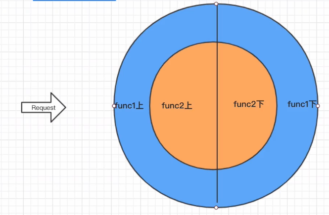

# 纯正商业级应用 Node.js Koa2开发微信小程序服务端

## 第 1 章 导学与 node.js

### 1-1 纯正商业级应用 Node.js Koa2开发微信小程序服务端

**讲什么**

- 二次开发 KOA
- KOA 不好用
- egg.js think.js

- 校验器 LinValidator
- 全局异常处理
- 自动路由注册
- KOA 核心机制
- 为什么要有洋葱模型？
- 中间件到底怎么样？
- JS、ES6、ES7中高级语法的应用
- 查找类(Class) 上的属性和方法
- 异步编程模型
- 深入 async 和 await
- 编程思维与面向对象
- Sequelize 与 MySQL
- KOA 示范项目
- Web 分层结构
- 完型填空
- 开源项目 Lin CMS 开发后端管理(不讲)
- Vue + KOA
- https://github.com/TaleLin

**前端为什么要学 node.js**

Node.js能力

- 脱离浏览器运行 js
- NodeJS Stream (前端工程化基础)
- 服务端 API
- 作为中间层

是否学 node.js 取决于定位

- 纯前端不需要
- CTO 由服务端工程师担任
  - 需要设计整个公司技术架构
  - 需要从全局考虑问题
  - 需要掌控公司最重要的资产：数据(谁掌握数据，谁才有话语权)

独立完成一个项目、产品

面试加分

前后端界限越来越模糊

- 双层结构：前端+服务端
- 三层结构：前端+后端+服务端(操作管理数据库)
- 前端自己编写 API

思维培养

- 前后端思维方式不同
- 更加成熟，考虑问题更加全面
- 学习服务端对于提高前端编程也很有帮助

### 1-2 异步、JavaScript特性与 NodeJS

**异步**

flask django 同步

KOA 使用 async await，而早期的 express 写异步代码很痛苦

前端涉及异步不多，如 http 请求

服务器端涉及异步较多，如 http 操作数据库等

**JS 特性**

语言简洁 es2019 < python

js 基于原型链 工程化 OO面向对象

**node.js**

使 js 脱离 浏览器

使用场景 node.js > python

### 1-3 申请 AppKey

http://www.7yue.pro/course

aRo3t9zJDjpKCfr3

### 1-4 旧岛小样业务分析

### 1-5 课程维护及更新说明

公众号： 林间有风

慕课：手记

## 第2章 Koa2的那点事儿与异步编程模型

### 2-1 软件与环境

### 2-2 node一小步，前端一大步

**Node.js 的能力与应用**

1. 脱离浏览器运行 js
2. NodeJS Stream (前端工程化基础)
3. **服务端 API**
4. 作为中间层

### 2-3 KOA的精简特性与二次开发必要性分析

后端：读写数据库 API

写出好的代码、提高开发效率，学好后端时间成本大，如悲观锁、乐观锁、事务、脏读、幻读等。

node.js 不只用于 web，node.js 的 api 比较低级、基础，不适合直接进行 web开发。

有基于 node.js 专业开发 Web 框架，如早起的 Express 和 后来的 KOA

KOA：洋葱圈模型、精简，因为精简，直接用难用，需要二次开发。

### 2-4 模块加载、ES、TS、Babel 浅析

项目初始化

```shell
npm init - y
```

安装 koa

```shell
npm i koa
```

### 2-5 KOA的中间件

根目录创建 app.js，作为应用程序入口

生成一个 Koa 实例，作为**应用程序对象**，它有很多中间件。

注册中间件，可以具名和可以匿名(推荐)。

匿名写法中，koa 会自动传入两个参数，ctx 和 next。ctx 是上下文对象，当要执行多个中间件时，通过 next() 执行。

当我们访问 localhost:3000 时， 这两个中间件会执行。

```js
const Koa = require('koa')
// app 称为应用程序对象，它有很多中间件
const app = new Koa()

// 具名方式
// function test () {
//   console.log('skjdflsdjf')
// }
// 注册中间件
// app.use(test)

// 注册中间件，推荐匿名写法
app.use((ctx, next) => {
	console.log('hello world')
	next()
})
app.use((ctx, next) => {
  console.log('hello world2')
})

// 前端发送 HTTP，KOA 接收 HTTP

app.listen(3000)

```

### 2-6 洋葱模型

当前端请求 localhost:3000时，console.log 执行顺序如下。

结果：1、3、4、2，执行1进入next，执行3，进入next，没有，继续执行4，然后继续执行2

```js
// app.js
const Koa = require('koa')
const app = new Koa()

app.use((ctx, next) => {
	// 洋葱模型
	console.log(1);
	next()
	console.log(2);
})
app.use((ctx, next) => {
	console.log(3);
	next()
	console.log(4);
})

app.listen(3000)
```

洋葱模型



加上 async await 保证洋葱模型

```js
app.use(async (ctx, next) => {
	// 洋葱模型
	console.log(1);
	
	await next()
	console.log(2);
	
})
app.use(async (ctx, next) => {
	console.log(3);
	await next()
	console.log(4);
})
```

### 2-7 强制 Promise

next() 返回的是 promise

```js
const Koa = require('koa')

const app = new Koa()
app.use((ctx, next) => {
	const a = next()
	console.log(a)
})
app.use((ctx, next) => {
	next()
	return 'abc'
  // reutrn new Promise()
})

app.listen(3000)
// 命令行 node app.js，启动 node 服务
// 浏览器请求 localhost:3000 时
// 终端中打印，
// Promise { 'abc' }

```

### 2-8 深入理解 async 和 await

- await 的作用
  - 对表达式求值
  - 阻塞当前线程
- async 后的函数返回值是 Promise
- 面试题：中间件为什么要加上 async ?

**await 的作用**

1.对表达式求值

await 后面可以跟任意表达式不只是 Promise，即可以对表达式求值。

next() 返回的是 Promise，通过 await 的求值特性，可以直接得到值

```js
const Koa = require('koa')

const app = new Koa()

app.use(async (ctx, next) => {
	const a = await next()
	// await 1. 求值关键字 表达式
	console.log(a)
	// a.then( res => {
	// 	console.log(res)
	// })
})
app.use((ctx, next) => {
	next()
	return 'abc'
})

app.listen(3000)
// 通过 await 直接拿到值 'abc'
```

2.阻塞当前线程

使用 await 会阻塞当前线程，等待异步结果的返回；这样就把异步调用变成同步操作了。

- 不使用 await
  - axios 不阻塞线程，end - start 结果接近于零
- 使用 await （必须配合 async）
  - 阻塞线程，end - start 很大

```js
const Koa = require('koa')

const app = new Koa()

app.use(async (ctx, next) => {
	const axios = require('axios')
	const start = Date.now()
	const res = await axios.get('http://7yue.pro')
	const end = Date.now()
	console.log(end - start)
	next()
	// return 'abc'
})

app.listen(3000)
```

这样，我们就可以直接使用 await 的两个特性，拿到请求结果，而不是 Promise

```js
app.use(async (ctx, next) => {
	const axios = require('axios')
	const res = await axios.get('http://7yue.pro')
	console.log(res) // 数据，而不是 Promise
})
```

await 只会阻塞当前线程，不会阻塞其他线程**。**

**async 后的函数返回值是 Promise**

async 后面跟函数，函数的任何返回值都会被包装成 Promise

```js
async function f1 () {
  return 'hello'
}
// node 此文件，执行
console.log(f1()) // Promise { 'hello' }
```

**面试题：中间件为什么要加上 async ?**

中间件函数加不加 async 都会返回 Promise, Koa 在内部已经处理了。之所以加 async 是因为在函数内部引用了 await，如果不加 async 就会报错。

异步的终极解决方案，async 和 await 的语法，最早出现在 C# 中。

### 为什么一定要保证洋葱模型？

当我们需要等后续中间件都完成后再执行操作，就需要保证洋葱模型，例如计时。

如果不加 async 和 await，koa 中间件的执行顺序就不一定按照洋葱模型的顺序执行。

1-3-2-4 不是 1-3-4-2，遇到 await 线程被阻塞了，所以执行了 2，当线程阻塞取消后，才会执行，所以最后执行 4，无法保证按照洋葱模型的顺序执行。

```js
const Koa = require('koa')

const app = new Koa()

app.use(async (ctx, next) => { // 若不加，不能保证洋葱模型
	console.log(1);
	await next()
	console.log(2);
})
app.use(async (ctx, next) => {
	console.log(3);
	const axios = require('axios')
	const res = await axios.get('http://7yue.pro')
	next()
	console.log(4);
	
})

app.listen(3000)

```

当需要拿到第二个中间件的返回结果时，必须保证第二个中间件已经执行完了。(不要通过返回值的形式获得，第三方中间件不能控制)。

```js
const Koa = require('koa')

const app = new Koa()

app.use(async (ctx, next) => {
	await next()
	const r = ctx.r
	console.log(r)
})
app.use(async (ctx, next) => {
	const axios = require('axios')
	const res = await axios.get('http://7yue.pro')
	ctx.r = res
	next()
})

app.listen(3000)

```

## 第3章 路由系统的改造

### 3-1 路由系统

使用 koa-router 来做路由管理，通过 koa-router 做路由管理，比直接在中间件内 if 判断要高级。访问 3000端口，对应路由，客户端可以拿到对应数据。

```js
// app.js
const Koa = require('koa')
const Router = require('koa-router')

const app = new Koa()
const router= new Router() // 第一步，实例化 router

// 中间件都必须通过 app.use 注册；但这里第二个参数也是中间件，是 koa-router 内部自动注册的中间件，所以可以拿到 ctx 和 next 参数
router.get('/classic/latest', (ctx, next) => { // 第二步，添加处理逻辑
	ctx.body = { key: 'classic' }
})

app.use(router.routes()) // 第三部，注册 routes

// app.use(async (ctx, next) => {
// 	console.log(ctx.path)
// 	console.log(ctx.method)
// 	if (ctx.path === '/classic/latest' && ctx.method === 'GET') { // 这里，ctx 是 Request 的别名
// 		ctx.body = { key: 'classic' } // 通过给 body 赋值，来给客户端返回数据
// 	}
// })


app.listen(3000)

```

### 3-2 服务端编程必备思维：主题与模型划分

好的代码利用阅读、维护，能提高编程效率。

主题划分的好，设计好数据库建表；主题的划分是渐进式的。这里划分成 3 个部分： 期刊、书籍、点赞。

### 3-3 多 Router 拆分路由

路由的版本管理，要保证开闭原则，修改关闭，扩展开放。

客户端要保证 api 版本的兼容性，通常支持 3 个版本，v1、v2、v3。

api 携带版本号的方式：

- 路径
- 查询参数
- header

尽量保持高阶模块调用低阶模块，不要反过来，以免造成循环引用的问题。例如主入口文件 app.js，可以调用其他模块，但不要在低阶模块中调用 app.js

### 3-4 ndoemon 自动重启 Server

### 3-5 vscode + nodemon 调试配置

### 3-6 requireDirectory 实现路由自动加载

### 3-7 初始化管理器与 Process.cwd


