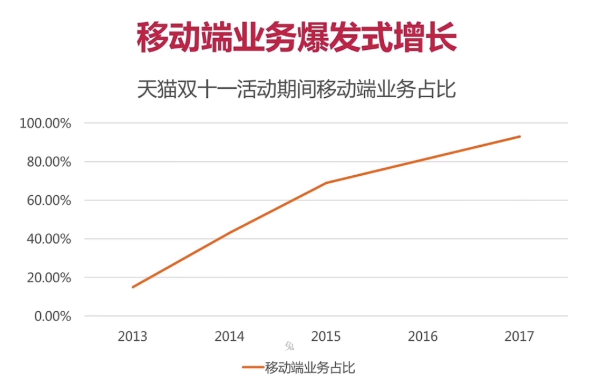
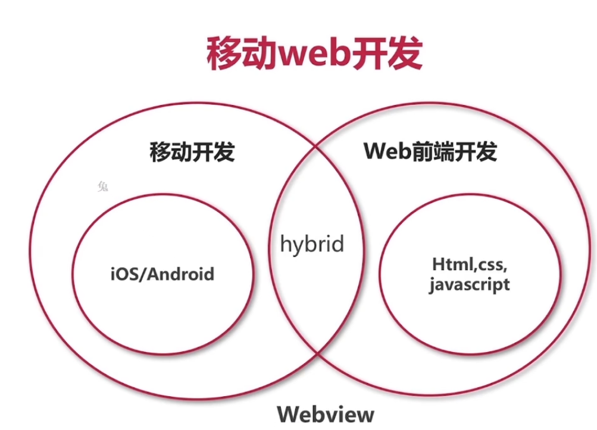
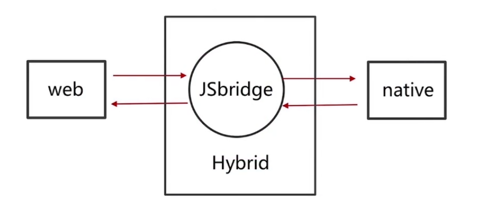
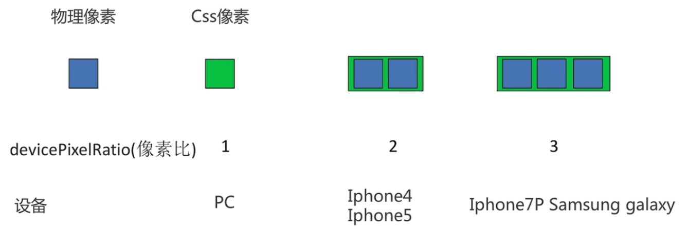
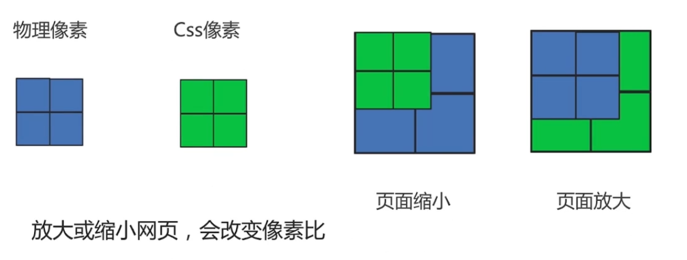
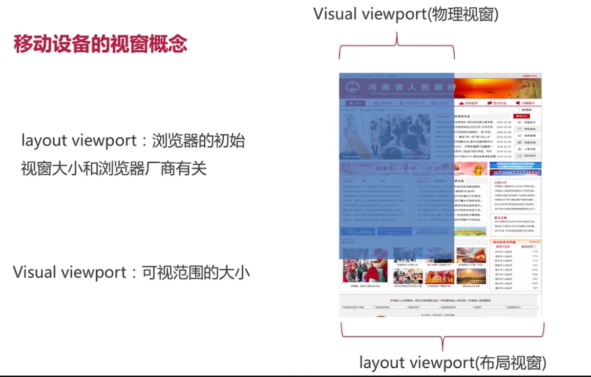
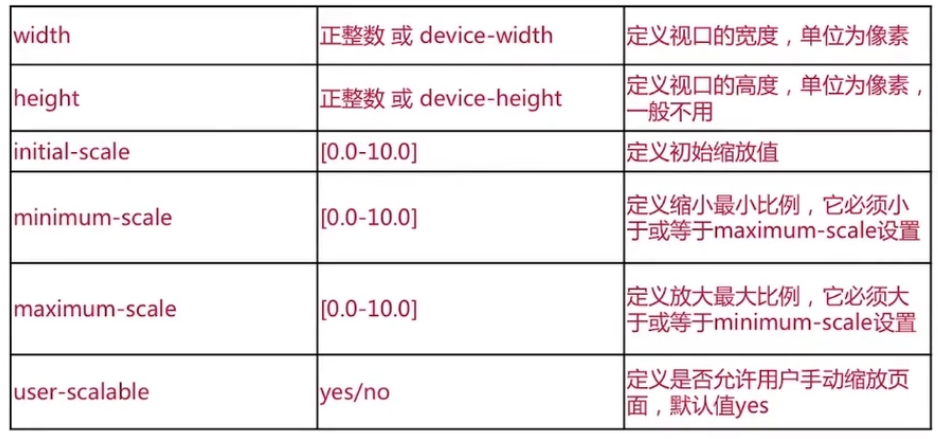

# react-webapp-美团

web 1.0 

浏览为主，功能单一

web 2.0

内容定制化，维基百科、facebook、twitter、rss、新浪微博、人人网。出现了不同的浏览器，带来了浏览器兼容性问题

web3.0

多端平台，移动发力


衍生出一个概念，Mobile First，先开发移动端如，ios，andriod，html5

移动web开发与传统pc开发

- 跑在手机端的web页面（H5页面）
- 跨平台
- 基于 webview
- 告别 **IE** 拥抱 **webkit**
- 更高的**适配**和**性能**要求


在 app 开发中，有 40% 的页面时移动 web 开发的




React 全家桶技术栈：React、Redux、webpack

Rem 适配：Rem + Flex

如何理解 Hybird开发



移动web基础

React技术栈技能

理论+实战

基于以上3点开发出，美团外卖移动webApp

收获：

- 掌握移动 web 调试与适配方法
- 掌握移动 web 开发与布局技巧
- 掌握 sass 使用方法
- 掌握 webpack 构建
- 掌握 React 组件化开发

技术能力 tencent T2.2 Ali P5

## 移动web基础

- 移动web概述
- 移动web调试
- 移动web适配
- 移动web事件

涉及知识点：使用chrome、物理像素，逻辑像素、Flex布局、MediaQuery、Viewport视窗、Rem适配、touch

### 2-1 移动web开发概述

什么是移动 web ？

- iOS，Android
- 2G，3G，4G
- HTML5
- viewport
- hybird


移动web开发概述：

- 跑在手机端的 web 页面（H5页面）
- 跨平台
- 基于 webview（终端的一个组件，类似于浏览器）
- 告别 **IE** 拥抱 **webkit**，只需要兼容 webkit 即可
- 更高的**适配**和**性能**要求，适配不同手机，手机性能若于pc，网络状态也若于pc

### 2-2 移动web开发调试

早期：alert()、Firebug

- Chrome Devtools 调试
- 真机调试方法

### 2-3 移动web适配概述

web前端适配方法：

PC：

- 960px / 1000 px 居中
- 盒子模型，表格，定高，定宽
- Display:inline-block

移动web：

- 定高，宽度百分比
- flex
- Media Query(媒体查询)

flex和Media Query 共同组成了响应式布局

移动web开发适配：

- viewport 和流式布局
- css flex 和 media query 媒体查询适配
- rem原理和适配方法
- 移动端其他适配问题

viewport 视窗：

- 什么是css像素，物理像素？
- 手机打开PC页面刚好被等比例缩放？浏览器特性，将页面内容刚好缩放至visual viewport 的可视区域内
- 设备宽高和 viewport 有什么关系？
- 如何使用 meta 设置viewport?



放大或缩小网页，会改变像素比。当页面缩小，同单位的css像素不足以承载对应的物理像素，同理方法。



### 2-4 viewport视窗概念

- layout viewport(布局视窗)
- visual viewport(物理视窗)
- ideal viewport(理想视窗)



ideal viewport(理想视窗)

```html
<meta name="viewport" content="width=device-width, initial-scale=1.0, maximun-scale=1.0, user-scalable=0" />
```



### 2-5 css3之flex布局

流式布局：

| display: -webkit-flex; | flex-direction  | order      |
| ---------------------- | --------------- | ---------- |
| display: flex;         | flex-wrap       | flex       |
|                        | justify-content | align-self |
|                        | align-items     |            |

flex-direction: row | row-reverse | column |column-reverse;

flex-wrap: nowrap | wrap | wrap-reverse;

justify-content: flex-start | flex-end | center | space-between | space-around;

align-items: flex-start | flex-end | center | baseline | stretch;

align-self: auto | flex-start | flex-end | center | baseline | stretch;

### 2-6 响应式布局和MediaQuery

### 2-7 rem,vw布局与适配

### 2-8 移动端touch事件详解

## React 技术栈

- 代码管理工具
- 项目构建与 webpack
- Sass 预处理
- React 组件化思想

涉及：git、vscode、gulp、webpack、sass、react

## 实战

美团外卖

- 外卖首页
  - 首页 tab
  - 订单 tab
  - 我的 tab
- 店铺详情页
  - 点菜 tab
  - 评价 tab
  - 商家 tab
- 分类页
- 评价页

涉及知识点

- 从零搭建构建环境：webpack、Babel、Eslint、webpack HMR、webpack-dev-server
- Redux 基础知识：redux、react-redux、redux-thunk、redux-logger、redux-devtool
- React + 页面逻辑：react-dom、es6、react-router、axios、rem适配、sass、vscode编辑器
- Hybird开发：通信机制、Jsbridge 开发、IOS webview、真实数据、性能调优
- 掌握移动web必备解决方案：300ms 点击延迟、多 tab页面懒加载、1px边框、Css伪类妙用、滚动加载数据、移动 web 输入框


