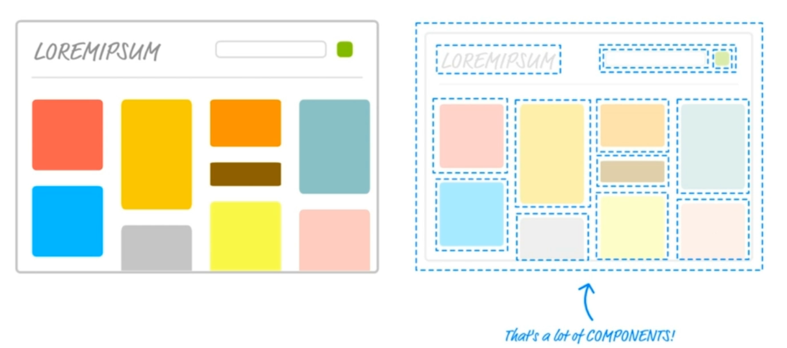
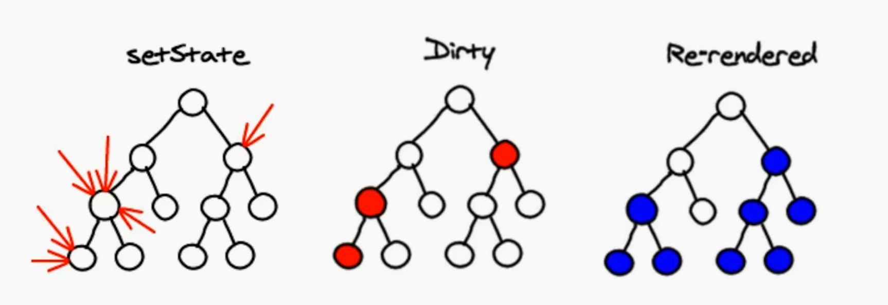
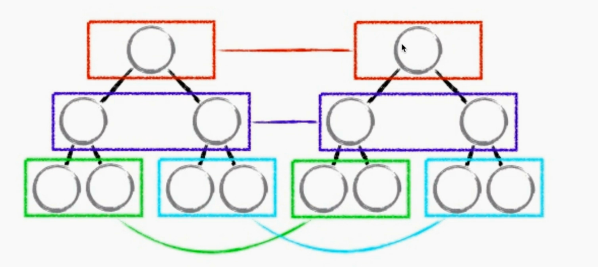
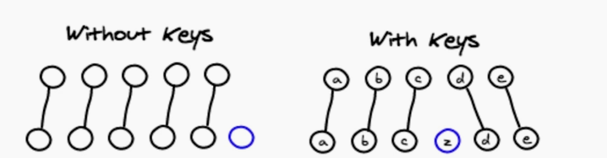
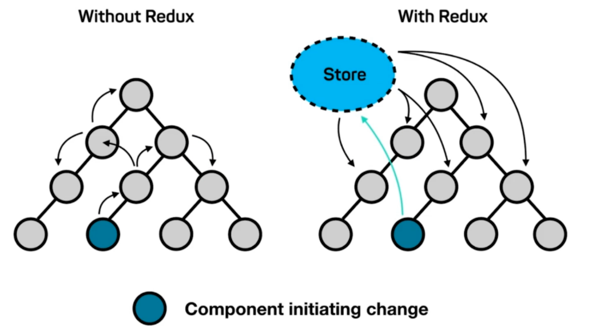
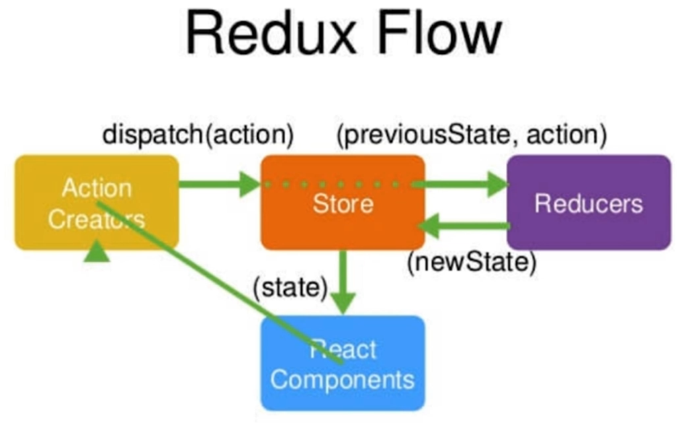

# react 简书

B站https://www.bilibili.com/video/av37028937/?p=1，里面有些笔记

**课程内容**

基础内容、环境搭建、基础语法、原理进阶、动画

Redux、Redux进阶

实战项目、环境搭建、Header、首页、详情页

登录校验、上线

**技术**

create-react-app、组件化思维、JSX、开发调试工具、虚拟DOM、生命周期、React-transition-group、Redux、Antd、UI，容器组件、无状态组件、redux-thunk、redux-saga、Styled-components(避免组件样式互相影响)、Immutable.js(避免数据误操作)、redux-immutable、axios

**收获**

- 彻底入门 React 的使用
- 完整了解 React 的工具全家桶
- 上手大型项目的前端开发
- 规范的代码编写

## 第 2 章 react 初探

### 2-1 react 简介

- Facebook 推出
- 2013年开源
- 函数式编程
- 使用人数最多的前端框架
- 健全的文档与完善的社区
- React Fiber（react 16 之后的统称），在16版本之后 react 在事件底层加入了事件优先级的概念，可以利用事件循环的碎片时间执行一些高优先级的用户交互，提高react用户体验

**官网**：https://reactjs.org/

**与 vue 的区别**：更加灵活，适合开发复杂度较高的项目;

### 2-2 开发环境搭建

**使用方式**

- 引入.js文件使用 React（古老）
- 通过脚手架工具来编码
  -  React 官方脚手架：Create-react-app
  - 脚手架是通过构建工具构建的，如，grunt、gulp、webpack

**创建项目**

1.安装 node 和 npm 后，全局安装 react 脚手架：

```shell
npm install -g create-react-app
```

创建并启动项目

shift+右键，选择在当前目录创建

```shell
create-react-app my-app
cd my-app
npm start
```

2.如果 Node >= 6 and npm >= 5.2，可运行命令安装

```shell
npx create-react-app my-app
cd my-app
npm start
```

### 2-3 工程目录文件简介

精简项目文件，主要是public目录和src目录，只留下

- public/index.html，模板文件

- src/index.js，入口文件

- src/App.js，根组件 

PWA progressive web application，通过写网页的形式写一些app应用

**registerServiceWorker** 使我们能够以写网页的形式写app应用，写好后存储在https协议的服务器上，当用户断网后依然可以访问，因为 registerServiceWorker 把网页存储在了网页之内，也就是缓存了。不使用可以去掉。

**public/mainfest.json**，是在使用pwa时，配置快捷方式图标用的。

### 2-4 react 中的组件

组件化思想：一个页面是有很多组件组成的。



**定义一个组件**

组件是通过类继承 React.Component 这个类来定义的，组件显示的内容就是 render 函数最终返回的内容。

```js
// src/App.js
import React, { Component } from 'react';

class App extends Component {
  render() {
    return (
      <div>
        hellow world
      </div>
    );
  }
}

export default App;
```

**JSX 语法**

ReactDOM 把 组件挂载到指定的dom节点上。

ReactDOM.render() 的第一个参数传入的是`<App />`而不是 App，而`< />`这种形式就是 JSX 语法，**使用JSX 语法就必须引入 'react'**，否则报错。

```js
// index.js
import React from 'react';
import ReactDOM from 'react-dom';
import App from './App';

ReactDOM.render(<App />, document.getElementById('root'));
```

同理，在App.js 中 render 函数中的 div 标签形式也是 JSX 语法，也需要引入 React。

```js
// App.js
import React, { Component } from 'react';

class App extends Component {
  render() {
    return (
      <div>
        hellow world
      </div>
    );
  }
}

export default App;
```

### 2-5 React 中最基础的JSX语法

**使用 h5 标签**

```js
// App.js
import React, { Component } from 'react';

class App extends Component {
  render() {
    return (
      <div>hellow world</div>
    );
  }
}

export default App;
```

**使用自定义组件标签**

使用自定义组件标签是，首字母必须大写，而 h5标签和在html相同不需要大写。

```js
// index.js
import React from 'react';
import ReactDOM from 'react-dom';
import App from './App';

ReactDOM.render(<App />, document.getElementById('root'));
```

## 第3章 React 基础精讲

本章通过TodoList功能的实现，给大家完整介绍React的基础语法，设计理念以及围绕React展开的一些编程思维。

### 3-1 使用React编写TodoList功能

- 在 index.js 中引入 TodoList 组件
- 创建 TodoList 组件
  - render 中 圆括号() 的作用使得我们可以换行书写
  - 使用 Fragment 占位符作为包裹元素

**引入 TodoList 组件**

```js
// index.js
import React from 'react';
import ReactDOM from 'react-dom';
import TodoList from './TodoList';

ReactDOM.render(<TodoList />, document.getElementById('root'));

```

**创建 TodoList 组件**

Fragment 为占位符，渲染dom时不显示

```js
// TodoList.js
import React, { Component, Fragment } from 'react'

class TodoList extends Component {
	render() {
		return (
			<Fragment>
				<div>
					<input />
					<button>提交</button>
				</div>
				<ul>
					<li>学英语</li>
					<li>learn react</li>
				</ul>
			</Fragment>
		)
	}
}

export default TodoList
```

### 3-2 React 中的响应式设计思想和事件绑定

实现 input 框的响应式

- state 存储数据
- 绑定数据或方法通过 `{}` 包裹
- 绑定函数时通过 bind 绑定 this
- 修改 state 数据，通过 setState 修改

```js
// TodoList.js
import React, { Component, Fragment } from 'react'

class TodoList extends Component {

  constructor (props) { // 最先被执行
    super(props)
    this.state = {
      inputValue: '',
      list: []
    }
  }
	render() {
		return (
			<Fragment>
				<div>
					<input 
      			value={this.state.inputValue} // react中表达式须使用{}
  					onChange={this.handleInputChange.bind(this)} // 使this指向组件
          />
					<button>提交</button>
				</div>
				<ul>
					<li>学英语</li>
					<li>learn react</li>
				</ul>
			</Fragment>
		)
  }
  handleInputChange (event) {
    this.setState({ // 修改数据不能直接修改，需要通过setState
      inputValue: event.target.value
    })
  }
}

export default TodoList

```

### 实现 TodoList 新增删除功能

- 通过 ... 展开运算符，展开数组，结合添加数据，完成添加功能
- 通过 bind 传入额外的参数 index ，完成定位要删除的数据
- 删除数据时，先复制原数组，完成删除操作，再通过 setState 覆盖原有数据。不要直接在原数据上操作，不利于 react 性能优化。

- immutable，react 不允许直接修改 state，所以修改时需要拷贝一份出来进行修改；如果直接修改，做性能优化会有问题。

```js
// TodoList.js
import React, { Component, Fragment } from 'react'

class TodoList extends Component {

  constructor (props) {
    super(props)
    this.state = {
      inputValue: '',
      list: []
    }
  }
	render() {
		return (
			<Fragment>
				<div>
					<input value={this.state.inputValue} onChange={this.handleInputChange.bind(this)} />
					<button onClick={this.handleBtnClick.bind(this)}>提交</button>
				</div>
				<ul>
					{
            this.state.list.map((item, index) => {
              return (
                <li 
                  key={index} 
                  onClick={this.handleItemDelete.bind(this, index)}
                >
                  {item}
                </li>
                )
            })
          }
				</ul>
			</Fragment>
		)
  }
  
  handleInputChange (event) {
    this.setState({
      inputValue: event.target.value
    })
  }

  handleBtnClick () {
    this.setState({
      list: [...this.state.list, this.state.inputValue],
      inputValue: ''
    })
  }

  handleItemDelete (index) {
    // imumutable
    // state 不允许我们做任何改变
    const list = [...this.state.list]
    list.splice(index, 1)
    this.setState({
      list: list
    })
  }
}

export default TodoList

```

### JSX语法细节补充

- jsx注释
- dangerouslySetInnerHTML属性
- 样式用 className
- label的for要用htmlFor

在JSX代码中编写注释

```jsx
{/* input框 */}
{
   // input 框,单行注释需要换行
}
```

用className代替class作为类属性，避免属性class和构造函数类class冲突。

```jsx
<input 
  id="insertArea"
  className='input' {/* clasName 代替 class */}
  value={this.state.inputValue}
  onChange={this.handleInputChange.bind(this)}
 />
```

内容不需要做转义时，利用dangerouslySetInnerHTML属性，也就有可能存在xss攻击的可能。外层{}，代表里面是js表达式，内层的{}其实就是一个js对象

```jsx
<li
  key={index}
  onClick={this.handleItemDelete.bind(this, index)}
  dangerouslySetInnerHTML={{__html: item}}
>
</li>
```

label在html中的作用是扩大点击区域，我们希望点击内容时，光标自动聚焦到输入框

```jsx
{/* 不用for，而用htmlFOr */}
<label htmlFor="insertArea">输入内容</label>
<input id="insertArea"></input>
```

### 拆分组件与组件之间的传值

- 组件拆分
- 父组件给子组件传值，既可以是值也可以是方法

将TodoList.js 拆分子组件，拆除 TodoItem.js

父组件给子组件传值，既可以是值也可以是方法。传递方法时需要绑定父组件的 this，方便在子组件中调用父组件的方法，修改数据。

```jsx
父组件传值
{
  this.state.list.map((item, index) => {
    return (
      <div>
        <TodoItem 
          content={item} 
          index={index} 
          deleteItem={this.handleItemDelete.bind(this)} 
          />
      </div>
    )
  })
}
```
子组件通过this.props获取值或方法。子组件中调用自身方法时绑定this操作，最好放在constructor中进行，可以**节约性能**。
```jsx
子组件 TodoItem.js
import React, { Component } from 'react'

class TodoItem extends Component {

  constructor(props) {
    super(props)
    this.handleClick = this.handleClick.bind(this); {/* 这样绑定this，比在render函数中绑定this性能高*/}
  }

  render() {
    {/* return <div onClick={this.handleClick.bind(this)}>{this.props.content}</div> */}
    return <div onClick={this.handleClick}>{this.props.content}</div>
  }

  handleClick() {
    this.props.deleteItem(this.props.index)
  }
}

export default TodoItem
```

### TodoList 代码优化

- 使用解构赋值获取props属性
- 先引入组件，后引入样式
- this指向的绑定，统一放在页面顶部
- jsx中的过多逻辑，放到函数中去
- setState 进行数据变更的新语法
- 循环 key 值

使用解构赋值获取props属性

优化前

```jsx
handleClick() {
  this.props.deleteItem(this.props.index)
}
```

优化后

```jsx
handleClick() {
  const { deleteItem, index } = this.props
  deleteItem(index)
}
```

先引入组件，后引入样式

优化前

```js
import React, { Component, Fragment } from 'react'
import './style.css'
import TodoItem from  './TodoItem'
```

优化后

```js
import React, { Component, Fragment } from 'react'
import TodoItem from  './TodoItem'
import './style.css'
```

this指向的绑定，统一放在页面顶部

this指向绑定写在render函数中会影响性能

优化前

```jsx
<div>
  <label htmlFor="insertArea">输入内容</label>
  <input 
    id="insertArea"
    className='input'
    value={this.state.inputValue}
    onChange={this.handleInputChange.bind(this)}
    />
  <button onClick={this.handleBtnClick.bind(this)}>提交</button>
</div>
```

优化后

```jsx
constructor (props) {
    super(props)
    this.handleInputChange = this.handleInputChange.bind(this)
    this.handleBtnClick = this.handleBtnClick.bind(this)
  }
render() {
  return (
  <div>
    <label htmlFor="insertArea">输入内容</label>
    <input 
      id="insertArea"
      className='input'
      value={this.state.inputValue}
      onChange={this.handleInputChange}
      />
    <button onClick={this.handleBtnClick}>提交</button>
</div>
  )
}
```

jsx中的过多逻辑，放到函数中去

优化前

```jsx
render函数中
<ul>
  {
    this.state.list.map((item, index) => {
      return (
        <div>
          <TodoItem 
            content={item} 
            index={index} 
            deleteItem={this.handleItemDelete} 
            />
        </div>
      )
    })
  }
</ul>
```

优化后

```jsx
render() {
  return (
    <Fragment>
      <ul>
        {this.getTodoItem()}
      </ul>
    </Fragment>
  )
}

getTodoItem() {
  return  this.state.list.map((item, index) => {
    return (
      <div>
        <TodoItem 
          content={item} 
          index={index} 
          deleteItem={this.handleItemDelete} 
          />
      </div>
    )
  })
}
```

setState 进行数据变更的新语法

以前setState 接收一个对象，现在可以接收函数

setState 如果接收一个函数，它是异步的

优化前

```jsx
 handleInputChange (event) {
    this.setState({
      inputValue: event.target.value
    })
  }
```

优化后

setState 如果接收一个函数，它是异步的；e.target.value需要先存起来再赋值。

```jsx
handleInputChange (event) {
  this.setState(() => {
    const value = event.target.value
    return {
      inputValue: value
    }
  })  
}

es6进一步简写，返回一个对象
handleInputChange (event) {
  const value = event.target.value
  this.setState(() => ({
    inputValue: value
  }))
}

```

使用 prevState，避免修改state的状态

```jsx
 handleBtnClick () {
    this.setState((prevState) => ({
      list: [...prevState.list, prevState.inputValue],
      inputValue: ''
    }))
  }
```

标准写法

```jsx
handleItemDelete (index) {
    this.setState((preState) => {
      const list = [...preState.list]
      list.splice(index, 1)
      return { li st }
    })
  }
```

循环 key 值

key 值要放在循环的最外层元素上，这里用index作为key值不严谨，会导致错误。

```jsx
return (
  <TodoItem 
    key={index}
    content={item} 
    index={index} 
    deleteItem={this.handleItemDelete} 
    />
)
```

### 围绕 React 衍生出的思考

- 声明式开发
- 可以与其他框架并存，只负责指定dom的渲染，其他dom可由其他框架负责。
- 组件化，形成组件树
- 单向数据流，便于数据维护
- 视图层框架，只关心页面渲染
- 函数式编程，便于自动化测试

## 第4章 React**高级内容**

本章讲解React高级部分内容，包含PropTypes，生命周期函数，虚拟Dom，数据mock，动画实现等部分课程讲解。

### 4-1 React developer tools 安装及使用

安装chrom插件 React Developer Tools

- 灰色 不是react开发的
- 红色 react开发代码
- 黑色 react线上版本(如，知乎)

可以通过它实时监控组件state的变化，不需要console.log了

### 4-2 PropTypes 与 DefaultProps 的应用

PropTypes 校验父组件传入的prop，defaultProps 设置 prop 默认值

<https://reactjs.org/docs/typechecking-with-proptypes.html>

### 4-3 props，state 与 render 函数的关系

当组件的state或props改变时，render 函数会重新执行。

当父组件的render函数被执行时，它的子组件的render都将被重新运行一次。

### 4-4 React 中的虚拟DOM

1. state数据 + jsx 模板 结合，生成虚拟DOM(虚拟dom就是一个js对象，用来描述真实dom)。
2. 用虚拟dom生成真实DOM，显示页面。
3. state发生变化
4. state数据 + jsx 模板，生成新的虚拟dom（极大地提升了性能）
5. 比较原虚拟dom和新虚拟dom的区别，找到变化的dom(极大提升性能)
6. 操作dom，改变对应dom内容。

vdom减少了对真实dom的创建以及真实dom的对比，取而代之的是js对象的对比，极大提高了性能。

### 4-5 深入了解虚拟DOM

jsx只是jsx模板语法

jsx -> createElement -> 虚拟dom(js 对象 ) -> 真实dom

createElement比jsx更底层

```jsx
// return <div><span>item</span></div>
return React.createElement('div', {}, React.createElement('span', {}, 'item'))
```

虚拟dom的优点

1. 性能提升了（虚拟dom比对代替真实dom比对）
2. 它使跨端应用得以实现(虚拟dom可以被原生应用识别，vdom -> 原生组件)。

### 4-6 虚拟 DOM 中的 Diff 算法

- setState 底层性能优化，把多次setState结合成一次setState，减少虚拟dom比对次数
- 虚拟dom，同层比对，如果一次比对不同，不会继续比对，用新的替换旧的
- 循环为什么引入key值的概念，为了提高虚拟dom比对的性能，key值要保持稳定，尽量不用index。

state发生变化,vdom对比

只有调用setState，state才会发生变化。setState实际上是异步的，为了提高react底层的性能。

若连续调用几次setState，且时间间隔很小，react会把多次setState合并成一个，只进行一次vdom比对，从而节省了性能。



diff算法，同级比较

若第一层vdom不同，react不会继续比对，而是删掉这部分dom，重新生成这部分dom进行替换

虽然可能会同时替换很多dom，但同级比对，算法简单，比对速度快，大大减少了vdom对比的性能消耗。



为什么循环，key值不要用 index，如果用 index 作为 key，就没办法保证原始虚拟dom和新虚拟dom上的key值保持一致了。



涉及的性能优化点

- setState是异步的，多次setState会合并成一个
- diff算法中的同级比对(diff算法中的一部分)
- 循环中需要使用key，不要用index作为key值(diff算法中的一部分)

### 4-7 React 中 ref 的使用

- ref 的使用，用来操作dom
- setState 与 ref 结合使用时的坑

不使用ref，使用e.target 获取dom节点

```jsx
render() {
  return (
    <Fragment>
      <input 
        id="insertArea"
        className='input'
        value={this.state.inputValue}
        onChange={this.handleInputChange}
        />
    </Fragment>
  )
}

handleInputChange (event) {
  const value = event.target.value
  this.setState(() => ({
    inputValue: value
  }))
}
```

使用ref，获取dom节点

ref内接收一个函数，函数接收一个参数，参数为ref绑定的dom，并将this.input 指向指向此dom。

```jsx
render() {
  return (
    <Fragment>
      <input 
        id="insertArea"
        className='input'
        value={this.state.inputValue}
        onChange={this.handleInputChange}
        ref={(input) => {this.input = input}}
        />
    </Fragment>
  )
}

handleInputChange () {
    const value = this.input.value
    this.setState(() => ({
      inputValue: value
    }))
  }
```

setState 与 ref 结合使用时的坑

setState 是异步函数，内部不会立即执行，所以之后如果有dom操作，需放到setState的回调函数中。

```jsx
render() {
  return (
    <Fragment>
      <ul ref={(ul) => {this.ul = ul}}>
        {this.getTodoItem()}
      </ul>
    </Fragment>
  )
}

handleBtnClick () {
  this.setState((prevState) => ({
    list: [...prevState.list, prevState.inputValue],
    inputValue: ''
  }), () => {
    console.log(this.ul.querySelectorAll('div').length)
  })

}
```

### 4-8 React 的生命周期函数

生命周期函数指 在某一个时刻组件会自动调用执行的函数。


初始化initailization，是在constructor中初始化，设置 props 和 state。

挂载Mounting（组件第一次挂载到页面的流程）

- componentWillMount，在组件**即将**被挂载到页面的时刻自动执行。
- render
- componentDidMount，组件被挂载到页面之后，自动执行。

更新Updation

- shouldComponentUpdate，组件被更新之前，自动执行。返回值为布尔值，决定组件是否被更新。
- componentWillUpdate，`组件被更新前，自动执行。它在shouldComponentUpdate之后，若shouldComponentUpdate返回true它才会执行，否则不执行。`
- render
- componentDidUpdate，组件更新完成后，自动执行
- componentWillReceiveProps
  - 一个组件要从父组件接收参数
  - 若组件第一次存在于父组件中，不会执行
  - 若这个组件之前已经存在于父组件中，才会执行
- 卸载Unmounting
  - 当组件即将被从页面中剔除时执行。

### 4-9 React 生命周期函数的使用场景

- **react性能提升的知识点**，shouldComponentUpdate 避免子组件不必要的render操作。
- 约定异步请求放在 componentDidMount 中

通过chrome插件，勾选highlight，设置渲染高亮。

组件render函数执行

- 父组件render函数执行
- props 或 state发生变化时

所以当父组件数据发生变化，render函数执行，子组件的render函数也必须执行，从而造成性能损耗。

可以利用生命周期函数做性能优化

```js
shouldComponentUpdate(nextProps, nextState) {
  if (nextProps.content !== this.props.content) {
    return true 
  } else {
    return false
  }
}
```

之前的性能提升做法

函数指定this在constructor中做

setState,react内置将多次合成一次来做，降低虚拟dom比对频率

diff算法同级比对，提升vdom比对速度，提升react性能

shouldComponentUpdate 提高子组件性能

异步请求放在 componentDidMount 中

异步请求需要放在只执行一次的生命周期函数中，如 componentWillMount，componentDidMount、constructor 中，但componentWillMount 可能会和rn、服务器端的同构等更高端的技术产生冲突。

所以约定，异步请求放在componentDidMount 中

### 4-10 使用Charles实现本地数据mock

charles不行

mock参考<https://juejin.im/post/5cc11f9c6fb9a0321437649a#heading-11>

<https://blog.csdn.net/weixin_43863015/article/details/88911789>

组件内，利用 axios 请求 '/api/todolist.json'

在 pubulic/ 内，新建 api/todolist.json，模拟数据

```js
componentDidMount() {
    axios.get('/api/todolist.json')
      .then((res) => {
        this.setState(() => ({
          list: [...res.data]
        }))
      })
      .catch(() => {alert('error')})
  }
```

### 4-11 React 中实现 CSS 过渡动画

通过切换元素不同class类，并结合 transition 实现过渡动画

```js
import React, { Component, Fragment } from 'react'
import './style.css';

class App extends Component {

  constructor(props) {
    super(props)
    this.state = {
      show: true
    }
    this.handleToggle = this.handleToggle.bind(this)
  }

  render() {
    return (
      <Fragment>
        <div className={this.state.show ? 'show' : 'hide'}>hello</div>
        <button onClick={this.handleToggle}>toggle</button>
      </Fragment>
      )
  }

  handleToggle() {
    this.setState({
      show: this.state.show ? false : true
    })
  }
}

export default App;
```

style.css

```css
.show {
  opacity: 1;
  transition: all 1s ease-in;
}

.hide {
  opacity: 0;
  transition: all 1s ease-in;
}
```

### 4-12 React 中使用 CSS 动画效果

forwards 保存keyframes最后一帧的样式

style.css

```css
.show {
  opacity: 1;
  animation: show-item 2s ease-in forwards;
}

.hide {
  opacity: 0;
  animation: hide-item 2s ease-in forwards;
}

@keyframes show-item {
  0% {
    opacity: 0;
    color: red
  }
  50% {
    opacity: 0.5;
    color: green;
  }
  100% {
    opacity: 1;
    color: blue;
  }
}

@keyframes hide-item {
   0% {
     opacity: 1;
     color: red
   }
   50% {
     opacity: 0.5;
     color: green;
   }
   100% {
     opacity: 0;
     color: blue;
   }
}
```

不管是 过渡还是动画，自己用可以实现一些简单动画效果，复杂的动画效果，还是需要借助动画框架。

### 4-13 使用 react-transition-group 实现动画（1）

<https://github.com/reactjs/react-transition-group>

使用 CSSTransition，它会自动的帮我们做class的增加和移除工作

例如动画结束后移除元素或者通过js钩子函数操作样式，是之前实现不了的

第一次出现就有动画效果

```js
import React, { Component, Fragment } from 'react'
import { CSSTransition } from 'react-transition-group';
import './style.css';

class App extends Component {

  constructor(props) {
    super(props)
    this.state = {
      show: true
    }
    this.handleToggle = this.handleToggle.bind(this)
  }

  render() {
    return (
      <Fragment>
        <CSSTransition
          in={this.state.show} 控制出场入场动画
          timeout={1000} 时长
          classNames='fade' 动画名
          unmountOnExit 动画完成后卸载元素
          onEnter={(el) => {el.style.color='blue'}} 钩子函数
          appear={true} 第一次加载元素时有动画
        >
          <div>hello</div>
        </CSSTransition>
        <button onClick={this.handleToggle}>toggle</button>
      </Fragment>
      )
  }

  handleToggle() {
    this.setState({
      show: this.state.show ? false : true
    })
  }
}

export default App;
```
style.css
```css
.fade-enter,.fade-appear {
  opacity: 0;
}
.fade-enter-active, .fade-appear-active {
  opacity: 1;
  transition: opacity 1s ease-in;
}
.fade-enter-done {
  opacity: 1;
}
.fade-exit {
  opacity: 1;
}
.fade-exit-active {
  opacity: 0;
  transition: opacity 1s ease-in;
}
.fade-exit-done {
  opacity: 0;
}
```

Transition 组件比 CSSTransition 更底层，当 CSSTransition 解决不了时，可以看看 Transition 

### 4-14 使用 react-transition-group 的使用（2）

使用 TransitionGroup 实现多个元素的动画效果

- 使用` <TransitionGroup>`包裹多个元素，内部通过`<CSSTransition>`控制具体元素的动画效果，不需要in属性。
- 注意如果是循环产生的数据，key值需要写在最外层属性上。

```js
import React, { Component, Fragment } from 'react'
import { CSSTransition, TransitionGroup } from 'react-transition-group';
import './style.css';

class App extends Component {

  constructor(props) {
    super(props)
    this.state = {
      show: true,
      list: []
    }
    this.handleAddItem = this.handleAddItem.bind(this)
  }

  render() {
    return (
      <Fragment>
        <TransitionGroup>
        {
          this.state.list.map((item, index) => {
            return (
              <CSSTransition
                timeout={1000}
                classNames='fade'
                unmountOnExit
                onEnter={(el) => {el.style.color='blue'}}
                appear={true}
                key={index}
              >
                <div >{item}</div>
              </CSSTransition>
            )
          })
        }
        </TransitionGroup>
        <button onClick={this.handleAddItem}>toggle</button>
      </Fragment>
      )
  }

  handleAddItem() {
    this.setState((prevState) => {
      return {
        list: [...prevState.list, 'item']
      }
    })
  }
}

export default App;
```

## 第5章 Redux入门

本章主要讲解Redux产生背景，组成内容以及使用方式，通过实例带大家上手Redux数据管理框架的使用。

### 5-1 Redux 概念简述

react只是一个轻量级的视图层框架，需要搭配一个数据层框架。

Redux  是一个数据层框架。

Redux的设计理念是把所有的数据放在store中进行管理，当一个组件改变了store的内容，其他组件可以感知到store的变化及时更新数据，间接实现了组件间数据传递。



Redux = Reducer + Flux

Flux 是官方推出的最原始的数据层框架，它有一些缺点，例如公共存储区域可以由很多歌store组成，数据存储时可能会产生数据依赖的问题。

Redux 是 Flux 的升级版，并引入了 Reducer。

### 5-2 Redux 的工作流程



React Component (借书的人)

Action Creators (借什么书)

Store (图书馆管理员)

Reducers (图书记录本)

整个流程：借书人和图书管理员说借哪一本书，管理员通过记录本知道书在哪，并拿到书给借书人。

对应Redux的流程：组件 React Components和Store说要我要获取数据，Action Creators 创建了一句话告诉了 Store，Store并不知道要给你什么数据，它需要查Reducers，Reducers知道你需要什么数据，Store拿到数据后给组件；同理更新数据。

react组件改变store数据先派发 action, action 会通过 dispatch 方法传递给 store，store 把之前的数据和 action 转发给 reducer，reducer 是一个函数，它接收到 previousState 和 action 后进行处理并返回一个新的 state 给 store，store用新state替换之前的state，store数据发生改变，react组件会感知到，组件会从store中重新取数据，并更新组件数据，从而实现页面数据的变化。

### 5-3 使用 Antd 实现 TodoList 页面布局

后端管理系统用的比较多，用户端用得少。

### 5-4 创建 redux 中的 store

创建 store，并从 store 中取数据

- 创建 store，使用 redux 中的 createStore 方法创建 store。
- 创建 reducer 并传给 store，reducer 是一个函数接收 state 和 action 两个参数。
- 在组件中使用 store，通过 store.getState() 获取 store 中的数据。

安装 redux

```shell
yarn add redux
```

创建 store

```js
// store/index.js
import { createStore } from 'redux'
const store = createStore()
export default store
```

创建 reducer

```js
// store/reducer.js
const defaultState = {
  inputValue: '123',
  list: [1,2]
}

export default (state = defaultState, action) => {
  return state
}
```

store 使用 reducer

```js
// store/index.js
import { createStore } from 'redux'
import reducer from './reducer'

const store = createStore(reducer)

export default store
```

在组件中使用 store

```js
import React, { Component } from 'react'
import 'antd/dist/antd.css'
import { Input, Button, List } from 'antd'
import store from './store'

class TodoList extends Component {
	constructor(props) {
		super(props)
		this.state = store.getState()
	}

	render() {
		return (
			<div>
				<div>
					<Input value={this.state.inputValue} placeholder="todo info" style={{ width: '300px', marginRight: '10px' }} />
					<Button type="primary">Primary</Button>
				</div>
				<List style={{ width: '300px' }} dataSource={this.state.list} renderItem={item => <List.Item>{item}</List.Item>} />
			</div>
		)
	}
}

export default TodoList
```

### 5-5 Action 和 Reducer 的编写

安装 chrome 插件，**redux-devtools**

配置 store，打开chrome控制面板，选择redux，如果提示需要配置，点击链接，按照说明进行配置

<https://github.com/zalmoxisus/redux-devtools-extension#usage>

重新打开redux，就可以看到store中的数据了

```js
import { createStore } from 'redux'
import reducer from './reducer'

const store = createStore(
  reducer,
  window.__REDUX_DEVTOOLS_EXTENSION__ && window.__REDUX_DEVTOOLS_EXTENSION__()
)

export default store
```


组件和store通信

创建action,通过 store.dispatch(action)传给 store，store 会自动把 当前数据（上一次存储的数据）和 action 转发给 reducer，reducer 通过 action 处理上一次数据（reducer 可以接收 state, 但绝不能修改 state）并返回一个新的数据给 store，store会用新数据替换老数据。通过 store.subscribe() 订阅 store，当 store 发生改变，subscribe 的函数参数会自动执行。我们可以从store中拿到新数据替换组件中老的数据this.setState(store.getState())

### 5-6 使用 Redux 完成 TodoList 删除功能

### 5-7 ActionTypes 的拆分

由于组件想要修改组件数据时，需要派发 action，用到了 action.type，而在reducer中也会用到action.type来判断进行不同的处理，type的值是一个字符串，如果其中一个拼写错误，错误非常难以找到。而变量和常量的拼写错误是可以被检测到的，所以需要拆分出 actionTypes.js

创建 /store/actionTypes.js

```js
export const CHANGE_INPUT_VALUE = 'change_input_value'
export const ADD_TODO_ITEM = 'add_todo_item'
export const DELETE_TODO_ITEM = 'delete_todo_item'
```

在组件和reducer.js中引入

TodoList.js

```js
import { CHANGE_INPUT_VALUE } from './store/actionTypes'

	handleInputChange(e) {
		const action = {
			type: CHANGE_INPUT_VALUE,
			value: e.target.value
		}
		store.dispatch(action)
	}
```
reducer.js
```js
import { CHANGE_INPUT_VALUE } from './actionTypes'

const defaultState = {}

export default (state = defaultState, action) => {
  if (action.type === CHANGE_INPUT_VALUE) {
  }
  return state
}
```

### 5-8 使用 actionCreator 统一创建 action

通过 actionCreator 统一创建管理 action，方便维护和自动化测试。

创建 /store/actionCreators.js

```js
import { CHANGE_INPUT_VALUE, ADD_TODO_ITEM, DELETE_TODO_ITEM } from './actionTypes'

export const getInputChangeAction = (value) => ({
  type: CHANGE_INPUT_VALUE,
  value
})

export const getAddItemAction = () => ({
  type: ADD_TODO_ITEM
})

export const getDeleteItemAction = (index) => ({
  type: DELETE_TODO_ITEM,
  index
})
```

在组件使用 actionCreator  生成 action

```js
import { getInputChangeAction, getAddItemAction, getDeleteItemAction } from './store/actionCreators'

	handleInputChange(e) {
		const action = getInputChangeAction(e.target.value)
		store.dispatch(action)
	}

	handleStoreChange() {
		this.setState(store.getState())
	}

	handleBtnClick() {
		const action = getAddItemAction()
		store.dispatch(action)
	}
```

### 5-9 Redux 知识点复习补充

Redux 设计和使用的三项原则

- store 是唯一的
- 只有 store 能够改变自己的内容
  - rsducer 只是根据 state 的副本进行操作并返回一个新的 state 给 store，store 再更新自己的数据。
- Reducer  必须是纯函数

纯函数指的是，给定固定的输入，就一定会有固定的输出，而且不会有任何副作用。

一旦一个函数内有 setTimeout、ajax请求 、日期相关的操作。

副作用，当我们对函数参数进行了修改，有可能会产生副作用。

复习

createStore，创建 store

store.dispatch，派发 action

store.getState，获取store 数据

store.subscribe，订阅store，一旦数据发生变化，执行参数函数

## 第6章 Redux进阶

本章主要讲解UI组件与容器组件基础，如何使用redux-thunk，redux-saga等Redux中间件，以及react-redux的使用方式。

###  6-1 UI组件和容器组件

UI组件(傻瓜组件)负责页面渲染。

容器组件(聪明组件)负责页面逻辑。

UI组件

```js
import React, { Component } from 'react'
import { Input, Button, List } from 'antd'

class TodoListUI extends Component {
  render() {
    return (
      <div>
				<div>
					<Input
						value={this.props.inputValue}
						placeholder="todo info"
						style={{ width: '300px', marginRight: '10px' }}
						onChange={this.props.handleInputChange}
					/>
					<Button type="primary" onClick={this.props.handleBtnClick}>Primary</Button>
				</div>
				<List
          style={{marginTop: '10px', width: '300px' }}
          bordered
					dataSource={this.props.list}
					renderItem={(item, index) => (<List.Item onClick={(index) => {this.props.handleItemDelete(index)}}>{item}</List.Item>)}
				/>
			</div>
    )
  }
}

export default TodoListUI
```

容器组件

```js
import React, { Component } from 'react'
import 'antd/dist/antd.css'
import store from './store'
import { getInputChangeAction, getAddItemAction, getDeleteItemAction } from './store/actionCreators'
import TodoListUI from './TodoListUI'

class TodoList extends Component {
	constructor(props) {
		super(props)
		this.state = store.getState()
		this.handleInputChange = this.handleInputChange.bind(this)
		this.handleStoreChange = this.handleStoreChange.bind(this)
		this.handleBtnClick = this.handleBtnClick.bind(this)
		this.handleItemDelete = this.handleItemDelete.bind(this)
		store.subscribe(this.handleStoreChange)
	}

	render() {
		return (
			<TodoListUI 
				inputValue={this.state.inputValue} 
				list={this.state.list}
				handleInputChange={this.handleInputChange}
				handleBtnClick={this.handleBtnClick}
				handleItemDelete={this.handleItemDelete}
			/>

		)
		
	}

	handleInputChange(e) {
		const action = getInputChangeAction(e.target.value)
		store.dispatch(action)
	}

	handleStoreChange() {
		this.setState(store.getState())
	}

	handleBtnClick() {
		const action = getAddItemAction()
		store.dispatch(action)
	}

	handleItemDelete(index) {
		const action = getDeleteItemAction(index)
		store.dispatch(action)
	}
}

export default TodoList
```

注意从父组件传入的函数，如果需要传参需要在一个匿名函数中调用传参

```js
<List
  dataSource={this.props.list}
  renderItem={(item, index) => (<List.Item onClick={(index) => {this.props.handleItemDelete(index)}}>{item}</List.Item>)}
  />
```

###  6-2 无状态组件

当一个组件只有一个render函数时，我们就可以用一个无状态组件定义这个组件。无状态组件就是一个函数。

无状态组件的优势

性能比较高，因为它就是一个函数。而普通的组件是一个类，既要执行render又要执行各种生命周期函数。

应用场景

当我们定义UI组件时，只负责页面渲染，没有进行任何逻辑操作时，这时可以通过无状态组件定义UI组件。

但这不是绝对的，UI组件也可以做一些简单的业务逻辑的。

```js
const TodoListUI = (props) => {
    return (
      <div>
				<div>
					<Input
						value={props.inputValue}
						placeholder="todo info"
						style={{ width: '300px', marginRight: '10px' }}
						onChange={props.handleInputChange}
					/>
					<Button type="primary" onClick={props.handleBtnClick}>Primary</Button>
				</div>
				<List
          style={{marginTop: '10px', width: '300px' }}
          bordered
					dataSource={props.list}
					renderItem={(item, index) => (<List.Item onClick={(index) => {props.handleItemDelete(index)}}>{item}</List.Item>)}
				/>
			</div>
    )
}

// class TodoListUI extends Component {
//   render() {
//     return (
//       <div>
// 				<div>
// 					<Input
// 						value={this.props.inputValue}
// 						placeholder="todo info"
// 						style={{ width: '300px', marginRight: '10px' }}
// 						onChange={this.props.handleInputChange}
// 					/>
// 					<Button type="primary" onClick={this.props.handleBtnClick}>Primary</Button>
// 				</div>
// 				<List
//           style={{marginTop: '10px', width: '300px' }}
//           bordered
// 					dataSource={this.props.list}
// 					renderItem={(item, index) => (<List.Item onClick={(index) => {this.props.handleItemDelete(index)}}>{item}</List.Item>)}
// 				/>
// 			</div>
//     )
//   }
// }
```

###  6-3 Redux 中发送异步请求获取数据

在 componentDidMount 中进行异步请求，拿到数据后改变 store 数据。

```js
componentDidMount() {
		axios.get('/api/list.json').then(({data}) => {
			const action = initListAction(data)
			store.dispatch(action)
		})
	}
```

###  6-4 使用Redux-thunk 中间件实现ajax数据请求

之前在组建中的 componentDidMount 做了一个 ajax 的异步请求。当我们把所有的异步请求或复杂的逻辑放在组建中实现时，组件会显得过于臃肿。这时可以同一放到一个地方集中管理。

Redux-thunk 中间件能够把**异步请求**或**复杂的逻辑**放到action中处理。

Redux-thunk 是 redux 的一个中间件。

安装 redux-thunk，`yarn add redux-thunk`

redux_devtools_extention 也是一个 redux 的中间件。

什么时候可以用redux的中间件？通过 redux 创建 store 时使用中间件，所以这里的中间件指的是 redux 的中间件。

###  6-5 什么是Redux的中间件

###  6-6 Redux-saga中间件入门（1）

###  6-7 Redux-saga中间件入门（2）

###  6-8 如何使用 React-redux（1）

###  6-9 如何使用 React-redux（2）

###  6-10 使用React-redux完成TodoList功能