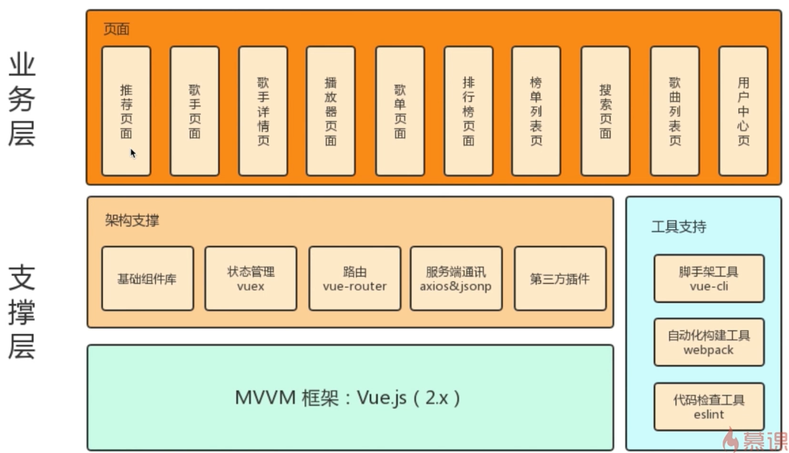
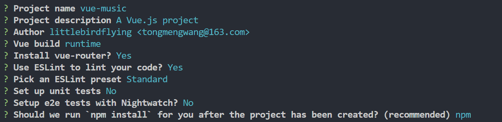

# Vue2.0开发企业级移动端音乐Web App

## 第1章 课程内容介绍

包括课程概述、课程安排、学习前提、讲授方式等方面的介绍，最后演示了整个音乐App的功能，让同学们对课程项目有一个直观的了解。

**概述**

- 做什么？移动端音乐 APP
- 功能？歌手页面、歌手详情页、播放器内核搜索页面、歌曲列表页面等
- 技术栈？vue 全家桶



13个基础组件+15个业务组件，代码量达到中度以上规模

**课程安排**

介绍、实战开发、项目优化及编译打包、回顾总结

**收获**

- 了解一个中度复杂规模的应用开发
- 掌握 vue.js 的高级应用
- 学会组件化、模块化的开发方式
- 了解类原生 App 体验交互的实现原理

## 第2章 项目准备工作

包括项目需求分析、脚手架初始化代码、项目目录介绍及图标字体、公共样式等资源的准备。

###  需求分析

### Vue-cli脚手架安装

```shell
vue init webpack vue-music
```
选择配置



### 项目目录介绍及图标字体、公共样式等资源准备

# 第 4 章

当请求数据没返回时，通过 v-if 控制组件渲染的时机，避免莫名其妙的错误

keep-alive 优化

组件销毁时，clearTimeout 利用内存释放


