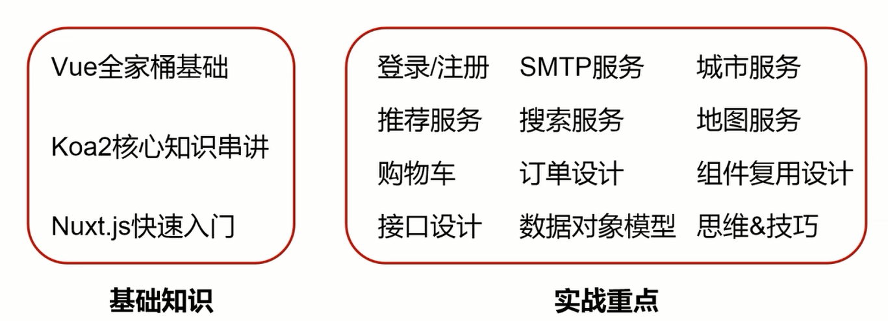
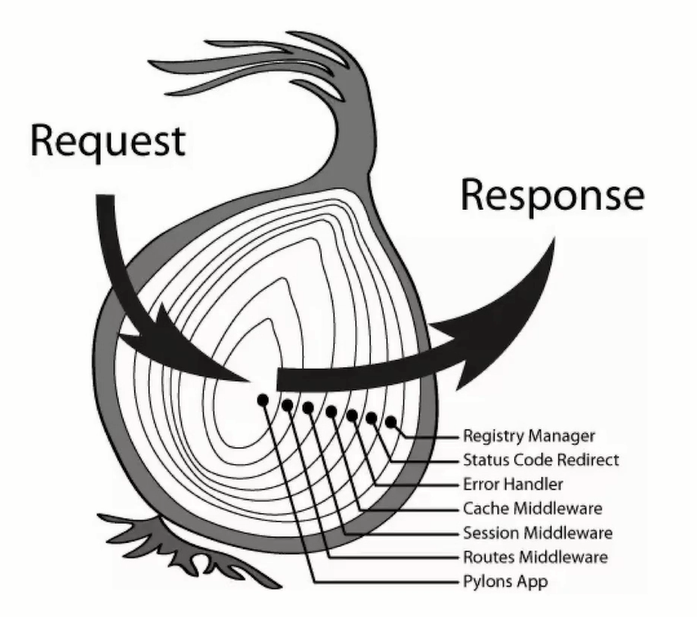
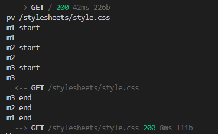

# vue美团

## 项目简介

### 业务内容

- 首页
- 登录/注册
- 产品列表
- 产品详情
- 购物车
- 订单

### 技术内容


### 主要内容



## vue基础

自定义指令应用场景：一个功能没有复杂到用组件去做，又不是一个表达式能解决的，这时候用自定义指令最合适。

## 第3章 Koa2基础知识
- koa-generator
- async和await语法
- koa2中间件
- koa2路由
- cookie和session
- mongoose基础
- redis基础

### 3-1 Koa-generator

安装

```shell
npm install -g koa-generator
```

创建项目

```shell
koa2 project
```

默认是以jade模板引擎安装的

通过 -e 设置项目模板引擎是 EJS，创建项目，根据提示运行项目，就可以在localhost:3000访问了

```shell
koa2 -e project
```

如果希望改服务端代码自启动，用 `npm run dev`启动项目，对应的dev script脚本中 配置了 nodemon

关于启动脚本

start 和 test，可以直接运行 npm start 启动，而其他脚本命令必须用 npm run ...

### 3-2 Koa异步async

- 异步的概念
- 理解async和await

async 和 await：用同步的方式解决异步的问题。

await 后跟的是 Promise，若不是 Promise 会转换成 Promise

```js
router.get('/testAsync', async (ctx) => {
  global.console.log('start', new Date().getTime()) // time1
  const a = await new Promise((resolve, reject) => {
    setTimeout(function () {
      global.console.log('async a', new Date().getTime())
      resolve('a')
    }, 1000)
  })
  // const b = Promise.resolve(123)
  const b = 123


  ctx.body = {
    a,
    b
  }
  
})
```

### 3-3 Koa中间件

- koa2中间件的原理
- 自定义koa2中间件



**自定义koa2中间件**

创建一个中间件 middleware/koa-pv.js

```js
function pv(ctx) {
    global.console.log('pv', ctx.path)
}

module.exports = function() {
    return async function(ctx, next) {
        pv(ctx)
        await next() // next() 的作用是继续执行下一个中间件
    }
}
```

并在app.js中使用这个中间件

```js
const Koa = require('koa')
const app = new Koa()
const pv = require('./middleware/koa-pv')

app.use(pv())
```

刷新浏览器，向服务器发送请求，会输出 console.log的结果，证明中间件执行了

**koa2中间件的原理**

代码的顺序从上到下，引用的顺序可以不一样，但是都会运行到。

定义三个中间件，m1 m2 m3

```js
function m1(ctx) {
    global.console.log('m1') // m2 m3
}

module.exports = function() {
    return async function(ctx, next) {
        global.console.log('m1 start') // m2 start m3 start
        m1(ctx)
        await next()
        global.console.log('m1 end') // m2 end m3 end
    }
}
```

在app.js 中使用

```js
const Koa = require('koa')
const app = new Koa()
const pv = require('./middleware/koa-pv')

app.use(pv())
app.use(m1())
app.use(m2())
app.use(m3())
...其他中间件
```

刷新页面，服务端会打印出如下内容，运行顺序符合洋葱模型，最开始的中间件运行后，最后还是可以会运行，形成一个闭环。



###  3-4 koa路由和cookie

- 路由的写法
- 接口举例
- cookie 和session的定义
- cookie和session的作用

<https://github.com/ZijianHe/koa-router>

通过 `ctx.cookies.set()` 和 `ctx.cookies.get()` 方法设置和获取cookie，访问 `/` 接口时在application的cookies选项中可以看到我们设定的cookie，当访问`/json` 接口时，返回数据中有cookie，说明读取到了。

```js
router.get('/', async (ctx, next) => {
  global.console.log('index2')
  ctx.cookies.set('pvid', Math.random())
  await ctx.render('index', {
    title: 'Hello Koa 2!'
  })
})

router.get('/string', async (ctx, next) => {
  ctx.body = 'koa2 string'
})

router.get('/json', async (ctx, next) => {
  ctx.body = {
    title: 'koa2 json',
    cookie: ctx.cookies.get('pvid')
  }
})
```

## 第4章 Mongoose和Redis基础

mongoose是mongodb的对象模型管理工具，使用mongoose可以更简单的操作mongodb数据库，通过可视化工具的robo 3t的介绍，任何数据库操作都可以直观的感受到，非常利于数据库操作的学习。redis是服务端开发必备的工具之一，通过本章的学习可以快速掌握常用redis命令以及在node中的应用。

- mongodb的概念&安装
- mongodb可视化工具RoBo 3T安装及应用
- mongoose的作用
- mongoose的应用

**mongodb的概念&安装**

mongodb是非关系型数据库。

安装 mongodb

配置mongodb环境变量，<https://www.youtube.com/watch?v=sBdaRlgb4N8&feature=youtu.be&t=120>

验证安装成功 打开git bash，which mongod，显示 mongod 所在路径，证明安装成功。

再输入 mongod，启动数据库

<https://stackoverflow.com/questions/41420466/mongodb-shuts-down-with-code-100>

**mongodb可视化工具RoBo 3T安装及应用**

### 4-1 mongoose（1）

**安装 mongoose**

```shell
npm i mongoose
```

**创建数据表**

创建 dbs/，用来创建和数据库配置相关的文件。

创建dbs/config.js，用来生命数据库的配置选项。

```json
module.exports = {
    dbs: 'mongodb://127.0.0.1:27017/dbs' // 在27017端口的mongodb服务下，新创建 dbs数据库
}
```

创建 dbs/models/person.js

创建collection数据表的描述 Schema 并和模型 model 关联，并导出

注意dbs/models/person.js，这个文件名 person 就是数据表collection的名字，文件内部是表的数据。

```js
// dbs/models/person.js
const mongoose = require('mongoose') 

let personSchema = new mongoose.Schema({
    name: String,
    age: Number
})

module.exports =  mongoose.model('Person', personSchema)
```

**和数据库连接**

```js
// app.js
const mongoose = require('mongoose')
const dbConfig = require('./dbs/config')

mongoose.connect(dbConfig.dbs, {
  useNewUrlParser: true
})
```

### 4-2 mongoose（2）

数据库中的表（colection），对应 person.js 文件。

表的描述，对应 mongoose.Schema 的实例

mongoose.model相当于表和描述之间的桥梁。 

通过模型model的实例去操作数据库。

```js
// person.js
const mongoose = require('mongoose') 

let personSchema = new mongoose.Schema({
    name: String,
    age: Number
})

module.exports =  mongoose.model('Person', personSchema)
```
这里完成了数据库的一个**写操作**。
```js
// user.js
const router = require('koa-router')()
const Person = require('../dbs/models/person')

router.prefix('/users')

router.post('/addPerson', async function(ctx) {
  const person = new Person({
    name: ctx.request.body.name,
    age: ctx.request.body.age
  })
  let code
  try {
    await person.save()
    code = 0
  } catch (e) {
    code = -1
  }

  ctx.body = {
    code: code
  }

})

module.exports = router
```

测试post接口

linux命令 curl ，-d 表示 post，数据项，请求地址

```shell
 curl -d 'name=lilei&age=27' http://localhost:3000/addPerson
```

**读数据库**

这里不考虑错误的情况

这里用的是 Person 的静态方法，没用使用模型的实例。	

```js
// user.js
const router = require('koa-router')()
const Person = require('../dbs/models/person')

router.prefix('/users')

router.post('/getPerson', async function(ctx) {
  const result = await Person.findOne({name: ctx.request.body.name}) // 找到一个
  const results = await Person.find({name: ctx.request.body.name}) // 找到多个
  ctx.body = {
    code: 0,
    result,
    results
  }
})

module.exports = router
```

测试post接口

```shell
 curl -d 'name=meimei' http://localhost:3000/getPerson
```

**更新数据库**

```js
// user.js
router.post('/updatePerson', async function(ctx) {
  const result = await Person.where({
    name: ctx.request.body.name
  }).update({
    age: ctx.request.body.age
  })
  ctx.body = {
    code: 0
  }
})
```

测试post接口

```shell
curl -d 'name=meimei&age=17' http://localhost:3000/users/updatePerson
```

**删除数据库**

真正写业务是严禁删除的

```js
// user.js
router.post('/removePerson', async function(ctx) {
  const result = await Person.where({
    name: ctx.request.body.name
  }).remove()
  ctx.body = {
    code: 0
  }
})
```

测试post接口

```shell
curl -d 'name=meimei' http://localhost:3000/users/removePerson
```

### 4-3 4-4 Redis

- redis 的概念&安装
- redis 的应用场景
- redis 的用法

**cookie 与 session 的关系**

服务端的程序如何识别客户端的状态，http是没有状态的，服务器通过session识别不同的用户，session就是用来存储用户信息的，也就是服务端用session保持用户的状态，客户端用cookie保存session,服务器端把session种植在cookie中，在下次访问时，cookie会带着session给服务端，进而达到身份认证的过程。

那么，session 存储在哪里呢？redis 是一个快速读写的存储数据库，使用简单，可以用来存放session。session也可以存放在内存当中，但当数据量庞大时，内存会不够。

**redis 的概念&安装**

<https://www.runoob.com/redis/redis-install.html>

配置好redis的环境变量

**启动redis**，`redis-server`

**连接redis**，需要两个中间件

- koa-redis，使用koa-redis连接redis
- koa-generic-session，用来处理session

安装这两个中间件

```shell
npm install koa-generic-session koa-redis
```

连接redis

```js
// app.js
const Koa = require('koa')
const app = new Koa()
const session = require('koa-generic-session')
const Redis = require('koa-redis')

app.keys = ['keys', 'keyskeys']
app.use(session({ // 配置项默认是session保存在内存中的，这里需要配置保存在redis中
  store: new Redis() 
}))


module.exports = app
```

在其中一个中间件内添加，每次经过这个中间件，session的count加1

```js
ctx.session.count++
```

刷新页面访问，在application中就可以看到存放有session的cookie了

更改cookie的key和前缀

```js
app.use(session({
  key: 'mt',   // 自定义 key
  prefix: 'mtpr', // 自定义前缀
  store: new Redis()
}))
```

**查看存储在redis中session**

命令行 `redis-cli`，打开服务

输入 `keys *`

可以看到我们之前配置过前缀是 mtpr的session


通过 get sessionkey 可以查看对应session的value值。

之前设置经过一个中间件时，session.count++，再次请求时count+2,是因为浏览器请求了两个文件，都经过了这个中间件。

