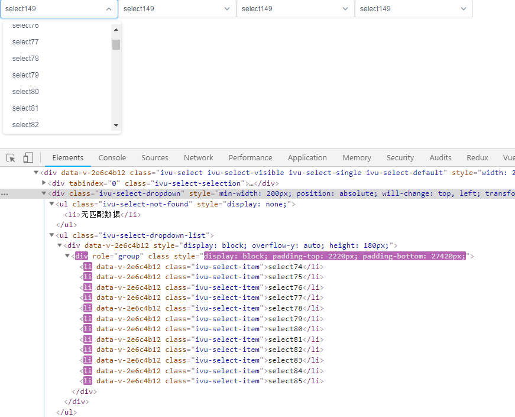

# vue性能优化

## 大数据量性能优化

- 列表优化
- 大型表单优化
- 表格优化

### 列表优化

下拉菜单、checkbox

1.下拉选择框

每一项数据都渲染了对应的dom，数据改变涉及大量dom的渲染，造成卡顿

安装包`npm i vue-virtual-scroll-list`

```vue
<template>
	<div>
		<Select v-model="selectData" style="width:200px">
			<virtual-list :size="30" :remain="6">
        <Option v-for="item in list" :value="item.value" :key="item.value">{{ item.label }}</Option>
			</virtual-list>
    </Select>
		<Select v-model="selectData" style="width:200px">
			<virtual-list :size="30" :remain="6">
        <Option v-for="item in list" :value="item.value" :key="item.value">{{ item.label }}</Option>
			</virtual-list>
    </Select>
		<Select v-model="selectData" style="width:200px">
			<virtual-list :size="30" :remain="6">
        <Option v-for="item in list" :value="item.value" :key="item.value">{{ item.label }}</Option>
			</virtual-list>
    </Select>
		<Select v-model="selectData" style="width:200px">
			<virtual-list :size="30" :remain="6">
        <Option v-for="item in list" :value="item.value" :key="item.value">{{ item.label }}</Option>
			</virtual-list>
    </Select>

	</div>
</template>

<script>
  // tools.js
  // export const doCustomTimes = (times, callback) => {
  //  let i = -1
  //  while (++i < times) {
  //    callback(i)
  //  }
  }
	import { doCustomTimes } from '@/lib/tools'
	import VirtualList from 'vue-virtual-scroll-list'
	export default {
		components: {
			VirtualList,
		},
		data() {
			return {
				list: [],
				selectData: 0
			}
		},
		mounted () {
			let list = []
			doCustomTimes(1000, (index) => {
				list.push({
					value: index,
					label: `select${index}`
				})
			})
			this.list = list
		},
	}
</script>

<style scoped>

</style>
```

组件会计算，列表全部渲染的高度，即父容器的高度。实际只渲染可视的元素，其他部分通过计算通过padding填充，这样也保证了滚动条的正确展示。

