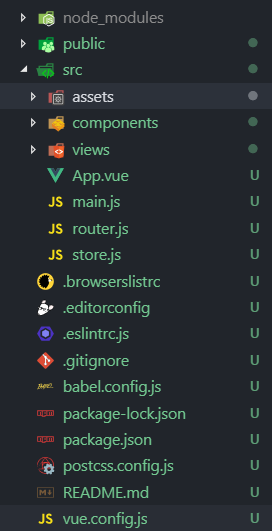
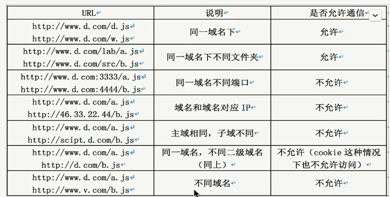
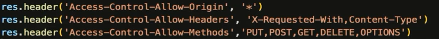

#  vue 技术栈开发实战

课程源码：https://github.com/lison16/vue-cource

## 使用 vue-cli3创建项目

- 使用 Vue UI 创建、管理项目
- 项目结构目录整理
- 初始文件添加
- 基本配置
- 跨域配置

### 使用 Vue UI 创建、管理项目

命令行打开 vue ui

```shell
vue ui
```

- 创建项目
  - 选择项目文件夹
  - 包管理器：npm
  - 下一步
- 预设
  - 选择手动
  - 下一步
- 功能
  - babel，勾选
  - vue-router，勾选
  - vuex，勾选
  - css预处理器，勾选
  - linter / formatter，勾选
  - 使用配置文件，勾选
  - 下一步
- 配置
  - 预处理器，选 less
  - linter / formatter 配置，选 eslint + standard config
  - lint on save，先关掉
  - 点击创建项目
- 是否保存预设
  - 不需要

### 项目结构目录整理



### 初始文件添加

**配置 .editorconfig**

```shell
root = true /# 使其生效 #/
[*] /# 对所有文件都有效 #/
charset = utf-8 /# 编码 utf-8 #/
indent_style = tab /# 缩进选择 tab，空格是 space #/
indent_size = 2 /# 缩进尺寸 #/

```

vscode 需要安装插件 EditorConfig for VS Code，安装后配置文件才会生效。

**添加 api 目录**

创建 /src/api/ 文件夹，作为请求文件的目录。

**整理 assets 目录**

添加 /assets/img/ 文件夹，存放图片。

添加 /assets/font/ 文件夹，存放图标字体。

**添加 config 目录**

创建 /src/config/ 文件夹，项目的配置文件，存放在 config文件夹中。

创建 /src/config/index.js 文件，并导出一个对象。

```js
export default {}
```

通过 import from '相对路径'，在其他文件中引入。

**添加 directive 目录**

创建 /src/directive/ 文件夹，用于存放自定义指令。

创建 /src/directive/index.js 文件。

**添加 lib 目录**

创建 /src/lib/ 文件夹。

创建 /lib/util.js 文件，用于存放与业务结合的工具函数。

创建 /lib/tools.js 文件，存放与业务无关的工具函数。

**添加 router 目录**

创建 /src/router/ 文件夹。

创建 /router/index.js 文件

将 router.js 移入文件夹。

拆分代码

```js
// index.js，存放路由实例，以及路由拦截等
import Vue from 'vue'
import Router from 'vue-router'
import routes from './router'

Vue.use(Router)

export default new Router({
  routes
})
// router.js，存放路由列表
import Home from './views/Home.vue'

export default [
	{
		path: '/',
		name: 'home',
		component: Home
	},
	{
		path: '/about',
		name: 'about',
		// route level code-splitting
		// this generates a separate chunk (about.[hash].js) for this route
		// which is lazy-loaded when the route is visited.
		component: () => import(/* webpackChunkName: "about" */ './views/About.vue')
	}
]
```

**添加 store 目录**

创建 /src/store/ 文件夹。将 store.js 移入文件夹。

创建根级别文件 /store/state.js 文件，/store/mutations 文件，/store/actions.js 文件。

创建模块级别文件 /store/module/user.js 文件，存放模块级别的 state、mutations、actions

将 store.js 改名为 index.js。

将各文件导入 index.js

```js
// index.js
import Vue from 'vue'
import Vuex from 'vuex'
import state from './state'
import mutations from './mutations'
import actions from './actions'
import user from './module/user'


Vue.use(Vuex)

export default new Vuex.Store({
  state,
  mutations,
	actions,
	modules: {
		user
	}
})
// module/user.js
const state = {
	//
}

const mutations = {
	//
}

const actions = {
	//
}

export default {
	state,
	mutations,
	actions
}
```

**添加 mock 目录**

创建 /src/mock/ 文件夹，用于模拟返回数据。
创建 /src/index.js 文件

安装 mockjs， `-D`作为开发依赖。

```shell
npm install mockjs -D
```
引入 mockjs
```js
import Mock from 'mockjs'

// 具体 mock 操作

export default Mock
```

**修改入口文件 main.js**

查看文件引入路径，保证路径正确。

### 基本配置与跨域配置

**配置 vue.config.js**

配置基础路径、目录别名、SourceMap、devServer 代理跨域。

```js
// vue.config.js
const path = require('path')

const resolve = dir => path.join(__dirname, dir)

const BASE_URL = process.env.NODE_ENV === 'production' ? '/iview-admin' : '/'

module.exports = {
	lintOnSave: false,
	baseUrl: BASE_URL,
	chainWebpack: config => {
		config.resolve.alias
			.set('@', resolve('src'))
			.set('_c', resolve('src/components'))
	},
	// 打包时不生成.map文件，减少体积，加快打包速度 
	productionSourceMap: false,
	devServer: {
		proxy: 'http://localhost:4000'
	}
}

```

## 路由基础篇

- router-link 和 router-view 组件
- 路由配置
  - 动态路由
  - 嵌套路由
  - 命名路由
  - 命名视图
- JS 操作路由
- 重定向和别名

### router-link 和 router-view 组件

点击 `router-link`组件，发生路由跳转，跳转路径由属性 to 决定。路由内容通过 `router-view`组件渲染到页面。

```html
<template>
  <div id="app">
    <div id="nav">
      <router-link to="/">Home</router-link> |
      <router-link to="/about">About</router-link>
    </div>
    <router-view/>
  </div>
</template>
```

### 动态路由

优点：组件复用、在同一组件处理不同逻辑

**路由列表中定义动态路由**

```js
// router.js
[
  {
		path: '/argu/:name',
		component: () => import('@/views/argu.vue')
  }
]
```
**页面组件处理不同逻辑**

当访问 /argu/动态值 时，可以根据路由参数的不同，处理不同的逻辑；相当于用同一个组件显示不同路由下的页面，实现了组件复用。

```html
<--页面组件-->
<template>
	<div>
		{{ $route.params.name }}
	</div>
</template>
```

### 嵌套路由

**路由列表中定义动态路由**

```js
// router.js
[
  {
		path: '/parent',
		component: () => import('@/views/parent.vue'),
		children: [
			{
				path: 'child',
				component: () => import('@/views/child.vue')
			}
		]
	}
]
```

**父级组件中使用 `<router-view />`**

```html
<template>
	<div>
		parent
		<router-view /> <--子组件在此显示-->
	</div>
</template>
<script>
```

当访问路径 /parent/child 时，就会显示 parent.vue 和 child.vue 结合的内容了。

### 命名路由

**路由列表中给路由项添加 name 属性**

```js
[{
		path: '/',
		name: 'home',
		component: Home
	},
	{
		path: '/about',
		name: 'about',
		component: () => import(/* webpackChunkName: "about" */ '@/views/About.vue')
	}]
```

**`<router-link>的 to 属性中使用 name 属性跳转`**

```html
<--正常情况-->
<router-link to="/">Home</router-link> |
<router-link to="/about">About</router-link>
<--使用命名路由时-->
<router-link :to="{ name: 'home' }">Home</router-link> |
<router-link :to="{ name: 'about' }">About</router-link>
```

### 命名视图

在一个页面显示多个视图(由`<router-view>`渲染出来的视图)。

**在页面组件中添加多个带名字的`<router-view>`**

```html
<-- 页面组件 -->
<template>
  <div id="app">
    <router-view />
      <router-view />
      <router-view name='email' />
      <router-view name='tel' />
  </div>
</template>
```

**路由列表中配置具有多个命名视图的路由**

```js
// router.js
[
    {
		path: '/named_view',
		components: {
			default: () => import('@/views/child.vue'),
			email: () => import('@/views/email.vue'),
			tel: () => import('@/views/tel.vue')
		}
	}
]
```


> 注意，components 需要加 s。

### 重定向

**路由列表中通过 redirect 重定向**

当访问 /main 路由时，重定向到首页。

```js
// router.js
// 1. 给 redirect 传入一个字符串路由
[
    {
		path: '/main',
		redirect: '/'
	}
]
// 2. 给 redirect 传入一个对象，通过 name 来重定向到响应名字的路由
[
    {
        {
		path: '/main',
		redirect: {
			name: 'home'
		}
	}
    }
]
// 3. 给 redirect 传入一个函数，根据 to对象 中的参数，灵活的重定向
[
    {
		path: '/main',
		redirect: to => { name: 'home' }
	}
]
```

### 别名

当访问路由别名时，就相当于访问这个路由。

**路由列表中通过 alias 给路由设置别名**

当我们访问 /home_page 时，显示的也是 home 页面。

```js
// router.js
[
    {
		path: '/',
		alias: '/home_page',
		name: 'home',
		component: Home
	},
]
```

### 编程式导航

通过 JS 来控制路由的跳转和返回。

通过 `$router` 实施路由跳转，`$router` 是在 new Vue({ router }) 注册的。

**回退 1**

`this.$router.go(-1)`

`this.$router.back()`

**向前 1**

`this.$router.go(1)`

**跳转指定路由**

`this.$router.push('/parent')`，push 传入路由字符串

`this.$router.push({ name: 'parent'})`，通过命名路由跳转

**替换到指定路由**

`this.$router.push({ name: 'parent'})`

**replace 和 push 的区别**

- push 跳转路由，会添加到路由跳转记录中。
- replace 是替换路由，也就是把当前路由的跳转记录替换掉。

**跳转路由传参的 3 种写法**

1.name 和 query 

查询参数传参，跳转后`http://localhost:8080/#/parent?name=lison`

```js
this.$router.push({
    name: 'parent',
    query: {
        name: 'lison'
    }
})
```

2.name 和 params

动态路由传参，跳转后 `http://localhost:8080/#/argu/lison`

```js
this.$router.push({
    name: 'argu',
    params: {
        name: 'lison'
    }
})
```

3.path

动态路由传参，结合模板字符串的写法，跳转后 `http://localhost:8080/#/argu/lison`

```js
const name = 'lison'
this.$router.push({
    path: `/argu/${name}`
})
```

> 注意，path 不能喝 params一起使用，无效。

## 路由进阶篇

- 路由组件传参
- HTML5 History 模式
- 导航守卫
- 路由元信息
- 过渡效果

### 路由组件传参

通过 `$route`接收参数，使页面组件和路由高度耦合。可以通过路由组件传参来解决，路由组件传参有 3 种模式。

**1.布尔模式**

路由列表中设置路由 props 为 true

```js
// router.js
[
    {
		path: '/argu/:name',
		name: 'argu',
		component: () => import('@/views/argu.vue'),
		props: true
	}
]
```

组件内通过 props 接收参数

```html
<--组件-->
<template>
	<div>{{ name }}</div>
</template>
<script>
export default {
	props: {
		name: {
			type:String,
			default: 'lison'
		}
	}
}
</script>
```

**2.对象模式**

路由列表中设置路由 props 为一个对象，不同路由可以设置传入不同参数

```js
// router.js
[
    {
		path: '/about',
		name: 'about',
		component: () => import('@/views/About.vue'),
		props: {
			food: 'banana'
		}
	}
]
```

组件内通过 props 接收参数，同上

**3.函数模式**

路由列表中设置路由 props 为一个函数，通过函数参数 route对象拿到参数值

```js
// router.js
[
    {
		path: '/',
		alias: '/home_page',
		name: 'home',
		component: Home,
		props: route => ({
			food: route.query.food
		})
	}
]
```

组件内通过 props 接收参数，同上

### HTML5 History 模式

router 构造函数除了传入路由列表还可以传入 mode 选项

history 模式是利用浏览器 history api 做页面无刷新跳转。但需要后端配合。

当 url 匹配不到静态资源时，默认显示 index.html

当 url 匹配不到静态资源并且前端路由也匹配不到组件的话，就会有问题，所以需要统一显示404页面。

**在路由列表的末尾添加404页面路由**

注意一定要在末尾，因为路由优先级前面的高。`path: '*'`表示匹配任意路由，当前面路由都匹配不到时，匹配404页面。

```js
// router.js 
[
    {
		path: '*',
		component: () => import('@/views/error_404.vue')
	}
]
```

### 导航守卫

路由发生跳转到导航结束期间，做一些相应的逻辑处理；如跳转到某个页面时，判断用户是否登录，若没登录就跳转到登录页面；如权限控制，若页面用户没有权限，做一些相应的处理。

**全局守卫**

在 router 实例上进行全局守卫设置

1.全局前置守卫

通过全局前置守卫`beforeEach`处理用户是否登录。逻辑如下：

- 若跳转页面不是登录页
  - 已登录就跳转
  - 否则跳转到登录页
- 若跳转页面时登录页
  - 已登录就跳转到首页
  - 否则跳转到登录页

```js
const HAS_LOGINED = true
// to from 都是路由对象，to 跳转后页面的路由对象，from，跳转前的路由对象，next 函数控制页面跳转。
router.beforeEach((to, from, next) => {
	if (to.name !== 'login') {
		if (HAS_LOGINED) next()
		else next({ name: 'login'})
	} else {
		if (HAS_LOGINED) next({ name: 'home'})
		else next()
	}
})
```

2.全局后置钩子

也为页面已发生跳转，所以不能叫守卫。

可以用来关闭 login 动画。

```js
router.afterEach((to, from) => {
	// logining = false
})
```

3.全局解析守卫

`router.beforeResolve` 注册一个全局守卫。这和 `router.beforeEach` 类似，区别是在导航被确认之前，**同时在所有组件内守卫和异步路由组件被解析之后**，解析守卫就被调用。

```js
// router.beforeResolve
```

4.路由独享的守卫

在路由配置上直接定义 `beforeEnter` 守卫：

```js
const router = new VueRouter({
  routes: [
    {
      path: '/foo',
      component: Foo,
      beforeEnter: (to, from, next) => {
        // ...
        next() // 注意，一定要调用 next 不然无法跳转
      }
    }
  ]
})
```

5.组件内的守卫

- `beforeRouteEnter`
- `beforeRouteUpdate`
- `beforeRouteLeave`

```js
// 页面路由组件中
beforeRouteEnter (to, from, next) {
    // this，虽然进入了组件内钩子，但此时页面还没有渲染，所以没有 this
    next(vm => {
        // 如果要使用组件实例，可以在 next 中使用
        // console.log(vm)
    })
},
beforeRouteLeave (to, from, next) {
    // 例如，用户一个页面编辑，突然点击跳转页面，这时需要提醒用户还未保存编辑
    // 组件已经渲染好了，可以使用 this
    const leave = confirm('您确认要离开吗？')
    if (leave) next()
    else next(false)
},
beforeRouteUpdate (to, from ,next) {
    // 路由发生变化，组件被复用时调用
    // 由于组件已经渲染过了，所以可以使用 this
    console.log(to.name, from.name)
},
```

6.完整的导航流程

1. 导航被触发
2. 在失活的组件 (即将离开的页面组件) 里调用离开守卫 beforeRouteLeave
3. 调用全局的前置守卫 beforeEach
4. 在重用的组件里调用 beforeRouteUpdate
5. 调用路由独享的守卫 beforeEnter
6. 解析异步路由组件
7. 在被激活的组件 (即将进入的页面组件) 里调用 beforeRouteEnter
8. 调用全局的解析守卫 beforeResolve
9. 导航被确认
10. 调用全局的后置守卫 afterEach
11. 触发 DOM 更新
12. 用创建好的实例调用 beforeRouterEnter 守卫里传给 next 的回调函数

### 路由元信息

在路由列表中，每个路由对象可以配置一个 meta 字段，存放自定义的信息。

例如页面权限，之后在路由前置路由中做处理。

demo: 动态设置路由页面的 title 值

```js
// 1. 在路由列表的路由对象中，配置 meta 字段，添加 title 值
//  router.js
[
    {
		path: '/about',
		name: 'about',
		component: () => import('@/views/About.vue'),
		meta: {
			title: '关于'
		}
	},
]
// 2. 在全局前置守卫处理
//  /router/index.js
import { setTitle } from '@/lib/util'
router.beforeEach((to, from, next) => {
	to.meta && setTitle(to.meta.title)
})

//  util.js 和业务有关的工具函数
export const setTitle = (title) => {
	window.document.title = title || 'admin'
}
```

### 路由切换动效

包住多个组件用 `<transition-group>`，单个组件用`<transition>`

为  `<transition-group>` 中的每一个组件设置一个 key，给`<transition-group>`设置一个 name，通过类名的方式设置，路由切换时，组件的隐藏和显示。

```html
<-- App.vue 根组件中 --> 
<template>
  <div id="app">
      <transition-group name='router'>
          <router-view key='default' />
          <router-view key='email' name='email' />
          <router-view key='tel' name='tel' />
      </transition-group>
  </div>
</template>

<style lang="less">
// 页面进入
//   进入路由前
.router-enter {
	opacity: 0;
}
//   路由页面从无到有的过程
.router-enter-active {
	transition: opacity 1s ease;
}
//   路由页面完全显示时
.router-enter-to {
	opacity: 1;
}
// 页面注销/离开
//   离开路由前
.router-leave {
	opacity: 1;
}
//   路由页面从有到无的过程
.router-leave-active {
	transition: opacity 1s ease;
}
//   路由页面完全消失时
.router-leave-to {
	opacity: 0;
}
</style>

```

若为某个页面设置特定的路由切换过渡效果，可以动态设置`<transtion-group>`的 name 属性。我们可以在访问特定路由时传递一个参数，比如通过 query 传一个参数，通过监听 `$route` 变化拿到参数，并根据参数设置特定路由页面的过渡效果。当路由切换携带对应参数时`http://localhost:8080/#/about?transitionName=router`，页面就可以显示指定过渡效果了。

```html
<template>
  <div id="app">
		<transition-group :name='routerTransition'>
		</transition-group>
  </div>
</template>
<script>
export default {
	data () {
		return {
			routerTransition: ''
		}
	},
	watch: {
		'$route' (to) {
			to.query && to.query.transitionName && (this.routerTransition = to.query.transitionName)
		}
	}
}
</script>
```

## 状态管理-bus 的使用

自己封装的组件最好有一个统一的前缀

**创建 bus**

new 一个 Vue 实例 作为 bus

```js
// bus.js
import Vue from 'vue'
const Bus = new Vue()
export default Bus
```

**将 bus 挂载到 Vue.prototype 上**

将 bus 实例挂在到 Vue.prototype 上，方便在各组件中调用

```js
// main.js
import Bus from './lib/bus'

Vue.prototype.$bus = Bus

new Vue({
  //
}).$mount('#app')
```

**在兄弟组件中使用 bus 通信**

在 email.vue 组件中，通过 `this.$bus.$emit()`出发自定义事件，并携带数据。

```html
<-- email.vue --> 
<template>
	<div class="email">
		<button @click="handleClick">按我</button>
	</div>
</template>
<script>
export default {
	methods: {
		handleClick () {
			this.$bus.$emit('on-click', 'hello')
		}
	}
}
</script>
```

在兄弟组件 tel.vue 中，通过 `this.$bus.$on`监听事件，获取传入的数据。

```html
<-- tel.vue -->
<template>
  <div class="tel">
		<p>{{message}}</p>
  </div>
</template>
<script>
export default {
	data () {
		return {
			message: ''
		}
	},
	mounted () {
		this.$bus.$on('on-click', mes => {
			this.message = mes
		})
	}
}
</script>
```

## 状态管理-Vuex-基础

使用 vuex 的状态流程


### state

**定义根级别 state 数据**

```js
// state.js
const state = {
	appName: 'admin'
}
export default state
```

**在组件 computed 中获取 state 数据**

1.通过`this.$store.state`获取状态

```html
<-- store.vue -->
<template>
	<div>
		<p>appName: {{ appName }}</p>
	</div>
</template>
<script>
    export default {
       data () {
		return {
			inputValue: ''
		}
        },
        computed: {
            appName () {
                return this.$store.state.appName
            }    
        } 
    }
    
</script>
```

如果是模块中的 state，需要在 state 后面加上模块名

```js
// 获取 user 模块中的状态
computed: {
    appName () {
    	return this.$store.state.user.userName
    }
}
```

2. 通过 `mapState`方法获取状态

2.1 获取根级别 state，mapState传入数组

...在这里用作展开操作符，展开一个对象，mapState 会返回一个对象，对象中包含属性，... 将对象中的属性扁平化处理。

```js
import { mapState } from 'vuex'
<script>
    export default {
        computed: {
						...mapState(['appName'])
        }
	}
</script>
```

2.2 获取根级别 state，mapState传入对象

```js
import { mapState } from 'vuex'	
<script>
  export default {
    computed: {
      ...mapState({
        appName: state => state.appName
      })
    }
	}
</script>
```

2.3 获取模块中的 state，mapState 传入数组

```js
computed: {
  ...mapState(['appName'])
}
```

2.3 获取模块中的 state，mpaState 只传入对象

```js
import { mapState } from 'vuex'	
<script>
  export default {
    computed: {
      ...mapState({
        userName: state => state.user.userName // 导入模块的状态
      })
    }
	}
</script>
```

2.4 获取模块中的 state，设置命名空间后，mapState 结合 createNamespacedHelpers 

给 user 模块设置命名空间

```js
// user.js
export default {
	// 模块使用命名空间，会让模块更加密闭，不会收到污染
	namespaced: true,
	state,
	getters,
	mutations,
	actions
}
```

获取 user 模块的 state 数据。

通过给 createNamespacedHelpers 函数传入 参数 'user'，在 mapState 中可以直接通过 state 获取状态名。

```js
import { createNamespacedHelpers } from 'vuex'
const { mapState } = createNamespacedHelpers('user')	
<script>
  export default {
    computed: {
      ...mapState({
        userName: state => state.userName
      })
    }
	}
</script>

```

2.5 获取模块中的 state，设置命名空间后，mapState 传入模块名

也可以给 mapState 传入模块名参数，这样也可以通过 state 获取数据。

```js
import { mapState } from 'vuex'	
<script>
  export default {
    computed: {
      ...mapState('user', { // 传入 模块名参数
        userName: state => state.userName
      })
    }
	}
</script>
```

### getters

与 state 用法一致。

### mutations

state 中的值不能直接赋值修改，需通过 mutations 中的方法来修改 state。在 mutations.js 中定义方法，并在Vuex.Store 实例中注入。

1.直接使用 commit 方法，传参是一个值

```js
// 组件中
methods: {
  handleChangeAppName () {
    this.$store.commit('SET_APP_NAME', 'newAppName')
  }
}
// 根级别 mutations.js 
import vue from'vue'
const mutations = {
	SET_APP_NAME (state, params) {
		state.appName = params
	}
}
export default mutations
```

2.直接使用 commit 方法，传参是一个对象

```js
// 组件中
methods: {
  handleChangeAppName () {
    this.$store.commit('SET_APP_NAME', {
      appName: 'newAppName'
    })
  }
}
// 根级别 mutations.js 
import vue from'vue'
const mutations = {
	SET_APP_NAME (state, params) {
		state.appName = params.appName
	}
}
export default mutations
```

3.直接使用 commit 方法，对象的写法

```js
// 组件中
methods: {
  handleChangeAppName () {
    this.$store.commit({
			type: 'SET_APP_NAME',
			appName: 'newAppName'
		})
  }
}
// 根级别 mutations.js 
import vue from'vue'
const mutations = {
	SET_APP_NAME (state, params) {
		state.appName = params.appName
	}
}
export default mutations
```

4.使用 mapMutations 辅助函数

```js
// 组件中
import { mapMutations } from 'vuex'
export default {
  methods: {
    ...mapMutations([
			'SET_APP_NAME'
		]),
    handleChangeAppName () {
    	// this.SET_APP_NAME('newAppName') // 1. 参数为一个值
    	this.SET_APP_NAME({ appName: 'newAppName' }) // 2. 参数为一个对象
 		}
  }
}
// 根级别 mutations.js 
import vue from'vue'
const mutations = {
	SET_APP_NAME (state, params) {
		// state.appName = params // 1. 参数为一个值
    state.appName = params.appName // 2. 参数为一个对象
	}
}
export default mutations
```

5.使用模块中的 mutations 方法

不使用命名空间时，使用模块中的 mutations 和根级别中的 mutations 用法相同。

若使用命名空间，需要传入模块名

```js
// 组件中
import { mapMutations } from 'vuex'
export defualt {
  methods: {
    // ...mapMutations([ // 1. 不使用命名空间
		// 	'SET_USER_NAME'
		// ]),
    ...mapMutations('user', [ // 2. 使用命名空间
			'SET_USER_NAME',
		]),
    changeUserName () {
			this.SET_USER_NAME('vue-course')
		}
  }
}
  
// user.js 模块
const mutations = {
	SET_USER_NAME (state, params) {
		state.userName = params
	}
}
export default {
	// namespaced: true, 1. 不使用命名空间
  namespaced: true, // 2. 使用命名空间
	state,
	getters,
	mutations,
	actions
}
```

6.通过 mutations修改 state 中 没有的值

通过 vue 的 set 方法来进行响应式的修改。

```js
// 组件中
import { mapMutations } from 'vuex'
export defualt {
  methods: {
    setAppVersion () {
      this.$store.commit('SET_APP_VERSION')
    }
  }
}

// 根级别 mutations.js 
import vue from'vue'
const mutations = {
	SET_APP_VERSION (state) {
		vue.set(state, 'appVersion', 'v2.0')
	}
}
export default mutations
```

### actions

定义好 actions

```js
// 根级别 actions.js
import { getAppName } from '@/api/app'

const actions = {
	// updateAppName ({ commit }) {
	// 	getAppName().then(res => {
	// 		const { info: { appName } } = res
	// 		commit('SET_APP_NAME', appName)
	// 	}).catch(err => {
	// 		console.log(err)
	// 	})
	// }
	async updateAppName ({ commit }) { // 使用 async await 处理异步请求
		try {
			const {info: { appName }} = await getAppName()
			commit('SET_APP_NAME', appName)
		} catch (err) {
			console.log(err)
		}
	}
}
export default actions
// /api/app.js
export const getAppName = () => {
	return new Promise((resolve, reject) => {
		const err = null
		setTimeout(() => {
			if(!err) resolve({ code: 200, info: { appName: 'newAppName' } })
			else reject(err)
		})
	})
}
```

1.通过辅助函数 mapActions

```js
// 组件中
import { mapActions } from 'vuex'
export default {
  methods: {
    ...mapActions([
			'updateAppName'
		]),
    handleChangeAppName () {
			this.updateAppName()
		},
  }
}
```

2.通过 dispatch 方法

```js
// 组件内
methods: {
  handleChangeAppName () {
    this.$store.dispatch('updateAppName')
  }
}
```

模块中的 actions

```js
// user.js
const actions = {
	updateUserName ({ commit, state, rootState, dispatch}) {

	}
}

export default {
	state,
	getters,
	mutations,
	actions
}
```

### module

动态注册模块 给模块添加模块

```js
// 组件内
computed: {
		...mapState('user', {
      todoList: state => state.todo ? state.todo.todoList: [] // 1. 动态注册模块
      // todoList: state => state.user.todo ? state.user.todo.todoList: [] // 2. 给模块添加模块
		})
},
methods: {
  registerModule () {
    this.$store.registerModule('todo', { // 1. 动态注册模块
    // this.$store.registerModule(['user', 'todo'], { // 2. 给模块添加模块
      state: {
        todoList: ['学习1', '学习2']
      }
    })
  }
}
```

## 状态管理-Vuex-进阶

- 插件
- 严格模式
- vuex+双向绑定

### 插件

定义一个持久化存储的插件 

**定义一个插件**

```js
// /store/plugin/saveInLocal.js

// 函数会在 store 实例初始化时调用
export default store => {
	if (localStorage.state) store.replaceState(JSON.parse(localStorage.state))
	store.subscribe((mutations, state) => {
		// 每次提交 mutation 时，都会调用此回调函数
		localStorage.state = JSON.stringify(state)
	})
}
```

**在 store 实例中注册插件**

```js
// /store.index.js

import saveInLocal from './plugin/saveInLocal'

Vue.use(Vuex)

export default new Vuex.Store({
	plugins: [ saveInLocal ]
})
```

### 严格模式

当 strict 为 true 时，为严格模式，严格模式下不能通过直接赋值的形式修改 state，只能通过 commit 的方式修改。

我们通过环境变量动态设置 strict 的值，开发环境下使用严格模式，生产环境下不使用。

```js
// /store.index.js
export default new Vuex.Store({
	strict: process.env.NODE_ENV === 'development',
})
```

### vuex+双向绑定

非 v-model 形式，通过 state 传入 value，通过 mutations 修改值。

```js
<--自定义组件 AInput.vue-->
<template>
	<input @input="handleInput" :value="value" />
</template>
<script>
export default {
	name: 'AInput',
	props: {
		value: {
			type: [String, Number],
			default: ''
		}
	},
	methods: {
		handleInput (event) {
			const value = event.target.value
			this.$emit('input', value)
		}
	}
}
</script>

```

```html
<--组件内-->
<template>
  <a-input :value="stateValue" @input="hanldeStateValueChange" />
  <p>{{ stateValue }}</p>
</template>
<script>
  import { mapState, mapMutations } from 'vuex'
  export default {
    computed: {
      ...mapState({
      	stateValue: state => state.stateValue
    }),
    methods: {
      ...mapMutations([
        'SET_STATE_VALUE'
      ]),
      hanldeStateValueChange (val) {
        this.SET_STATE_VALUE(val)
      }
    }
  }  
</script>
```

```js
// 根级别 mutations.js
import vue from'vue'

const mutations = {
	SET_STATE_VALUE (state, value) {
		state.stateValue = value
	}
}
export default mutations
// 根级别 state.js
const state = {
	stateValue: 'abc'
}
export default state
```

v-model 形式

设置计算属性的 get 和 set 方法。

```js
<--组件内-->
<template>
  <a-input v-model="stateValue" />
  <p>{{ stateValue }}</p>
</template>
<script>
  import { mapMutations } from 'vuex'
  export default {
    computed: {
      stateValue: {
        get () {
          return this.$store.state.stateValue
        },
        set (val) {
          this.SET_STATE_VALUE(val)
        }
      },
    },
    methods: {
      ...mapMutations([
        'SET_STATE_VALUE'
      ]),
      hanldeStateValueChange (val) {
        this.SET_STATE_VALUE(val)
      }
    }
  }  
</script>
```

## Ajax 请求实战

- 解决跨域问题
- 封装 axios
  - 请求拦截
  - 响应拦截
- 请求实战

### 解决跨域问题

1. 设置代理
2. 在服务端设置一些 header 头




**设置代理**

通过设置代理，设置到同一域名下，从而避免跨域。

```js
// vue.config.js
module.exports = {
	devServer: {
		proxy: 'http://localhost:4000' // 服务端 url
	}
}
```

**在服务端设置 header 头**



### 封装 axios

以类的形式来封装

**配置基础url**

在 /config/index.js 中配置基础请求 url。

```js
// 若设置了代理，这里的开发环境域名可以设为 '', 若没设置代理要写服务端 url
export const baseURL = process.env.NODE_ENV == 'production' ? 'http://production.com' : 'http://localhost: 3000'
```

**以类的形式封装 axios，并设置拦截器**

以类的形式封装 axios

- 设置公共配置
- 添加请求和响应拦截器，在拦截器中做可复用的处理，如请求 loading
  - 通过队列处理多请求的 loading 状态

```js
// /lib/axios.js
import axios from 'axios'
import { baseURL } from '@/config'
class HttpRequest {
  constructor (baseUrl = baseURL) {
    this.baseUrl = baseUrl
    this.queue = {}
  }
  getInsideConfig () {
    const config = {
      baseURL: this.baseUrl,
      headers: {
        //
      }
    }
    return config
  }
  distroy (url) {
    delete this.queue[url]
    if (!Object.keys(this.queue).length) {
      // Spin.hide()
    }
  }
  interceptors (instance, url) {
    instance.interceptors.request.use(config => {
      // 添加全局的loading...
      if (!Object.keys(this.queue).length) {
        // Spin.show()
      }
      this.queue[url] = true
      return config
    }, error => {
      return Promise.reject(error)
    })
    instance.interceptors.response.use(res => {
      this.distroy(url)
      const { data, status } = res
      return { data, status }
    }, error => {
      this.distroy(url)
      return Promise.reject(error)
    })
  }
  request (options) {
    const instance = axios.create()
    options = Object.assign(this.getInsideConfig(), options)
    this.interceptors(instance, options.url)
    return instance(options)
  }
}
export default HttpRequest
```

**生成封装的 axios 实例**

```js
// /api/index.js
import HttpRequest from '@/lib/axios'

const axios = new HttpRequest()
export default axios
```

**在具体请求模块中使用封装的 axios 实例书写具体接口请求函数**

```js
// /api/user.js
import axios from './index'

export const getUserInfo = ({ userId }) => {
	return axios.request({
		url: '/getUserInfo',
		method: 'post',
		data: {
			userId
		}
	})
}
```

**在组件中使用接口请求函数**

```js
// 组件中
<script>
  import { getUserInfo } from '@/api/user'
export default {
  methods: {
    getInfo () {
			getUserInfo({ userId: 21 }).then(res => {
				console.log(res)
			})
		}
  }
}
</script>
```

## 使用 Mock 模拟 Ajax 请求

- 响应模拟
- Mock用法精讲

### 响应模拟

**在入口文件引入 mock 代码**

在入口文件引入 mock 代码，并根据环境只在非生产环境下引入。

```js
// main.js
if (process.env.NODE_ENV !== 'production') require('./mock')
```

**响应模拟**

```js
// /mock/index.js
import Mock from 'mockjs'
import { getUserInfo } from './response/user'

Mock.mock('http://localhost:3000/getUserInfo', getUserInfo)

export default Mock

// /mock/response/user.js
export const getUserInfo = options => {
	return {
		name: 'lison'
	}
}
```

### Mock用法精讲

[mockjs笔记](https://github.com/littlebirdflying/front-end-practice/blob/master/vue.js/vue%E6%8A%80%E6%9C%AF%E6%A0%88%E5%BC%80%E5%8F%91/vue-course/src/mock/mock.doc.md)

## Vue中的第三方JS库的使用

从数字渐变组件谈第三方JS库的使用

- 组件封装基础
- 组件中使用Id值
- 组件中获取DOM

### 组件封装基础

数字动画库：https://inorganik.github.io/countUp.js/

把这个数字动画库封装成一个 vue 组件。

**安装 countup 库**

```shell
npm install countup
```

**新建自定义组件**

新建 /components/count-to/ 文件夹，并在其中创建 index.js 和 count-to.vue 文件。

index.js 的作用是我们在引用组件时可以简写 `import CountTo from '_c/count-to'`, vue 会自动找 count-to 文件夹中的 index.js，由于在 index.js 引入了组件，所以相等于引入了组件，达到了简写的目的。

```js
import CountTo from './count-to.vue'
export default CountTo
```

在组件中引入 js 库，并命名。

```html
<--/components/count-to.vue-->
<template>
  <div></div>
</template>
<script>
  import CountUp from 'countup'
  export defualt {
    name: 'CountTo'
  }
</script>
```

**新建页面**	

新建页面，引入 count-to 组件。

```html
<-- /views/count-to.vue-->
<template>
	<div>
  	<count-to></count-to>
  </div>
</template>
<script>
  import CountTo from '_c/count-to'
  export default {
    name: 'count_to',
    components: {
      CountTo
    }
  }
</script>
```

**新建路由**

配置页面路由。

```js
// router.js
[
  {
		path: '/count-to',
		name: 'count_to',
		component: () => import('@/views/count-to.vue')
	},
]
```

**使用唯一 id 值**

this._uid全局自增唯一的

mounted阶段，dom挂在完成，但渲染不一定完成，所以要在渲染完成需要使用 $nextTick。

```js
<--/components/count-to.vue-->
<template>
  <div>
  	<span :id="eleId"></span>
  </div>
</template>
<script>
  import CountUp from 'countup'
  export defualt {
    name: 'CountTo',
      computed: {
        eleId () {
          return `count_up_${this._uid}`
        }
      },
    mounted () {
      this.$nextTick(() => {
        const counter = new CountUp(this.eleId)
      })	
    }
  }
</script>
```

**封装组件**

- 根据传参确定 props，确定必传参数和可选参数。

- 也可以根据需求，自己创建 props，结合库的方法来用，例如，设置动画延迟时间。
- 组件样式
  - 外层样式可以直接设置 class 类名实现。
  - 组件内部样式标签样式，通过 props 传入，绑定 class 的方式实现。
- 给组件添加自定义内容
  - 单个使用 slot，多个使用 具有 slot

实现一个基础的组件。

```html
<--/components/count-to.vue-->
<template>
	<div>
		<slot name="left"></slot><span :class="countClass" :id="eleId"></span><slot name="right"></slot>
	</div>
</template>
<script>
import CountUp from 'countup'
// import CountUp from 'countup.js'
export default {
	name: 'CountTo',
	data () {
		return {
			counter: {}
		}
	},
	computed: {
		eleId () {
			return `count_up_${this._uid}`
		},
		countClass () {
			return [
				'count-to-number', // 默认内部标签 class
				this.className // 外部传入的 内部标签 class
			]
		}
	},
	props: {
		/**
		 * @description 起始值
		 */
		startVal: {
			type: Number,
			default: 0
		},
		/**
		 * @description 最终值
		 */
		endVal: {
			type: Number,
			required: true // 必填值
		},
		/**
		 * @description 小数点后保留几位小数
		 */
		decimals: {
			type: Number,
			default: 0
		},
		/**
		 * @description 动画延迟开始时间
		 */
		delay: {
			type: Number,
			default: 0
		},
		/**
		 * @description 渐变时长
		 */
		duration: {
			type: Number,
			default: 1
		},
		/**
		 * @description 是否使用变速效果
		 */
		useEasing: {
			type: Boolean,
			default: false
		},
		/**
		 * @description 数字是否分组
		 */
		useGrouping: {
			type: Boolean,
			default: true
		},
		/**
		 * @description 分组符号
		 */
		separator: {
			type: String,
			default: ','
		},
		/**
		 * @description 整数和小数分割符号
		 */
		decimal: {
			type: String,
			default: '.'
		},
		className: {
			type: String,
			default: ''
		}

	},
	
	mounted () {
		this.$nextTick(() => {
			this.counter = new CountUp(this.eleId, this.startVal, this.endVal, this.decimals,this.duration, {
				useEasing: this.useEasing,
				useGrouping: this.useGrouping,
				separator: this.separator,
				decimal: this.decimal
			})
			setTimeout(() => {
				this.counter.start()
			}, this.delay)
		})
	}
}
</script>
```

在页面中使用。

```js
<template>
	<div>
		<count-to :end-val="100">
			<span slot="left">总金额：</span>
			<span slot="right">元</span>
		</count-to>
	</div>
</template>
<script>
import CountTo from '_c/count-to'
export default {
	name: 'count_to',
	components: {
		CountTo
	}
}
</script>
```

### 组件中获取DOM

父组件调用子组件内部方法

- 先获取dom，可以通过 id 或者 ref，ref 用在组件上获取的就是组件实例，用在原生 html 标签上获取的就是dom。
- 在父组件中，通过 ref 获取组件实例中的方法，再通过 ref 获取到具体 dom 的信息。

```html
<--父组件-->
<template>
	<div>
		<count-to ref="countTo" :end-val="100">
		</count-to>
		<button @click="getNumber">获取数值</button>
	</div>
</template>
<script>
import CountTo from '_c/count-to'
export default {
	name: 'count_to',
	components: {
		CountTo
	},
	methods: {
		getNumber () {
			this.$refs.countTo.getCount()
		}
	}
}
</script>
```

```html
<--子组件-->
<template>
	<div>
		<slot name="left"></slot><span ref="number" :class="countClass" :id="eleId"></span><slot name="right"></slot>
	</div>
</template>
<script>
import CountUp from 'countup'
// import CountUp from 'countup.js'
export default {
	methods: {
		getCount () {
			console.log(this.$refs.number.innerText)
		}
	}
}
</script>
```

更新值，利用 watch 监听值得变化，并调用js库更新 api

添加事件，动画更新后事件

设置初始样式，用到 style

引入 less 文件

- import
- 在 style 标签中直接写样式
- 在 style 标签中通过 @import 引入


设置组件默认样式

​	定义组件样式的三种方式

​		Import @import  直接写

给组件传值，传值类型，默认值（基本类型和引用类型），必须

组件的id值

ref 和 slot 的使用

如果 props 传入的是引用类型，需要通过函数的形式返回默认值

```js

 delay: {
  type: Array,
  default: () =>{
    return []
  }
}
```

## 从 SplitPane组件谈Vue中如何“操作”DOM

- 简单两列布局
- 如何让两个 div 改变宽度
- 鼠标拖动效果
- v-model 和 .sync 的用法

## 递归组件的使用

- 封装简单的 Menu 组件
- 递归组件

