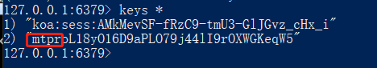
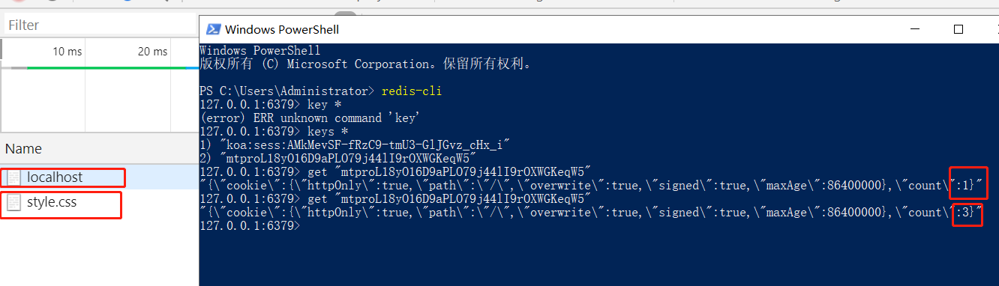
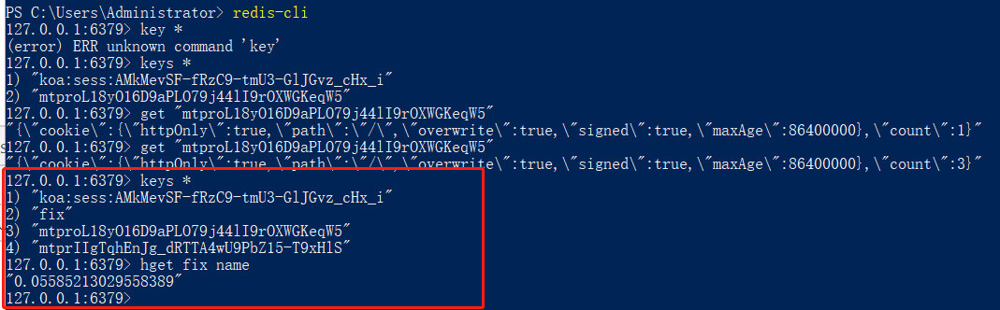
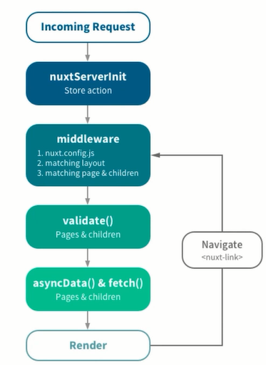
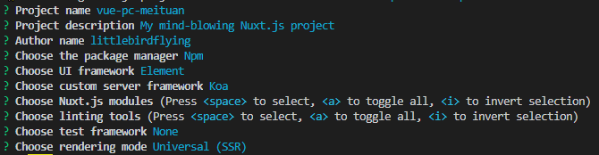
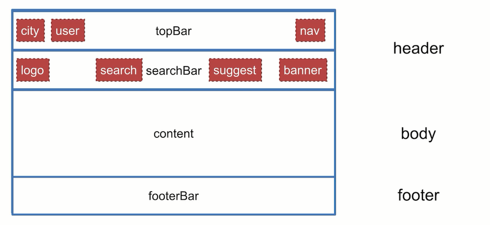
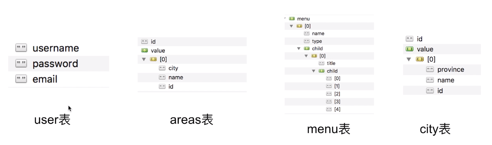
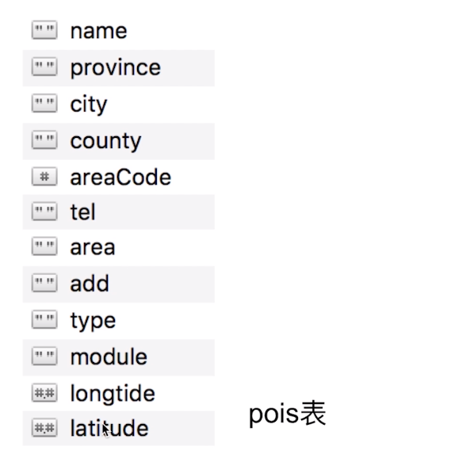

# vue美团

## 项目简介

### 业务内容

- 首页
- 登录/注册
- 产品列表
- 产品详情
- 购物车
- 订单

### 技术内容


### 主要内容


## vue基础

自定义指令应用场景：一个功能没有复杂到用组件去做，又不是一个表达式能解决的，这时候用自定义指令最合适。

## 第3章 Koa2基础知识
- koa-generator
- async和await语法
- koa2中间件
- koa2路由
- cookie和session
- mongoose基础
- redis基础

### 3-1 Koa-generator

安装

```shell
npm install -g koa-generator
```

创建项目

```shell
koa2 project
```

默认是以jade模板引擎安装的

通过 -e 设置项目模板引擎是 EJS，创建项目，根据提示运行项目，就可以在localhost:3000访问了

```shell
koa2 -e project
```

如果希望改服务端代码自启动，用 `npm run dev`启动项目，对应的dev script脚本中 配置了 nodemon

关于启动脚本

start 和 test，可以直接运行 npm start 启动，而其他脚本命令必须用 npm run ...

### 3-2 Koa异步async

- 异步的概念
- 理解async和await

async 和 await：用同步的方式解决异步的问题。

await 后跟的是 Promise，若不是 Promise 会转换成 Promise

```js
const router = require('koa-router')()

router.get('/testAsync', async (ctx) => {
  global.console.log('start', new Date().getTime()) // time1
  const a = await new Promise((resolve, reject) => {
    setTimeout(function () {
      global.console.log('async a', new Date().getTime())
      resolve('a')
    }, 1000)
  }) 
  // const b = Promise.resolve(123)
  const b = 123


  ctx.body = {
    a,
    b
  }
  
})
```

### 3-3 Koa中间件

- koa2中间件的原理
- 自定义koa2中间件


**自定义koa2中间件**

创建一个中间件 middleware/koa-pv.js，pv是日志的意思

```js
function pv(ctx) {
    global.console.log('pv', ctx.path)
}

module.exports = function() {
    return async function(ctx, next) {
        pv(ctx)
        await next() // next() 的作用是继续执行下一个中间件
    }
}
```

并在app.js中使用这个中间件

```js
const Koa = require('koa')
const app = new Koa()
const pv = require('./middleware/koa-pv')

app.use(pv()) // 
```

刷新浏览器，向服务器发送请求，会输出 console.log的结果，证明中间件执行了

**koa2中间件的原理**

代码的顺序从上到下，引用的顺序可以不一样，但是都会运行到。

定义三个中间件，m1 m2 m3

```js
function m1(ctx) {
    global.console.log('m1') // m2 m3
}

module.exports = function() {
    return async function(ctx, next) {
        global.console.log('m1 start') // m2 start m3 start
        m1(ctx)
        await next()
        global.console.log('m1 end') // m2 end m3 end
    }
}
```

在app.js 中使用

```js
const Koa = require('koa')
const app = new Koa()
const pv = require('./middleware/koa-pv')

app.use(pv())
app.use(m1())
app.use(m2())
app.use(m3())
...其他中间件
```

刷新页面，服务端会打印出如下内容，运行顺序符合洋葱模型，最开始的中间件运行后，最后还是可以会运行，形成一个闭环。


###  3-4 koa路由和cookie

- 路由的写法
- 接口举例
- cookie 和session的定义
- cookie和session的作用

<https://github.com/ZijianHe/koa-router>

通过 `ctx.cookies.set()` 和 `ctx.cookies.get()` 方法设置和获取cookie，访问 `/` 接口时在application的cookies选项中可以看到我们设定的cookie，当访问`/json` 接口时，返回数据中有cookie，说明读取到了。

```js
router.get('/', async (ctx, next) => {
  global.console.log('index2')
  ctx.cookies.set('pvid', Math.random())
  await ctx.render('index', {
    title: 'Hello Koa 2!'
  })
})

router.get('/string', async (ctx, next) => {
  ctx.body = 'koa2 string'
})

router.get('/json', async (ctx, next) => {
  ctx.body = {
    title: 'koa2 json',
    cookie: ctx.cookies.get('pvid')
  }
})
```

## 第4章 Mongoose和Redis基础

mongoose是mongodb的对象模型管理工具，使用mongoose可以更简单的操作mongodb数据库，通过可视化工具的robo 3t的介绍，任何数据库操作都可以直观的感受到，非常利于数据库操作的学习。redis是服务端开发必备的工具之一，通过本章的学习可以快速掌握常用redis命令以及在node中的应用。

- mongodb的概念&安装
- mongodb可视化工具RoBo 3T安装及应用
- mongoose的作用
- mongoose的应用

**mongodb的概念&安装**

mongodb是非关系型数据库。

安装 mongodb

配置mongodb环境变量，<https://www.youtube.com/watch?v=sBdaRlgb4N8&feature=youtu.be&t=120>

验证安装成功 打开git bash，which mongod，显示 mongod 所在路径，证明安装成功。

再输入 mongod，启动数据库

<https://stackoverflow.com/questions/41420466/mongodb-shuts-down-with-code-100>

**mongodb可视化工具RoBo 3T安装及应用**

### 4-1 mongoose（1）

**安装 mongoose**

```shell
npm i mongoose
```

**创建数据表**

创建 dbs/，用来创建和数据库配置相关的文件。

创建dbs/config.js，用来生命数据库的配置选项。

```json
module.exports = {
    dbs: 'mongodb://127.0.0.1:27017/dbs' // 在27017端口的mongodb服务下，新创建 dbs数据库
}
```

创建 dbs/models/person.js

创建collection数据表的描述 Schema 并和模型 model 关联，并导出

注意dbs/models/person.js，这个文件名 person 就是数据表collection的名字，文件内部是表的数据。

```js
// dbs/models/person.js
const mongoose = require('mongoose') 

let personSchema = new mongoose.Schema({
    name: String,
    age: Number
})

module.exports =  mongoose.model('Person', personSchema)
```

**和数据库连接**

```js
// app.js
const mongoose = require('mongoose')
const dbConfig = require('./dbs/config')

mongoose.connect(dbConfig.dbs, {
  useNewUrlParser: true
})
```

### 4-2 mongoose（2）

数据库中的表（colection），对应 person.js 文件。

表的描述，对应 mongoose.Schema 的实例

mongoose.model相当于表和描述之间的桥梁。 

通过模型model的实例去操作数据库。

```js
// person.js
const mongoose = require('mongoose') 

let personSchema = new mongoose.Schema({
    name: String,
    age: Number
})

module.exports =  mongoose.model('Person', personSchema)
```
这里完成了数据库的一个**写操作**。
```js
// user.js
const router = require('koa-router')()
const Person = require('../dbs/models/person')

router.prefix('/users')

router.post('/addPerson', async function(ctx) {
  const person = new Person({
    name: ctx.request.body.name,
    age: ctx.request.body.age
  })
  let code
  try {
    await person.save()
    code = 0
  } catch (e) {
    code = -1
  }

  ctx.body = {
    code: code
  }

})

module.exports = router
```

测试post接口

linux命令 curl ，-d 表示 post，数据项，请求地址

```shell
 curl -d 'name=lilei&age=27' http://localhost:3000/addPerson
```

**读数据库**

这里不考虑错误的情况

这里用的是 Person 的静态方法，没用使用模型的实例。	

```js
// user.js
const router = require('koa-router')()
const Person = require('../dbs/models/person')

router.prefix('/users')

router.post('/getPerson', async function(ctx) {
  const result = await Person.findOne({name: ctx.request.body.name}) // 找到一个
  const results = await Person.find({name: ctx.request.body.name}) // 找到多个
  ctx.body = {
    code: 0,
    result,
    results
  }
})

module.exports = router
```

测试post接口

```shell
 curl -d 'name=meimei' http://localhost:3000/getPerson
```

**更新数据库**

```js
// user.js
router.post('/updatePerson', async function(ctx) {
  const result = await Person.where({
    name: ctx.request.body.name
  }).update({
    age: ctx.request.body.age
  })
  ctx.body = {
    code: 0
  }
})
```

测试post接口

```shell
curl -d 'name=meimei&age=17' http://localhost:3000/users/updatePerson
```

**删除数据库**

真正写业务是严禁删除的

```js
// user.js
router.post('/removePerson', async function(ctx) {
  const result = await Person.where({
    name: ctx.request.body.name
  }).remove()
  ctx.body = {
    code: 0
  }
})
```

测试post接口

```shell
curl -d 'name=meimei' http://localhost:3000/users/removePerson
```

### 4-3 4-4 Redis

- redis 的概念&安装
- redis 的应用场景
- redis 的用法

**cookie 与 session 的关系**

服务端的程序如何识别客户端的状态，http是没有状态的，服务器通过session识别不同的用户，session就是用来存储用户信息的，也就是服务端用session保持用户的状态，客户端用cookie保存session,服务器端把session种植在cookie中，在下次访问时，cookie会带着session给服务端，进而达到身份认证的过程。

那么，session 存储在哪里呢？redis 是一个快速读写的存储数据库，使用简单，可以用来存放session。session也可以存放在内存当中，但当数据量庞大时，内存会不够。

**redis 的概念&安装**

<https://www.runoob.com/redis/redis-install.html>

配置好redis的环境变量

**启动redis**，`redis-server`

**连接redis**，需要两个中间件

- koa-redis，使用koa-redis连接redis
- koa-generic-session，用来处理session

安装这两个中间件

```shell
npm install koa-generic-session koa-redis
```

连接redis

```js
// app.js
const Koa = require('koa')
const app = new Koa()
const session = require('koa-generic-session')
const Redis = require('koa-redis')

app.keys = ['keys', 'keyskeys']
app.use(session({ // 配置项默认是session保存在内存中的，这里需要配置保存在redis中
  store: new Redis() 
}))


module.exports = app
```

在其中一个中间件内添加，每次经过这个中间件，session的count加1

```js
ctx.session.count++
```

这里操作的session对象，并没有直接操作redis，是通过中间件操作的。

刷新页面访问，在application中就可以看到存放有session的cookie了

更改cookie的key和前缀

```js
app.use(session({
  key: 'mt',   // 自定义 key
  prefix: 'mtpr', // 自定义前缀
  store: new Redis()
}))
```

**查看存储在redis中session**

命令行 `redis-cli`，打开服务

输入 `keys *`，查询所有key值

可以看到我们之前配置过前缀是 mtpr的session




通过 get sessionkey 可以查看对应session的value值。

之前设置经过一个中间件时，session.count++，再次请求时count+2,是因为浏览器请求了两个文件，都经过了这个中间件。



**不通过中间件，直接操作redis**

不经过session读写redis

通过中间件`koa-redis` 创建redis的客户端，通过客户端直接操作redis

```js
const router = require('koa-router')()
const Redis = require('koa-redis')
const Person = require('../dbs/models/person')

// 新建 redis 客户端
const Store = new Redis().client

router.prefix('/users')

router.get('/fix', async function(ctx) {
  const st = await Store.hset('fix', 'name', Math.random())
  ctx.body = {
    code: 0
  }
})

module.exports = router
```

通过curl发送一个get请求

```shell
curl http://localhost:3000/users/fix
```

在 redis-cli 中，输入命令

`key *` 可以查看所有key，发现有fix

通过 `hget fix name` 查看value值



所以redis有两种使用场景

- 结合 session 使用
- 只是为了存储数据，保证高速读写，也可以用redis

具体redis的操作命令可以参考，redis 菜鸟 文档

## 第5章 Nuxt.js基础知识

Nuxt是Vue实现SSR最好的方案，我们整个项目都是基于Nuxt框架来实现的，我们需要了解如何通过脚手架快速初始化一个工程项目，熟悉每个目录的含义，知道如何配置各个页面的视图、模板、异步获取数据等。

### Nuxt.js 概述

基于 vue2 包含了 vue-router，可以支持 vuex 、Vue Server Render、vue-meta。

英文官网（**版本最新**）：<https://nuxtjs.org/guide>

中文官网：<https://zh.nuxtjs.org/guide/installation>

### Nust.js 工作流



asyncData是用来渲染vue组件的，fetch通常是用来修改vuex的。

### Nuxt.js 安装

```shell
vue init nuxt-community/koa-template '项目名'
```

使用这个模板，需要把nuxt版本降级到1.4.2

npm 切换依赖包安装源

```shell
nrm use npm 选择 npm 作为安装源
nrm ls 查看安装源
```
### nuxt基础知识
- 路由&示例
- 页面模板&示例
- 异步数据&示例&SSR剖析
- Vuex应用&示例

> eslint 会提示有错误，需要更新 eslint-plugin-html，`npm i eslint-plugin-html@^3`，安装主版本是3的以上版本。

#### **路由&示例**

当我们在pages文件夹中创建文件时

- next配置了对应路由，路由名称与文件名相同。
- 把文件作为配置的入口文件。 

#### **页面模板&示例**

创建项目后，默认会有两个模板文件

layouts/default.vue

layouts/error.vue

当我们创建路由文件时，没有设置模板文件会默认使用default.vue作为模板文件。而default.vue中引用了一个公共组件 Footer.vue

`<nuxt />` 相当于 `<router-view />` 的作用

`<nuxt-link />` 相当于 `<router-link />` 的作用

创建一个search模板，layouts/search.vue

```vue
<template>
  <div class="layout-search">
    <h1>search layout header</h1>
    <nuxt />
    <footer>search layout footer</footer>
  </div>
</template>
<style>
  .layout-search {
    color: red;
  }
</style>
```

在路由页面中使用search模板，pages/search.vue

```vue
<template>
  <div class="page">
    Page is search
  </div>
</template>
<script>
export default {
  layout: 'search' // 使用 search模板
}
</script>

```

#### **配置文件的作用 nuxt.config.js**

- title，浏览器tab页面标题
- meta，
- css，配置全局css样式

#### **异步数据&示例&SSR剖析**

在服务端创建一个路由，创建一个city相关的路由文件，server/interface/city.js

```js
import Router from 'koa-router'

const router = new Router({
  prefix: '/city'
})

router.get('/list', async (ctx) => {
  ctx.body = {
    list: ['北京', '天津']
  }
})

export default router
```

在主文件中引入路由，server/index.js

```js
import cityInterface from './interface/city'
...
// 固定写法
app.use(cityInterface.routes()).use(cityInterface.allowedMethods())
```

windows用git bash通过curl命令进行测试，返回数组则成功。

```js
curl http://localhost:3000/city/list
```

在客户端通过ssr的方式获取异步数据

```vue
<template>
  <div class="page">
    Page is search
    <ul>
      <li v-for="(item, idx) in list" :key="idx">{{item}}</li>
    </ul>
  </div>
</template>
<script>
import axios from 'axios'
export default {
  layout: 'search',
  data() {
    return {
      list: []
    }
  },
  // mounted在服务器端不会被执行，只有在浏览器端才会被执行，所以页面查看源码数据不是直接返回
  // async mounted() {
  //   let { status, data: { list } } = await axios.get('/city/list')
  //   if (status === 200) {
  //     this.list = list
  //   }
  // }

  // 服务端 不仅下发了数据和模板编译后的内容 同时还下发了异步获取的数据。数据是通过下发一个script标签，在window上挂载一个对象，对象里会包含data选项。
  // fetch在这里不行，因为它是用来处理vuex相关的数据的，这里是组件相关，要用 asyncData
  async asyncData() {
    let { status, data: { list } } = await axios.get('http://localhost:3000/city/list')
    if (status === 200) {
      return {
        list
      }
    }
  }
}
</script>

```

#### Vuex应用&示例

还是遵循**创建即配置**的原则

和用异步数据效果一样，下发的数据都是通过服务端下发一个script标签的方式，然后给window赋值一个属性实现的，达到服务端数据和浏览器端数据同步。

#### nuxtServerInit 的使用

[https://zh.nuxtjs.org/guide/vuex-store/#nuxtserverinit-%E6%96%B9%E6%B3%95](https://zh.nuxtjs.org/guide/vuex-store/#nuxtserverinit-方法)

### Vue SSR 工作原理

#### SSR 概述

- 用来解决 SEO 的问题
- 使结果快速展现

#### SSR 实现原理

请求->nuxtServerInit（可以不做操作）->middleware(可以不做操作，有内置的中间件操作)->validate（可以不作操作）->**asyncData() & fetch()**

在拿数据阶段，一般是 asyncData 向服务端拿数据再结合模板渲染好页面给到浏览器，包括样式、编译好的模板内容（静态内容）、script标签中的数据部分，交互是在浏览器端完成的，浏览器端也会对数据和模板进行编译，但不会直接渲染页面，因为服务端已经渲染过一次了，这时，浏览器端会创建虚拟的渲染结果和浏览器返回的进行对比（vdom对比），如果有区别，会重新请求数据。所以服务器给到浏览器端的数据就是为了对比用的。

#### Vue SSR 的渲染流程


## 第6章 实战准备

工程搭建使用Nuxt脚手架快速搭建工程，这块是通用的，所有学员都可以直接应用到自己的项目。

- 环境准备
- 项目安装
- 辅助工具安装
- 配置改装

### 6-1 环境准备与项目安装

环境准备

- node，8.12.0
- vue，2.5.17
- npm，6.4.1
- webpack，4.19.1
- nuxt，2.0.0

项目安装

1. npm install -g npx
2. npx create-nuxt-app project-name



###  6-2 辅助工具安装与配置改装

#### 辅助工具安装

- MongoDB
- redis
- TObo 3T

#### 配置改装

- 支持es6/7，例如 import/export
- 使用 sass
- 修改 build配置

**不识别es module语法，通过 babel 解决，顺便解决es6编译问题**

1. 修改脚本命令
2. 添加babel配置文件
3. 安装babel所需插件

1.修改脚本命令

改dev和start添加`--exec babel-node`

```json
  "scripts": {
    "dev": "cross-env NODE_ENV=development nodemon server/index.js --watch server --exec babel-node",
    "start": "cross-env NODE_ENV=production node server/index.js --exec babel-node",
  },
```

2.添加babel配置文件

在根目录创建 `.babelrc` 文件，添加如下配置

```json
{
  "presets": ["es2015", "stage-0"]
}
```

3.安装babel所需插件

先全局安装 babel-cli babel-core，否则会报内部没有 babel-node 命令

```shell
npm i babel-cli babel-core -g
```

项目安装

```shell
npm i babel-cli   // 这是babel解释器的客户端主程序 
npm i babel-core   // babel的核心文件,好像默认会自动安装
npm i babel-preset-es2015 // 把代码转换成ES6
npm i babel-preset-stage-0 // 把代码转换成ES7
```

**使用 sass**

当我们在vue文件中，使用scss语法会出错 `<style lang="scss">`

需要安装sass对应loader

```shell
npm install --save-dev node-sass sass-loader
```

重启项目生效。

**修改 build配置**

修改 nuxt.config.js

1.配置文件

添加 reset.css 和 main.css，main.css 后面会创建，这里先注释掉

```json
css: [
    'element-ui/lib/theme-chalk/reset.css',
    'element-ui/lib/theme-chalk/index.css'
    // '~assets/css/main.css'
  ],
```

2.添加缓存，增加编译速度

在build配置选项中，添加 cache: true

```json
build: {
    transpile: [/^element-ui/],
    /*
    ** You can extend webpack config here
    */
    extend(config, ctx) {
    },
    cache: true
  }
```

## 第7章 开发美团网首页

从需求分析到设计思路讲述再通过手把手的引导实现首页设计，在功能上包括城市定位服务，头部引导导航，搜索等。

### 7-1 需求分析

需求分析

- 模板设计
- 组件设计
- 数据结构设计
- 接口设计

模板设计

大多数页面可分为三大板块 header、body、footer，可作为默认模板。而像登录注册明显板式不同的可以单独出来。然后再根据具体内容，根据功能或内容等不同分类，抽象成组件。



组件设计

城市服务组件


用户数据&状态


导航标签


这里完全可以写死

需要考虑的是

- 如何节省网络请求？
- 如何语义化？
- DOM最简化？

...

### 7-2 首页Header开发-城市定位服务设计

### 7-3 首页Header开发-头部引导导航设计

报document错误的时候，解决方案是把 nuxt.config.js 的cache设为false，cache:false

<https://github.com/nuxt/nuxt.js/issues/3804>

### 7-4 首页Header开发-搜索界面设计

### 7-5 Bug修复

### 7-6 首页搜索

### 7-7 首页菜单（1）

布局

上下两大部分，第一部分，左边是菜单，右边是xxx，第二部分是一个大组件

一定要把dom结构设计的很简单，数据结构可以相对复杂些。

### 7-8 首页菜单（2）

### 7-9 章节小结

### 7-10 Footer补充

## 第8章 开发美团网首页-登录注册

从静态页面实现到真实的业务逻辑，一步一步带领大家实现注册、登录、退出，其中还用到了第三方RTMP服务，在技术上mongodb，passport,redis一应俱全

passport 验证权限的类库

**需求分析(数据结构设计)**





**需求分析(接口设计)**

用户类接口

- 注册，/users/signup
- 登录，/users/signin
- 验证，/users/verify
- 退出，/users/exit
- 获取用户信息，/users/getUser

**创建配置文件并配置**

- mongodb 数据库地址，'mongodb://127.0.0.1:27017/student'，mongodb服务器地址+数据库名称。
- redis 数据库地址
- smtp 服务地址、用户邮箱、用户授权码
  - smtp qq邮箱设置：点击设置->账户->往下拉，开启smtp服务(前两项)后获取授权码，授权码放到config.js中，**严格保密**。
- 随机生成邮箱验证码
- 验证码过期时间
  - 任何地方都会用到过期时间，要保证唯一性，所以放到配置文件中合适。

server/dbs/models/config.js

```js
export default {
  dbs: 'mongodb://127.0.0.1:27017/student',
  redis: {
    get host () {
      return '127.0.0.1'
    },
    get port () {
      return 6379
    }
  },
  smtp: {
    get host () {
      return 'smtp.qq.com'
    },
    get user () {
      return '767610876@qq.com'
    },
    // 授权码严格保密
    get pass () {
      return 'xxx'
    }
  },
  get code () {
    return () => {
      return Math.random().toString(16).slice(2, 6).toUpperCase()
    }
  },
  get expire () {
    return () => {
      return new Date().getTime() + 60 * 60 * 1000
    }
  }
}
```

**设置用户模型**

server/dbs/models/users.js

安装 mongoose，`npm i mongoose`

```js
import { Schema, model } from 'mongoose'

const UserSchema = new Schema({
  username: {
    type: String,
    unique: true,
    require: true
  },
  password: {
    type: String,
    require: true
  },
  email: {
    type: String,
    require: true
  }
})

export default model('User', UserSchema)
```

**设置axios**

安装包，`npm i axios`

通过axios.create() 创建 axios 的实例，期间可以进行配置，设置一些 axios 的公共配置，如基础路径、超时时间、headers 等等

server/interface/utils/axios.js

```js
import axios from 'axios'

const instance = axios.create({
  baseURL: `http://${process.env.HOST || 'localhost'}:${process.env.PORT || 3000}`,
  timeout: 1000,
  headers: {

  }
})

export default instance
```

**创建 passport**

安装包，`npm i koa-passport passport-local`

由于 http 是无状态的，我们通过 session 验证状态。用户每次进来，都自动通过 session 验证，需要进行序列化和反序列化；反序列化指的是，这样在每次请求中都会从 cookie的 session 中读取用户对象和服务端的session做验证对比，如果找到说明是登录状态，从而达到从无状态到有状态的转变；序列化指的是，用户登录验证成功后，会把用户数据存储在 session中。

server/interface/uitls/passport.js

```js
import passport from 'koa-passport'
import LocalStrategy from 'passport-local'
import UserModel from '../../dbs/models/users'

passport.use(new LocalStrategy(async function (username, password, done) {
  let where = {
    username
  }
  let result = await UserModel.findOne(where)
  if (result !== null) {
    if (result.password === password) {
      return done(null, result)
    } else {
      return done(null, false, '密码错误')
    }
  } else {
    return done(null, false, '用户不存在')
  }
}))
// 序列化
passport.serializeUser(function (user, done) {
  done(null, user)
})
// 反序列化
passport.deserializeUser(function (user, done) {
  return done(null, user)
})

export default passport
```

**创建用户接口**

安装包 `npm i koa-router koa-redis nodemailer`

创建路由对象

获取redis 的客户端

在signup接口中定义逻辑，获取注册请求字段username、password、email、code(验证码)。

验证验证码

根据code验证验证码，从redis中获取 在nodemail在发验证码时会在redis上存储的验证码，对比验证码。

由于reids是键值存储的，通过nodemail:开头规范验证码验证相关的数据，通过username来关联具体用户。

验证是否过期。

验证账户和密码是否已注册，未注册则注册并写库

server/interface/users.js

```js
import Router from 'koa-router'
import Redis from 'koa-redis'
import nodeMailer from 'nodemailer'
import User from '../dbs/models/users'
import Passport from './utils/passport'
import Email from '../dbs/models/config'
import axios from './utils/axios'

let router = new Router({
  prefix: '/users'
})

let Store = new Redis().client

router.post('signup', async (ctx) => {
  const {
    username,
    password,
    email,
    code
  } = ctx.request.body

  if (code) {
    const saveCode = await Store.hget(`nodemail:${username}`, 'code')
    const saveExpire = await Store.hget(`nodemail:${username}`, 'expire')
    if (code === saveCode) {
      if (new Date().getTime() - saveExpire > 0) {
        ctx.body = {
          code: -1,
          msg: '验证码已过期，请重新尝试'
        }
        return false
      } else {
        ctx.body = {
          code: -1,
          msg: '请填写正确的验证码'
        }
      }
    }
  } else {
    ctx.body = {
      code: -1,
      msg: '请填写验证码'
    }
  }
  let user = await User.find({
    username
  })
  if (user.length) {
    ctx.body = {
      code: -1,
      msg: '已被注册'
    }
    return
  }
  // 验证码正确+首次注册=可以写库
  let nuser = await User.create({
    username,
    password,
    email
  })
  // 验证写库是否成功
  if (nuser) {
    let res = await axios.post('/users/signin', {
      username,
      password
    })
    if (res.data && res.data.code === 0) {
      ctx.body = {
        code: 0,
        msg: '注册成功',
        user: res.data.user
      }
    } else {
      ctx.body = {
        code: -1,
        msg: 'error'
      }
    }
  } else {
    ctx.body = {
      code: -1,
      msg: '注册失败'
    }
  }
})

```

编写用户类的其他接口

**配置**

**启动 redis 服务**

```shell
redis-server
```

出现提示  `The server is now ready to accept connections on ort 6379` 说明启动成功。

**启动 mongodb**

```shell
mongod
```

出现提示  `waiting for connections on port 27017 ` 说明启动成功。

## 编写页面登录注册退出

用户名因为有可能是汉字需要通过`encodeURIComponent`编码

密码需要md5的方式加密

安装包，`npm i crypto-js`，常用的和加密相关的库，有多种加密方式。

**登录后修改登录状态**

在 user.vue 组件中

获取登录状态两种方式：
- vuex
- 异步获取(这里)，这里使用了 async和await

使用异步获取接口的方式获取用户状态，并使用 async 和 await

```js
async mounted () {
    const { status, data: {user}} = await this.$axios.get('/users/getUser')
}
```

注意 user 需要使用 decodeURIComponent(encodedURI) 解码

退出逻辑，使用中间件机制

```js
<template>
  <div>
    exit
  </div>
</template>

<script>
  export default {
    layout: 'blank',
    middleware: async (ctx) => {
      let { status, data } = await ctx.$axios.get('/users/exit')
      if (status === 200 && data && data.code === 0) {
        window.location.href = '/'
      }
    }
  }
</script>

<style lang="scss">

</style>
```

