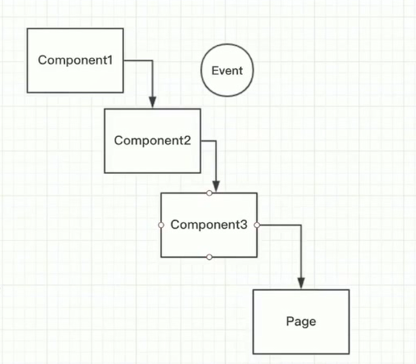
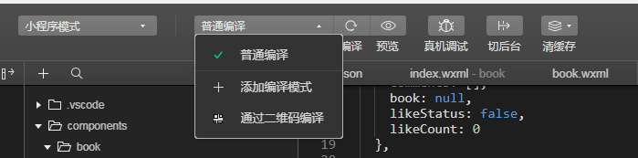
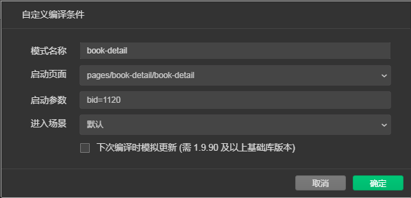

# 小程序进阶-临时

## appkey获取

github 关键词 旧岛

```json
const config = {
  api_blink_url: 'http://bl.7yue.pro/v1/',
  appkey: 'RdshydjBvcYZhMZC'
}
```

## 第六章

###  数据来源的三种途径

- WXML
- JS->WXML
- 服务器->JS-WXML

### 数据绑定

js 中，data 中存数据；WXML 中，通过 {{}} 绑定数据

### 三元表达式与图片切换

通过三元表达式控制图片或数据的切换

```html
// wxml
<image src="{{like?yesSrc : noSrc}}"  />
<text>{{like?count1:count2}}</text>
```

```js
// js
data: {
    like: true,
    count1: 99,
    count2: 999,
    yesSrc: 'images/like.png',
    noSrc: 'images/like2.png'
}
```

### 组件的封闭性，开放性及粒度

开放性：可以从组件外部进行设置，也就是通过  properties

### 组件的properties属性详解

```html
// wxml
<image src="{{like?yesSrc : noSrc}}"  />
<text>{{like?count1:count2}}</text>
```

```js
// js
Component({
    properties: {
        like:{
            type: Boolean
        },
        count:{
            type: Number
        }
    },
    data: {
        like: true,
        count1: 99,
        count2: 999,
        yesSrc: 'images/like.png',
        noSrc: 'images/like2.png'
    }
})
```

### let,var与组件事件应用

## 第七章

### 看待组件的两种观点

组件的好处：复用、代码分离

代码分离>复用

### 生命周期函数

### wx.request-4xx状态码并不会执行fail

### 合法域名问题

开发阶段可以不校验合法域名，但是上线后必须在小程序后台添加合法域名

### 访问API获取数据

```js
onLoad: function (options) {
    wx.request({
        url：'',
        header: {
        	appkey: ''
    	}
    })
}
```

开发阶段应该对上述请求函数进行封装，直接写是不可取的。

### 正确理解 Promise

应用场景：

- 解决异步嵌套的问题-回调地狱
- 利用 return

### 模块化导入公共配置文件

根目录新建 config.js 文件

存储公共数据，并使用 `export` 导出

```js
export const config = {
    api_base_url: 'http://bl.7yue.pro/v1/',
    appkey: "RdshydjBvcYZhMZC"
}
```

使用 ES Module export 与 import 导入公共数据

新建 util/http.js，定义一个 http 类，封装 request 请求方法，公共配置数据通过 `import `引入

```js
import {config} from '/config.js'
class HTTP {
    request (params) {
        // url, data, method
        wx.request({
            url
        })
    }
}
```

**导出多个数据与引入多个数据**

**导出**

```js
// config.js
export const config = {}
export let fn1 = function () {}
```

或

```js
// config.js
const config = {}
let fn1 = function () {}

export {conifg, fn1}
```

导出时，改名字

```js
export {config as config1}
```


**引入**

```js
import {config, fn1} from '/config.js'
```

引入时，改名字

```js
import {config as config1, fn1} from '/config.js'
```

### HTTP类的封装与ES6 startsWith

```js
import {config} from '/config.js'

class HTTP {
    request (params) {
        // url, data, method
        if (!params.method) {
            params.method = "GET"
        }
        wx.request({
            url: config.api_base_url + params.url,
            method: params.method,
            data:params.data,
            header: {
                'content-type':'application/json',
                'appkey': config.appkey
            },
            success: (res) => {
                let code = res.statusCode.toString()
                // 拿到字符串的首字母
                // var startChar = code.charAt(0)
                // if (startChar == '2') {}
                if (code.startsWith('2')) {
                    // 回调函数传递
                    params.success(res.data)
                } else {
                    // 服务器异常
                }
            },
            fail: (err) => {
                // api 调用失败
            }
        })
    }
}

export {HTTP}
```

注意：导出和引入只能使用相对路径

### 通用错误异常处理

好的反馈


```js
import {config} from '../config.js'

// request 函数代码已经很多，应该在进行拆分
const tip = {
    1： '抱歉，出现了一个错误',
    1005: 'appkey无效，请前往www.7yue.pro申请',
    3000: '期刊不存在'
}

class HTTP {
    request (params) {
        if (!params.method) {
            params.method = "GET"
        }
        wx.request({
            url: config.api_base_url + params.url,
            method: params.method,
            data:params.data,
            header: {
                'content-type':'application/json',
                'appkey': config.appkey
            },
            success: (res) => {
                let code = res.statusCode.toString()
                if (code.startsWith('2')) {
                    // 回调函数传递
                    params.success(res.data)
                } else {
                    // 服务器异常
                    // 根据文档，模拟 4xx 的错误情况
                    let error_code = res.data.error_code
                    this._show_error(error_code)
                }
            },
            fail: (err) => {
                // api 调用失败
                // 断网后，可看到效果
                this._show_error(1)
            }
        })   
    }
    
    // es6 没有提供私有函数的标准，这里通过下划线表示私有函数，只在函数内调用（自定义的私有函数可以再外部调用，不过不要这样做）
    _show_error (error_code) {
        if (!error_code) {
            error_code = 1
        }
        wx.showToast({
            title: tips[error_code],
            icon: 'none',
            duration: 2000
        })
    }
}

export {HTTP}
```

页面使用

比直接在页面写代码少很多，但这还不是最好的写法。

```js
import {HTTP} from '../../utils/http.js'

let http = new HTTP()

Page({
  onLoad: function (options) {
    http.request({
      url: 'classic/latest',
      success: (res) => {
        console.log(res)
      }
    })
  }
})
```

## 第八章

### 什么是'剥夺函数 return 的能力'

使用回调函数剥夺了函数 return 的能力

### 组件属性赋值与页面渲染流程解析


### setData 的误区

误区1：只有通过setData 设置的数据才能被 wxml 使用，这是错误的。

反例：如果 data 中有数据，是可以在 wxml 中显示数据的。

```js
data: {
    test: 1
}
```

对于页面或组件的 wxml，所能使用的数据完全取决于 data 中有什么数据，setData 用于数据更新(更新数据必须通过 setData，直接赋值操作无效)。

```js
// 无效
this.data.test =2
// 只能通过setData
this.setData({
    test: 2
})
```

若 data 中没有 setData 更新的数据项，setData 会先创建这个数据项然后再更新。凡是要被 wxml 使用的变量最好都在 data 中标识，如像异步操作更新的数据最好还是在 data 中设置默认值，否则数据没有请求回来前，页面无法正常显示。

### movie组件的实现

**vscode格式化css代码**：安装 Beautify 插件

css技术点

**不规则调整图片的位置**

```css
.tag {
  width: 46rpx;
  height: 142rpx;
}
/* 通过 relative 调整 */ 
.tag {
  width: 46rpx;
  height: 142rpx;
  position: relative;
  right: 310rpx;
  bottom: 58rpx;
}
```

**让文字换行并居中**

在整体居中的条件下，设置最大宽度 ` max-width: 550rpx;`，这样即使文字少也是会居中的

### 再谈组件的实现

组件的通用性

例如 http 请求这种业务性代码也该写在使用方，而就是 paga 页面中，而不应该写在组件中

### 自定义事件的激活与监听

通过 tap 事件不能把组件的数据传入页面，这时，需要用到自定义事件

通过 triggerEvent 自定义 like 事件，并通过第二个参数对象传参

```js
// like 组件内
methods: {
    onLike: function(event) {
      // 自定义事件
      // 激活
      let behavior = this.properties.like ? 'like' : 'cancel'
      this.triggerEvent('like', {
        behavior: behavior // 通过第二个参数对象进行传参
      }, {})
    }
  }
```
在页面中，监听 like 事件，并通过 event.detail 拿到数据
```html
<--页面内-->
    <v-like  bind:like="onLike" like="{{classic.like_status}}" count="{{classic.fav_nums}}"/>
```

```js
 onLike: function (event) {
    let behavior = event.detail.behavior
  },
```

### 喜欢还是不喜欢

判断是否存在，执行操作写法**

利用 && 短路操作，如果存在就执行，不存在就不执行

```js
// 利用 && 判断是否传入了 success 回调函数
params.success && params.success(res.data)
```

### 组件的生命周期

文档-框架-自定义组件-Component构造器

5个组件生命周期函数

### 组件的data与properties的奇怪现象

第一，可以看到在 properties 中可以使用 Number 或 String 当作默认值，而在data中**不可以**。

第二，properties 和 data 中的属性是一样的。所以微信会把 properties 和 data 合并成同一个 js 对象，当我们访问任意一个时，都指向同一个 js 对象。**注意**：properties 和 data 中不要出现同名属性，小程序合并时会覆盖掉。

```js
// 组件 js
Component({
  properties: {
    index: Number
  },
  data: {
    year: Number,
    month: String
  },

  attached: function(){
    console.log(this.properties) // {index: 0, year: ƒ, month: ƒ}
    console.log(this.data)       // {index: 0, year: ƒ, month: ƒ}
  }
})
```

所有 data 中的属性默认值设置可以是：

```js
data: {
    year: 0,
    month: ""
}
```

### 业务逻辑到底写组件里还是页面里

例如组件某个数据需要补零操作

- 我可以page页面中拿到数据后进行补零操作，再传入到组件
- 将原始数据传入组件，在组件内部进行补零操作（正确）

分析：这个数据只有组件用到，所以补零操作是归属于组件的，应该在组件内部进行处理。

封装组件不是最难的，关键是判断业务逻辑是写在组件内还是组件外，达到组件的灵活性、应用型和方便性。

### observer 函数的应用

监听传入组件的某个值，当值发生变化时，执行 observer 函数

### 千万不要在observer中修改自身属性

**微信的去零操作**

```js
 properties: {
    index: {
      type: Number,
      observer: function (newVal, oldVal, changedPath) {
        let val = newVal < 10 ? '0' + newVal : newVal
        this.setData({
          index: '08' // type 类型是 Number，微信会自动把 08 转成 8，达不到补零操作
        })
      }
    }
  },
  data: {
    year: Number,
    month: String
  },
```

**oberver 和 setData 引发的内存泄漏**

若在 observer 中 setData 的属性名和监听的属性名相同，有可能会引发无线循环，从而导致**内存泄漏**，如下的补零操作：监听 type 值，当 type 改变时调用 observer函数，补零，setData index ，index 发生变化，重复上述操作，导致无线循环，内存泄漏。

````js
 properties: {
    index: {
      type: String, // 这里改成字符串，防止微信的去零操作
      observer: function (newVal, oldVal, changedPath) {
        let val = newVal < 10 ? '0' + newVal : newVal
        this.setData({
          index: val
        })
      }
    }
  },
  data: {
    year: Number,
    month: String
  },
````

**通过新的属性保存改变后的值，避免oberver setData 发生内存泄漏**

```js
 properties: {
    index: {
      type: String,
      observer: function (newVal, oldVal, changedPath) {
        let val = newVal < 10 ? '0' + newVal : newVal
        this.setData({
          _index: val // 利用 _index 保存修改后得的值
        })
      }
    }
  },
  data: {
    year: Number,
    month: String,
    _index: ''
  },
```

通过 oberserver 进行补零操作不是最好的方案，**wxs**才是。

### epsoide组件与流行页面样式

**月份变汉字**

```js
let months = ['一月','二月','三月','四月','五月','六月','七月','八月','九月','十月','十一月','十二月']
let date = new Date()
let month = date.getMonth()

// 将 month 作为索引读取对应文字描述
let result = months[month]
```

**文字基线对齐**

```css
.index-container{
  display:flex;
  flex-direction: row;
  align-items: baseline;      
}
```

## 第九章

### navi组件与移动端触碰区域讨论

不同于pc鼠标的精确点击，手机触碰区域要更大一些，对单指操作用户体验提升很大。

- 可以让设计师加图片设计的大一些。
- 或者通过代码是触碰区域大一些。

### navi组件与flex宽度陷阱

如果确定要撑满屏幕，最后加上 width: 100%;不然有时候会撑不满

### 禁用事件的技巧

**如何在真机上进行调试**

点击预览，生成二维码，手机微信扫描二维码，点击三个点，点击进入调试，重新扫描二维码即可。

**事件机制**

当我们在嵌套组件的最底层组件创建一个自定义事件，事件是可以一直冒泡到 Page 的。



具体组件出发自定义事件，及页面监听事件

```html
组件内 
<image bind:tap="onLeft" class="icon" src="{{latest?disLeftSrc:leftSrc}}" />
```

```js

methods: {
    onLeft: function (event) {
        this.tirggerEvent('left', {}, {})
    }
}
```

```html
页面内
<v-navi bind:left="onNext"/>
```

**禁止事件的技巧**

在组件内部判断是否是第一期或是最新一期，来决定是否触发事件。

```js
methods: {
    onLeft: function (event) {
        if (!this.properties.latest) {
            this.tirggerEvent('left', {}, {})
        }
    },
    onRight: function (event) {
        if (!this.properties.first) {
            this.tirggerEvent('left', {}, {})        
        }
    }
  }
```

### music 组件初步实现

三种类型的期刊：电影、音乐、句子。所以需再封装音乐组件和句子组件。

由于音乐组件比较复杂，所以先实现基本的页面

### 初识组件的behavior行为

句子组件，同样不要开始做的多复杂，只需要能显示句子即可。

在面向对象编程中，是通过 class 继承的。在小程序中，组件代码继承是通过 behaviors 继承的。

Behavior 是一个构造器,一个组件可以继承多个 behavior。


创建 class-beh.js 文件，通过 Behavior 构造器，存放公共代码部分

```js
// class-beh.js
let classicBeh = Behavior({
    properties: {
        img: String,
        content: String
    },
    attached: function () {

    },
    data: {},
    method: {}
})

export {classicBeh}
```

在组件中引入后，通过`behaviors`选项使用

```js
import {classicBeh} from '../class-beh.js'

Component({
  behaviors: [classicBeh], // 可以引入多个 behavior
  properties: {}
})
```

### behavior继承与多继承的覆盖规则

behavior 优势在于都多个项目，其思维还是面向对象继承的思想。Python是多继承，其他语言是单继承。而 behavior 也是一种多继承思想。

es6 的 class extends 就是单继承

**behavior 多继承 变量同名覆盖的问题**

小程序的规则如下：

- 当组件 properties 属性和 behavior 中的重名时，组件的 properties  属性会覆盖 hehavior 的，符合面向对象继承的规则，子类会覆盖父类中的相关属性。
- 若子组件中properties 没有属性值，3个beh中都有相同的属性时，后面的会覆盖前面的

规则同样适用于 methods 的继承

特例：生命周期函数的继承。

- 若 beh 和子组件都有相同的生命周期函数，小程序会依次调用behs中的生命周期函数，最后调用子组件的生命周期函数，而不是覆盖。

```js
// 其中一个 behavior
let classicBeh = Behavior({
    properties: {
        img: String,
        content: String
    },
    attached: function () {

    },
    data: {},
    method: {}
})

export {classicBeh}
```

```js
// 组件中
Component({
    behaviors: [beh1, beh2, beh3],
    properties: {
        img: Number
    }
})
```

### 是否是最新期刊的逻辑判断初步实现期刊切换

所有对 classic 的相关操作，都会集中在 classicModel 这个类当中。

### 使用Storage保存最新期刊号

封装小函数，可读性更强，起到了注释的作用

通过把具体逻辑封装到 model 中，我们不需要把具体的逻辑写在页面中。

**使用缓存可能会引起一些问题**

如果在写入缓存不够小心写入一些错误的数据，在读取时就会出错，而缓存不会随着程序关闭而清除，这时需要手动清除缓存。

**清缓存**：小程序开发工具-清缓存，选择清除数据缓存。	

### onNext与函数重构技巧

一些问题，数据都是实时请求的，但要提高网页性能和用户体验就需要用到缓存。

## 第10章 新版Music组件、组件通信与wxss样式复用

### 谈谈缓存对于改善用户体验的作用

缓存思路：检查有无缓存，若无，请求 API 写入缓存

###  解决缓存带来的问题

思考那些数据可以被缓存，那些数据不应该被缓存，例如一些固定不变的数据是可以用缓存的，而经常由于其他因素导致的变化是不应该用缓存的，例如点赞的人数和状态。

### ES6模板字符串和扩展运算符的应用

对象扩展运算符使用要灵活一些，如果需要将数据封装或说明，不使用扩展运算符反而更好些。

### 独立更新like组件状态

### 如何让自定义组件支持hidden？

直接在**自定义组件**上使用 hidden 是无效的，而内置组件是可以的

```html
<v-movie hidden="{{true}}" img="{{classic.image}}" content="{{classic.content}}" />
```

解决方案：让自定义组件的 properties 接收一个 hidden 的属性，再把属性值绑定到内置组件的 hidden 属性上

```js
Component({
  properties: {
    hidden: Boolean
  }
})
```

```html
<view hidden="hidden" class='classic-container'> 
</view>
```

**容易犯得错误**：传入变量属性值没使用{{}}

```html
错误的
<view hidden="hidden" class='classic-container'> 
正确的
<view hidden="hidden" class='classic-container'> 
```

### @import在组件间复用样式

behavior 解决的是组件间js代码复用问题

css的复用可以通过 @import

```css
@import '../common.wxss';
```

wxml 也可以复用，但是在自定义组件中复用意义不大，复用的方式也是通过 template 模板进行复用。

###  music组件样式

### 新版音乐播放对象

getBackgroundAudioManager 的bug：https://www.imooc.com/wenda/detail/458867

### 组件间通信

父子通信通过数据绑定和triggerEvent完成

兄弟组件通信可以通过，可通过父组件间接通信

###  hidden不会触发组件的detached，但wxif会

组件消失时，做某种操作，这事就用到了钩子函数

hidden 不会触发组件的datached钩子函数；if可以

使用 wx:if时进行组件切换时，会执行完整的生命周期的，新组件还是会初始化的。

###  完成音乐播放

切换期刊时，音乐不要停止，并且新的期刊状态显示正确。这里不使用**组件通信**，而是用**组件生命周期函数来做**。

**在生命周期函数中调用methods中的方法是，不需要写methods，直接通过 this.方法名即可。加上methods会报错。**

### 用简洁的代码优化音乐播放

最好不要在生命周期函数，特别是初始化的函数中写具体的业务逻辑。把具体的业务代码用一个私有函数封装起来，再在生命周期函数中调用，是一种更好的方式。

在完成切换效果时，在一个页面中完成切换比通过跳转页面来完成切换要好。这里要注意 hidden 和 if 引起的性能问题。

如何通过音乐总控开关控制音乐图片的切换，**通过音乐管理对象的事件监听函数**。

**小程序的音乐播放对象在安卓上是有bug的，不知道有没有修改。**

### 真实感受Component与Model的好处

动画

- 小程序提供了动画 api。
- 小程序对 css3支持不错，优先考虑使用css3动画，通用性更强。

做游戏：需要对 css3 和 canvas 精通

而web的相关动画，网上有现成的，直接拿来就用。


component 复用性、利于团队协作	

model的意义：用来处理业务逻辑，而page页面主要是完成数据绑定的。使用model之后，page页面的代码阅读更加流畅，同时model也减少了page页面代码量

## 第11章 Promise正确用法与函数签名设计技巧

###  tabBar配置

```json
// app.json
{
  ...,
  "tabBar": {
    "borderStyle": "black",
    "selectedColor": "#000000",
    "backgroundColor": "#ffffff",
    "color": "#c7c7c7",
    "list": [
      {
        "pagePath": "pages/classic/classic",
        "selectedIconPath": "/images/tab/classic@highlight.png",
        "iconPath": "/images/tab/classic.png",
        "text": "流行"
      },
      {
        "pagePath": "pages/book/book",
        "selectedIconPath": "/images/tab/book@highlight.png",
        "iconPath": "/images/tab/book.png",
        "text": "书单"
      },
      {
        "pagePath": "pages/my/my",
        "selectedIconPath": "/images/tab/my@highlight.png",
        "iconPath": "/images/tab/my.png",
        "text": "喜欢"
      }
    ]
  }
}
```

### airbnb编码规范

文档：https://github.com/sivan/javascript-style-guide

对象属性简写

函数简写

import 规范

使用 class

模板字符串

箭头函数

对象有多个属性时，最后一项加加逗号。

能用 const 不用 let,能用 let 不用 var，理论上 const 效率高于 let

### 纯粹回调、Promise与async、await

**处理异步**

纯粹callback有**回调地狱**和**return**的问题。

promise 可以解决上述问题，但回调地狱和return只是**代码风格**的问题，promise还能解决很多功能性的问题，如**多个异步等待合并**，不需要层层传递callback(promise没有剥夺函数return的能力)

async await ES2017  小程序不支持

### Promise的本质与用法

Promise 是一个对象，对象可以保存状态。而函数不能保存状态(除了闭包函数)。

```js
// new Promise 第一步
// 异步代码 写在 Promise 的函数中 第二步
const promise = new Promise((resolve, reject)=>{
    // Promise 三种状态
    // pending fulfilled rejected
    //  进行中    已成功    已失败   resolve或reject会凝固状态
    wx.getSystemInfo({
        success:res=>resolve(res),
        fail:err=>reject(error)
    })
})
// 通过 then 获取结果 第三步
promise.then(
    res=>console.log(res),
    err=>console.log(error)
)
```

**Promise的精髓**，利用对象的方式保存了异步调用的结果。Promise的实例赋值给变量后，可以在代码中到处用，而不需要携带回调函数，直到你想要的取异步调用的结果时，再附加回调函数。

### Promise重构 一 参数列表设计原则与默认值

使用 Promise 的写法，源头必须也是 Promise 的写法。

```js
class HTTP {
  request(url, data={}, method='GET'){
    return new Promise((resolve, reject)=>{
        
    })
  }
  _request(url, data={}, method='GET') {
    wx.request({
      url: config.api_base_url + params.url,
      method: params.method,
      data: params.data,
      header: {
        'content-type': 'application/json',
        'appkey': config.appkey
      },
      success: (res) => {},
      fail: (err) => {}
    })
  }
}
export { HTTP }
```

### Promise重构 二 重构request

```js

class HTTP {
  request(url, data={}, method='GET'){
    return new Promise((resolve, reject)=>{
        this._request(url, resolve, reject, data, method)
    })
  }

  _request(url,resolve, reject, data={}, method='GET') {
    wx.request({
      url: config.api_base_url + url,
      method: method,
      data: data,
      header: {
        'content-type': 'application/json',
        'appkey': config.appkey
      },
      success: (res) => {
        let code = res.statusCode.toString()
        if (code.startsWith('2')) {
          resolve(res.data)
        } else {
          reject()
          let error_code = res.data.error_code
          this._show_error(error_code)
        }
      },
      fail: (err) => {
        reject()
        this._show_error(1)
      }
    })
  }
}
export { HTTP }
```

### Promise重构 三 对象解构

既保证request参数列表的可读性，又保证我们传参是熟悉的对象形式，就需要**对象结构**。

```js
class HTTP {
    request({param1,param2,param3}) { // 通过对象结构的方式
        return new Promise((resolve, reject)=>{
            this._request(param1,param2,param3) // 这里通过使用具体性，更明确
        })
    }
}

class BookModel extends HTTP {
    getSomething() {
        return this.request({ // 这里还是使用习惯的对象传参的方式
            param1: 'xxx',
            param2: 'xxx',
            param3: 'xxx'
        })
    }
}
```

### Promise的正确用法

用 Promise 多次调用服务器 API，如链式调用3个API API1 API2 API3

回调函数的写法

```js
asyncFunc1(function(){
    //...
    asyncFunc2(function(){
        //...
        asyncFunc3(function(){
            //...
        })
    })
})
```

Promise 典型错误用法

```js
bookModel.getHotList()
        .then((res)=>{
    		//...
            bookModel.getMyBookCount()
            .then(res=>{
                //...
                bookModel.getMyBookCount()
                .then(res=>{
                 	//...   
                })
            })
        })
```

Promise 正确用法

```js
        bookModel.getHotList()
            .then(res=>{
            	//...
                return bookModel.getMyBookCount()
            })
            .then(res=>{
                //...
                return bookModel.getMyBookCount()
            })
            .then(res=>{
                //...
            })
```

## 第12章 组件高级应用

### tabBar配置

### 列表渲染

css技巧

```css
.title {
  margin-top: 10rpx;
  text-overflow: ellipsis;
  white-space: nowrap;
  overflow: hidden;
}
```

### 书籍首页布局

### 巧用flex布局简化CSS

css技巧

flex换行，并且每行两个子元素居中

通过 padding 控制每行的个数，通过左右对齐实现间距，由于外部有设置居中，这里不用设置。

```css
.books-container {
  display: flex;
  flex-direction: row;
  flex-wrap: wrap;
  padding: 0 90rpx 0 90rpx;
  justify-content: space-between;
}
```

### wx：key的用法与意义

若循环的是对象，可以用键值

key不需要双括号，也不需要 item.id，直接写id就可以。

key必须数字或字符串 不重复

```html
<block wx:key="id" wx:for="{{books}}"> books是数组
    <v-book book="{{item}}" />
</block>
```

```html
// key 可以是空值或纯数字，但是这样起不到提高性能的作用，但是可以消除警告
<block wx:key="" wx:for="{{books}}"></block>
<block wx:key="1" wx:for="{{books}}"></block>
```

若列表子元素是数字或字符串

```html
<block wx:key="*this" wx:for="{{books}}"></block>
```

### 项目型组件与通用性组件

在自定义组件中实现页面跳转的优点和缺点

缺点

- 降低了组件的通用性

优点

- 方便

如何取舍？

若只服务与当前的项目，可以把跳转页面写死在组件内，这类的组件就是**项目组件**。

### 书籍详情页面三组数据加载

model 编写请求函数，页面请求setData存储

### 三种小程序编译模式



普通编译：每次编译完，项目都会初始化，初始化页面有 app.json 指定。

自定义编译：设置模式名称、启动页面、和启动参数（也就是页面传参）即可。



### 标签组件难点提示

css技巧

阴影

```css
box-shadow: 2px 2px 3px #e3e3e3;
```

### 标签布局

问题： display:inline-flex怎么用

关于组件布局样式是设置在组件内还是组件外？推荐组件外

如果在组件内部设置如margin的样式，那么每次使用组件都会携带

若不设置，可以在需要间隔时再进行添加，更为合理一些，如

```css
.comment-container v-tag {
  margin-right: 15rpx;
}
```

自动换行 margin-bottom 不起作用：需要把父元素改成flex布局。

```css
.comment-container {
  display: flex;
  flex-direction: row;
  flex-wrap: wrap;
}
.comment-container v-tag {
  margin-right: 15rpx;
  margin-bottom: 10rpx;
}
```

### 组件设计思想：slot插槽的使用

**设计思想**：slot的行为和js 中properties类似，properties传递一个属性值，slot传递标签，都是从组件外部向组件内部传递数据或者标签。

**1.组件内wxml创建 带 name 的slot 标签**

```html
组件 wxml
<view class='container'>
  <slot name="after"></slot>
</view>
```

**2.组件内js开启 slot**

```js
组件 js
Component({
  options: {
    multipleSlots: true
  }
})
```

**3.页面使用组件并使用slot属性，将内容传入组件**

```html
页面 wxml
<v-tag>
    <text slot="after"></text>
</v-tag>
```

**4.在页面中设置插槽样式**

```html
页面 wxml
<v-tag>
    <text class='num' slot="after"></text>
</v-tag>
```

```css
页面 wxss
.num {
  margin-left: 5px;
  font-size: 22rpx;
  color: #aaa;
}
```

### 自定义组件样式探讨 一：hack方式

**强制覆盖自定义组件的样式**

设置自定义组件样式

不要直接在自定义组件名上设置css样式，而是对自定义组件内的**内置组件**设置样式

```css
.comment-container > v-tag:nth-child(1) > view {
  background-color: #fffbdd;
}
```

v-tag 是 **自定义组件**，view text image 是**内置组件，**理论上来说不能对自定义组件应用css样式，因为不能明确样式施加对象。

### 自定义样式探讨2：外部样式的概念

开源组件 UI

默认样式和自定义样式之间的一个平衡

我们需要一种不违反组件封装原则的修改默认样式的机制，如组件属性、slot

我们需要通过**参数传递**来修改css样式


组件属性——js的传递

slot——wxml的传递

所以小程序应该提供了css样式的传递

外部样式 externalClass —— css的传递

```js
组件 js
Component({
  externalClasses:["tag-class"],
})
```

```html
组件 wxml
<view class='container tag-class'>
</view>
```

小程序把 container 这样的 class 叫做**普通样式**，把 tag-class 这样的 class 叫做**外部样式**。

注意，外部样式不一定能覆盖普通样式的，因为外部样式和普通样式的先后顺序在小程序中是不一定的。


将外部样式传入组件内
**在页面中定义好样式**

```css
页面 wxss
.ex-tag {
  background-color: #fffbdd;
}
```
**在页面自定义组件中，通过预先设置后的属性将样式名传入**

```html
页面 wxml
<v-tag tag-class="ex-tag" text="{{item.content}}">
    <text class='num' slot="after">{{'+'+item.nums}}</text>
</v-tag>
```

结果没有显示，是因为**组件内普通样式和外部样式有冲突，因为先后顺序不确定**。

现在外部样式还不能覆盖自定义组件的普通样式也就是默认样式。

### 自定义样式4：外部样式如何强制覆盖普通样式

解决方案：可以通过`!important`来解决。

只有能提高外部样式类的优先级就可以，不一定非要用 !important

```css
.ex-tag {
  background-color: #fffbdd !important;
}
```

### 外部样式类的使用技巧

动态判断并传入外部样式类

```html
页面
<block wx:for="{{comments}}" wx:key="content">
    <v-tag tag-class="{{index==0?'ex-tag1':'' || index==1?'ex-tag2':''}}" text="{{item.content}}">
        <text class='num' slot="after">{{'+'+item.nums}}</text>
    </v-tag>
</block>
```

## 第13章 小程序wxs的应用

### 分析换行符 不解析换行的原因

段落文字中的 \n 出现原因

在 network中的response中查看源代码，preview中并不是源代码

### wxs 的概念与应用

https://developers.weixin.qq.com/miniprogram/dev/reference/wxs/

**创建 wxs 文件**
```js
// filter.wxs
var format = function (text) {
  if (!text) { // format函数执行两次，页面初始化一次，setData 数据更新一次
    return
  }
  var reg = getRegExp('\\\\n', 'g')
  return text.replace(reg, '\n&nbsp;&nbsp;&nbsp;&nbsp;') // 从第二段起，段首空两格
}

module.exports = { // 通过 module.exports 导出
  format: format
}
```

由于 `<text>`把其中内容当成一个段落，所以首行缩进只能缩进第一个段落

```css
.content {
  text-indent: 58rpx;
  font-weight: 500;
}
```

**在 wxml 中导入 wxs**

属性 decode 为 true 时，`&nbsp;`才会变成空格

```html
// 导入 wxs，module 命名
<wxs src="../../utils/filter.wxs" module="util" />
// 使用
<text class='content' decode="{{true}}">{{util.format(book.summary)}}</text>
```

注意：WXS（WeiXin Script）是小程序的一套脚本语言，结合 `WXML`，可以构建出页面的结构。

WXS 与 JavaScript 是不同的语言，有自己的语法，并不和 JavaScript 一致。

**wxs 直接写在 wxml 中**

当过滤函数只是在特定 wxml 中 一次性使用时，可以考虑写在 wxml 中

```html
<wxs module = "util">
	var limit = function (x) {}
  var format = function (y) {}
  module.exports = {
  	limit: limit,
  	format: format
  }
</wxs>
```

### 短评功能

遮罩，提取为公共组建 mask

## 第14章 搜索与高阶组件

### 并行请求与串行请求

串行请求，在请求函数回调中再继续请求，时间长

并行请求，同时发送请求，时长为最长的那个

```js
// 并行请求后，关闭 loading
onLoad: function(options) {
    wx.showLoading() // 页面加载显示 loading
    const bid = options.bid
    const detail = bookModel.getDetail(bid)
    const comments = bookModel.getComments(bid)
    const likeStatus = bookModel.getLikeStatus(bid)

    // 并行3请求，都完成后，关闭loading
    Promise.all([detail, comments, likeStatus])
      .then(res => {
        this.setData({
          book: res[0],
          comments: res[1].comments,
          likeStatus: res[2].like_status,
          likeCount: res[2].fav_nums
        })
        wx.hideLoading()
      })
  },
```

### 搜索组件

auto-focus 自动聚焦

```html
<input placeholder-class="in-bar" placeholder="书籍名" class="bar" auto-focus="true" />
```

### 自定义组件的models目录探讨

组件的业务逻辑也单独放在 model 中，比如keyword.js 中，存放位置有三种思路：

- 项目的models 文件夹中，keyword.js 处理组件的业务逻辑
  - 若只是一个项目用，业务逻辑都放在 models 文件夹中比较好
- components 文件中
  - 若需分享给别人或在其他项目中使用，放在 components 中比较好
- 单独组件下，新建 keyword.js 处理组件的业务逻辑

图片的存放，同理

## 第15章 代码重构与行为抽象

本章我们将重构搜索代码，将分页逻辑提取成一个“行为”。以后，当我们遇到任何一个需要使用分页逻辑的组件时都可以服用分页Behavior。此外，本章有大量的细节需要我们完善。比如如何对搜索加“锁”，如何判断是否还有更多数据等。 

### 用随机字符串触发Oberver函数

下滑到底部，加载更多 scroll-view | Page onReachBottom ，优先使用后者，后者复杂些

使用 onReachBottom 完成下滑加载更多，onReachBottom 函数写在 Page 中，通过属性将一个随机字符串传入组件，组件通过 observer 监听属性变化，并执行相应操作。

### 加载更多的判断技巧

```js
_load_more(){
			if(!this.data.q) { // 如果 q 为空，不执行后续代码
				return
			}
			const length = this.data.dataArray.length
			bookModel.search(length, this.data.q).then(res => { // 参数的确定
				const tempArray = this.data.dataArray.concat(res.books)
				this.setData({
					dataArray: tempArray
				})
			})
		},
```

### 使用锁的概念解决重复加载数据的问题

重复加载数据的问题（快速触发请求时，参数相同的请求）

```js
_load_more(){
			if(this.data.loading) {
				return
			}
			this.data.loading = true
			bookModel.search(length, this.data.q).then(res => {
				const tempArray = this.data.dataArray.concat(res.books)
				this.setData({
					dataArray: tempArray,
				})
				this.data.loading = false // 若 wxml 没绑定，可直接复制改变；若wxml绑定了，需要更新，则需要使用 setData
			})
		},
```

无效请求的问题（比如数据没有了，还在发请求）

### 组件行为逻辑抽象——分页行为

## 第16 章 

获取用户信息

无需授权显示用户头像`<open-data />`，只能显示，不同通过js拿到信息

wx.getUserInfo()不能弹窗了

微信希望开发者引导用户点击 button 弹出授权框，用户同意授权后，通过js拿到用户信息

用户授权后，在页面 的 onLoad 中通过 wx.getUserInfo() 可以拿到用户授权信息