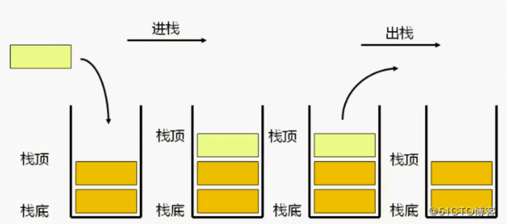

# 栈

## 栈的定义

栈是一种特殊的线性表，仅能够在栈顶进行操作，有着先进后出(后进先出)的特性。



生活中的例子：羽毛球。

每次取羽毛球时，都只能从顶部取，最底下的羽毛球取不到，用完羽毛球后，也只能从顶部放回去。

## 数据存储

从数据存储的角度看，实现栈有两种方式，一种是以数据做基础，一种是以链表做基础，数组是最简单的实现方式，这里使用数组实现栈和队列。

定义一个 Stack 类，数据将存储在items数组之中。

```js
function Stack() {
  var items =[] // 使用数组存储数据
}
```

## 栈的方法

栈有以下几个方法：

- push 添加一个元素到栈顶 (向桶里放入一个羽毛球)
- pop 弹出栈顶元素 (从桶里拿出一个羽毛球)
- top 返回栈顶元素，注意，不是弹出 (看一眼桶里最顶端的羽毛球，但是不拿)
- isEmpty 判断栈是否为空 (看看羽毛球是不是用完了)
- size 返回栈里元素的个数 (数一下桶里还有多少羽毛球)
- clear 清空栈 (把桶里的羽毛球都倒出来扔掉)

```js
function Stack() {
  var items = [] // 存储数据
  
  // 从栈顶添加元素，也叫压栈
  this.push = function(item) {
    item.push(item)
  }
  
  // 弹出栈顶元素
  this.pop = function() {
    return items.pop()
  }
  
  // 返回栈顶元素
  this.top = function() {
    return items[items.length - 1]
  }
  
  // 判断栈是否为空
  this.Empty = function() {
    return items.length === 0
  }
  
  // 返回栈的大小
  this.size = function() {
    return items.length
  }
  
  // 清空栈
  this.clear = function() {
    items = []
  }
}
```

