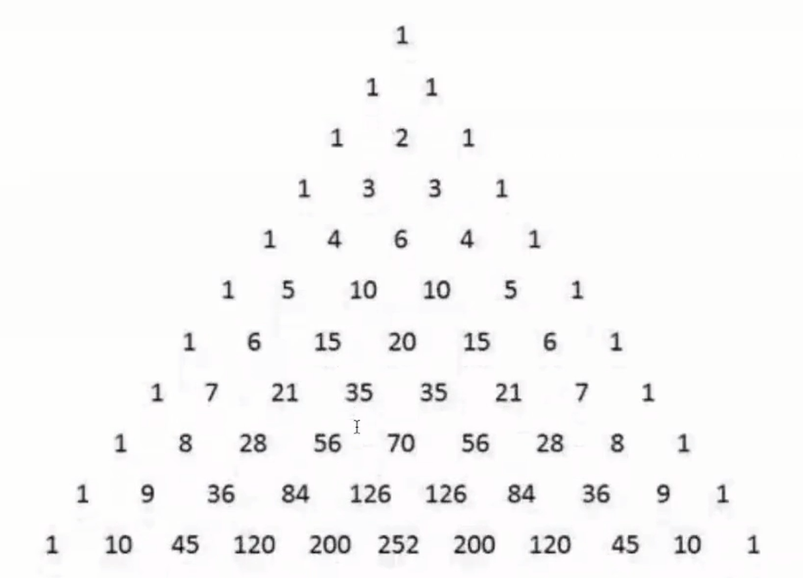

# 队列

## 队列的定义

队列是一种特殊的线性表，其特殊之处在于，它只允许你在队列的头部删除元素，在队列的尾部添加新的元素。

## 队列的实现

基于数组或链表，这里使用数组。

### 数据存储

同栈一样，队列的实现也使用数组来存储数据，定义一个简单的 Queue 类

```js
function Queue() {
  var items = [] // 存储数据
}
```

数组将存储在 items 数组之中，现在，这个类没有任何方法。

### 队列的方法

队列的方法如下：

- enqueue 从队列尾部添加一个元素（新来一个排队的人，文明礼貌，站在了队尾）
- dequeue 从队列头部删除一个元素（排在队伍最前面的人刚办理完登记手续，离开了队伍）
- head 返回头部的元素，注意，不是删除（只是看一下，谁排在最前面）
- size 返回队列大小（数一数有多少人在排队）
- clear 清空队列（航班取消，大家都散了吧）
- isEmpty 判断队列是否为空（看看是不是有人在排队）
- tail 返回队尾节点

```js
function Queue() {
  var items = [] // 存储数据
  
  // 向队列尾部添加一个元素
  this.enqueue = function(item) {
    items.push(item)
  }

  // 移除队列头部的元素
  this.dequeue = function() {
    return items.shift()
  }

  // 返回队列头部的元素
  this.head = function() {
    return items[0]
  }

  // 返回队列尾部的元素
  this.tail = function() {
    return items[items.length - 1]
  }

  // 返回队列大小
  this.size = function() {
    return items.length
  }

  // clear
  this.clear = function() {
    items = []
  }

  // isEmpty 判断是否为空队列
  this.isEmpty = function() {
    return items.length == 0
  }
}
```

## 队列的应用练习

栈的特性是先进后出，队列的特性是先进先出。

### 约瑟夫环（普通模式）

#### 题目要求

有一个数组 a[100] 存放 0--99；要求每个两个数删除一个数，到末尾时循环至开头继续进行，求最后一个被删掉的数。

#### 思路分析

前10个数是 0 1 2 3 4 5 6 7 8 9 10，所谓每隔两个数删掉一个数，其实就是把 2 5 8 删除掉，到末尾时循环至开头继续进行。

如果用数组就很麻烦，关键是到了末尾如何回到开头重新来一遍，还得考虑把删掉的元素从数组中删除。

如果用队列就简单了，先将这100个数放入队列，使用while循环，while循环终止的条件是队列里只有一个元素。使用index变量从0开始计数，算法步骤如下：

1. 从队列头部删除一个元素，index+1
2. 如果index%3 == 0，就说明这个元素是需要删除的元素，如果不等于0，就不是需要被删除的元素，则把它添加到队列的尾部

不停地有元素被删除，最终队列里只有一个元素，此时while循环终止，队列的所剩的元素就是最后一个被删除的元素。

#### 示例代码

```js
function del_ring(arr_list) {
	// 把数组里的元素都放入到队列中
  var queue = new Queue()
  for (var i = 0; i < arr_list.length; i++) {
    queue.enqueue(arr_list[i])
  }
  
  var index = 0
  while(queue.size() != 1) {
    // 弹出一个元素，判断是否需要删除
    var item = queue.dequeue()
    index += 1
    // 每隔两个就要删除掉一个，那么不是被删除的元素就放回到队列尾部
    if (index % 3 != 0) {
      queue.enqueue(item)
    }
  }
  
  return queue.head()
}

// 准备好数据
var arr_list = []
for (var i = 0; i < 100; i++) {
  arr_list.push(i)
}

console.log(del_ring(arr_list))
```

### 斐波那契数列（普通模式）

斐波那契数列是一个非常经典的问题，有着各种各样的解法，比较常见的是递归算法，其实也可以使用队列来实现

#### 题目要求

使用队列计算斐波那契数列的第n项

#### 思路分析

斐波那契数列的前两项是 1  1，此后的每一项都是该项前面两项之和，即f(n) = f(n-1) + f(n-2)。

若用数组实现，太过麻烦，直接考虑使用队列来实现。

先将两个1添加到队列中，之后使用while循环，用index计数，循环终止的条件是 index < n - 2

- 使用dequeue方法从队列头部删除一个元素，该元素为 del_item
- 使用head方法获得队列头部的元素，该元素为 head_item
- del_item + head_item = next_item，将 next_item 放入队列，注意，只能从尾部添加元素
- index+1

当循环结束时，队列里面有两个元素，先用 dequeue 删除头部元素，剩下的那个元素就是我们想要的答案

#### 示例代码

```js
function fibonaci(n) {
  var queue = new Queue()
  var index = 0
  // 先放入斐波那契数列的前两个数值
  queue.enqueue(1)
  queue.enqueue(1)
  while(index < n-2) {
    // 出队列一个元素
    var del_item = queue.dequeue()
    // 取队列头部元素
    var head_item = queue.head()
    var next_item = del_item + head_item
    // 将计算结果放入队列
    queue.enqueue(next_item)
    index += 1
  }
  
  queue.dequeue()
  return queue.head()
}

console.log(fibonaci(8))
```

### 小结

使用队列的例子还有很多，比如逐层打印一颗树上的节点。像kafka，rabbitmq这类消息队列，其形式就是一个队列，消息生产者把消息放入队列中（尾部），消费者从队列中取出消息进行处理（头部），只不过背后的实现更为复杂。

如果你了解一点socket，那么你应该知道当大量客户端向服务端发起连接，而服务端忙不过来时，就会把请求放入到队列中，先来的先处理，后来的后处理，队列满时，新来的请求直接抛弃掉。

数据结构在系统设计中的应用非常广泛，只是我们水平达不到那个级别，知道的太少，但如果能理解并掌握这些数据结构，那么就有机会在工作中使用它们并解决一些具体的问题，当我们手里除了锤子还有电锯时，那么我们的眼里就不只是钉子，解决问题也会更加开阔。

### 用队列实现栈（困难模式）

#### 题目要求

用两个队列实现一个栈

#### 思路分析

队列是先进先出，而栈是先进后出，两者对数据的管理模式刚好是相反的，但是却可以用两个队列实现一个栈。

两个队列分别命名为queue_1，queue_2，实现的思路如下：

- push，实现push方法时，如果两个队列都为空，那么默认向queue_1里添加数据，如果有一个不为空，则向不为空的队列里添加数据
- top，两个队列，或者都为空，或者一个不为空，只需要返回不为空的队列的尾部元素即可
- pop，pop方法是比较复杂，pop方法要删除的是栈顶，但这个栈顶元素其实是队列的尾部元素。每一次做pop操作时，将不为空的队列里的元素依次删除并放入到另一个队列中直到遇到队列中只剩下一个元素，删除这个元素，其余的元素都跑到之前为空的队列中了。

在具体的实现中，我定义额外的两个变量，data_queue和empty_queue，data_queue始终指向那个不为空的队列，empty_queue始终指向那个为空的队列。

#### 代码示例

```js
function QueueStack() {
  var queue_1 = new Queue()
  var queue_2 = new Queue()
  var data_queue = null // 放数据的队列
  var empty_queue = null // 空队列，备份使用
  
  // 确认哪个队列放数据，哪个队列做备份空队列
  var init_queue = funciton() {
    // 都为空，默认返回queue_1
    if (queue_1.isEmpty() && queue_2.isEmpty()) {
      data_queue = queue_1
      empty_queue = queue_2
    } else if (queue_1.isEmpty()) {
      data_queue = queue_2
      empty_queue = queue_1
    } else {
      data_queue = queue_1
      empty_queue = queue_2
    }
  }
  
  // push方法
  this.push = function(item) {
    init_queue()
    data_queue.enqueue(item)
  }
  
  // top方法
  this.top = function() {
    init_queue()
    return data_queue.tail()
  }
  
  /**
  * pop方法要弹出栈顶元素，这个栈顶元素，其实就是queue的队尾元素
  * 但是队尾元素不能删除的，我们可以把 data_queue 里的元素（除了队尾元素）都移除放入到empty_queue中
  * 最后移除data_queue的队尾元素并返回
  * data_queue 和 empty_queue 交换了身份
  */
  this.pop = function() {
    init_queue()
    while(data_queue.size() > 1) {
      empty_queue.enqueue(data_queue.dequeue())
    }
    return data_queue.dequeue()
  }
}
```

### 打印杨辉三角（困难模式）

#### 题目要求

使用队列打印出杨辉三角的前n行，n >= 1

#### 思路分析

杨慧三角示意图如下：



  杨慧三角中的每一行，都依赖于上一行，假设在队列里存储第 n - 1 行的数据，输出第 n 行时，只需要将队列里的数据依次出队列，进行计算得到下一行的数值并将计算所得放入到队列中。

计算的方式：`f[i][j] = f[i-1][j-1] + f[i-1][j]`，i 代表行数，j 代表一行的第几个数，如果 j = 0 或 j = i，则 `f[i][j] = 1`。

但是将计算所得放入到队列中时，队列中保存的是两行数据，一部分是第n-1行，另一部分是刚刚计算出来的第n行数据，需要有办法将这两行数据分割开。

分开的方式有两种，一种是使用for循环进行控制，在输出第5行时，其实只有5个数据可以输出，那么就可以使用for循环控制调用enqueue的次数，循环5次后，队列里存储的就是计算好的第6行的数据。

第二种方法是每一行的数据后面多存储一个0，使用这个0来作为分界点，如果dequeue返回的是0，就说明这一行已经全部输出，此时，将这个0追加到队列的末尾。

#### 示例代码

```js
function print_yanghui(n) {
  var queue = new Queue()
  queue.enqueue(1)
  // 第一层for循环控制打印几层
  for (var i = 1; i <= n; i++) {
    var line = ''
    var pre = 0
    // 第二层for循环控制打印第 i 层
    for (var j = 0; j < i; j++) {
      var item = queue.dequeue()
      line += item + ' '
      // 计算下一行的内容
      var value = item + pre
      pre = item
      queue.enqueue(value)
    }
    // 每一层最后一个数字是1，上面的for循环没有计算最后一个数
    queue.enqueue(1)
    console.log(line)
  }
}

function print_yanghui_2(n) {
  var queue = new Queue()
  queue.enqueue(1)
  queue.enqueue(0)
  for(var i = 1; i <= n; i++) {
    var line = ''
    var pre = 0
    while(true) {
      var item = queue.dequeue()
      // 用一个0把每一行的数据分割开，遇到0不输出，
      if (item == 0) {
        queue.enqueue(1)
        queue.enqueue(0)
        break
      } else {
        // 计算下一行的内容
        line += item + ''
        var value = item + pre
        pre = item 
        queue.enqueue(value)
      }
    }
    console.log(line)
  }
}

print_yanghui(10)
print_yanghui_2(10)
```

### 作业

### 用两个栈实现一个队列（普通模式）

栈是先进后出，队列是先进先出，但可以用两个栈来模拟一个队列，请实现 enqueue，dequeue，head这三个方法。

### 迷宫问题（地狱模式）

#### 题目要求

有一个二维数组

```js
var maze_array = [
  [0, 0, 1, 0, 0, 0, 0],
  [0, 0, 1, 1, 0, 0, 0],
  [0, 0, 0, 0, 1, 0, 0],
  [0, 0, 0, 1, 1, 0, 0],
  [1, 0, 0, 0, 1, 0, 0],
  [1, 1, 1, 0, 0, 0, 0],
  [1, 1, 1, 0, 0, 0, 0]
]
```

元素为0，表示这个点可以通行，元素为1，表示不可以通行，设置起始点为`maze_array[2][1]`，终点是`maze_array[3][5]`，请用程序计算这两个点是否想通，如果想通请输出两点之间的最短路径（从起始点到终点所经过的每一个点）


