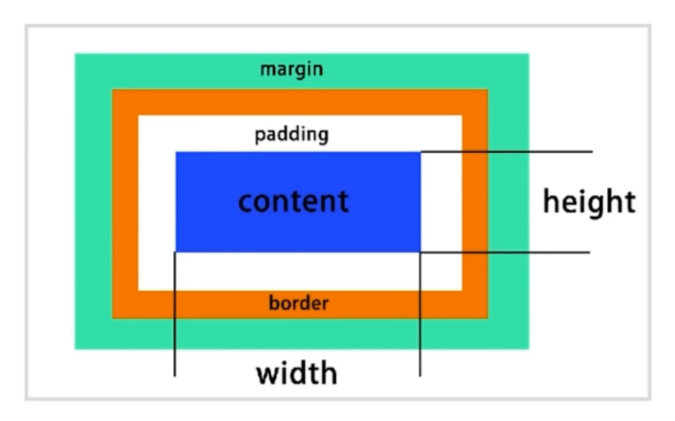
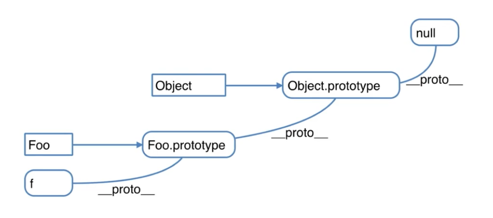

知识复习

## HTML

### html 元素的分类和特性

- html 常见元素和理解
- html版本
- html 元素分类
- html元素嵌套关系
- html 元素默认样式和定制化
- 面试题

#### html 常见元素和理解

**html 常见元素**

head中

meta、title、style、link、script、base

```html
<meta charset="utf-8">
<meta name="viewport" content="width=device-width, initial-scale=1.0, maximum-scale=1.0, user-scalable=no">
```

body中

- div/section/article/aside/header/footer
- p
- span/em/strong
- table/thead/tbody/tr/td
- a
- form/input/select/textarea/button

**html 重要属性**

```css
a[href, target]
img[src alt]
table td[colspan, rowspan]
form[target, method, enctype]
input[type, value]
button[type]
select>option[value]
label[for]
```

#### 如何理解 html 语义化

有利于搜索引擎搜索，便于开发人员阅读

#### html5新增内容

html5中和html相关的内容

- 新区块标签：section/article、nav、aside、header/footer、em/strong、i （icon）
- 表单增强：日期时间搜索、表单验证、placeholder自动聚焦

#### html 元素分类

- 按默认样式分：块级 block、行内 inline、inline-block
- 按内容分：。。。。。。

#### html 元素嵌套关系

- 块级元素可以包含行内元素
- 块级元素不一定能包含块级元素
- 行内元素一般不能包含块级元素（除 a>div是合法的）

### html 元素默认样式和定制化

默认样式的意义：快捷方便。

默认样式带来的问题：不是我们需要的。可以通过 css reset或直接 * {margin: 0; padding: 0;} 或 normalize.css。

### html 面试真题

#### doctype 的意义是什么

- 让浏览器以标准模式渲染
- 让浏览器知道元素的合法性

#### HTML XHTML HTML5的关系

- HTML 属于 SGML
- SHTML 属于 XML，是 HTML 进行 XML 严格化的结果
- HTML5 不属于 SGML 或 SML，比 XHTML 宽松

#### HTML5 有什么变化

- 新的语义化元素
- 分类和嵌套变更
- 表单增强
- 新的API(离线、音视频、图形、实时通信、本地存储、设备能力)

#### em 和 i 有什么区别

- em是语义化的标签，表强调
- i 是纯样式的标签，表斜体
- HTML5中 i 不推荐使用，一般用作图标

#### 语义化的意义是什么

- 开发者容易理解
- 机器容易理解结构（搜索、读屏、软件）
- 有助于 SEO
- semantic microdata

#### 哪些元素可以自闭合

- 表单元素 input
- 图片 img
- br hr
- meta link

#### html 和 dom 的关系

- html 是 “死”的
- dom 由 html 解析而来，是活的
- js 可以维护 dom

#### property 和 attribute 的区别

- attribute 是 “死”的
- property 是“活”的

#### form的作用有哪些

- 直接提交表单
- 使用 submit / reset 按钮
- 便于浏览器保存表单
- 第三方库可以整体提取值
- 第三方库可以进行表单验证

## css

### css选择器

选择器

- 用于匹配HTML元素
- 分类和权重
- 解析方式和性能
- 值得关注的选择器

浏览器的解析方式：从右往左（节省性能）

```css
.body div .hello {
  color: red;
}
```

####  选择器分类

- 元素选择器 a {}
- 伪元素选择器 ::before {}
- 类选择器 .link {}
- 属性选择器 [type=radio] {}
- 伪类选择器 :hover {}
- ID选择器 #id {}
- 组合选择器 [type=checkbox] + label {}
- 否定选择器 :not(.link) {}
- 通用选择器 * {}

 #### 选择器权重

- ID选择器 #id{} +100
- 类 属性 伪类 +10
- 元素 伪元素 +1
- 其他选择器 +0
- !important 优先级最高
- 元素属性(行内属性) 优先级高
- 相同权重 后写的生效

> 不进位，官大一级压死人

### css常见属性 

- 字体、字重、颜色、大小、行高
- 背景、边框
- 滚动、换行
- 粗体、斜体、下划线
- 其他

#### 非布局样式(字体)

- 字体族：serif sans-serif monospace cursive fantasy
- 多字体fallback
- 网络字体、自定义字体
- iconfont

> 多平台字体适配 ->fallback机制
>
> iconfont原理 -> 自定义机制

#### 非布局样式(行高)

- 行高的构成
- 行高相关的现象和方案
- 行高的调整

> 图片下面有空隙原理是什么？如何去除？
>
> 图片样式按照内联元素进行对齐的，也要遵守行高的构成，默认是按照 base-line 方式对齐，base-line 与底线之间是有偏差的，偏差大小视字体大小而定，例如字体12px，偏差大约为3px(经典的3px缝隙问题)
>
> 解决方式：
>
> 1.更换字体排列方式 vertical-align: bottom; 按底线对齐
>
> 2.让img变为block元素 display: block;

#### 非布局样式(背景)

- 背景颜色
- 渐变色背景
- 多背景叠加
- 背景图片和属性(雪碧图)
- base64 和性能优化
- 多分辨率适配

```css
/* 背景颜色 渐变色背景 多背景叠加 */
body{
  background:yellow;
}
.c1{
  height:90px;
  /* background:rgba(255,0,0, .3); */
  /* background:url(./test.png); */
}
.c2{
  height:90px;
  /* background: -webkit-linear-gradient(left, red, green); */
  /* background: linear-gradient(to right, red, green); */
  /* background: linear-gradient(180deg, red, green); */
  /* background: linear-gradient(135deg, red 0, green 10%, yellow 50%, blue 100%); */
  background: linear-gradient(135deg, transparent 0, transparent 49.5%, green 49.5%, green 50.5%, transparent 50.5%, transparent 100%),
    linear-gradient(45deg, transparent 0, transparent 49.5%, red 49.5%, red 50.5%, transparent 50.5%, transparent 100%);
  background-size: 30px 30px;
}
```
> 性能提升：雪碧图(减少http请求)、base64(减少http请求，但本身体积增大1/3，增大了解码要求，只用于小图标)
>
> 多分辨率适配：通过设置成比例背景图的width、height、background-position、backround-size

```css
.c1{
  height:900px;
  background:red url(data:image/png;base64,...)
    background-repeat: no-repeat;
  /* background-position: center top; */
  /* background-position: 20px 30px; */
  /* background-size:100px 50px; */
}
.c2{
  width:20px;
  height:20px;
  background:url(./test_bg.png) no-repeat;
  background-position: -17px -5px;
  background-size: 261px 113px;
}
.c3{
  width:20px;
  height:20px;
  background:url(./test_bg.png) no-repeat;
  background-position: -169px -23px;
  background-size: 261px 113px;
}
```

#### 非布局样式(背景)

- 边框的属性： 线型 大小 颜色
- 边框背景图
- 边框衔接(三角形)

#### 非布局样式(滚动)

- 滚动行为和滚动条


#### 非布局样式(文字折行)

- overflow-wrap(word-wrap) 通用换行控制
  - 是否保留单词
- word-break 针对多字节文字
  - 中文句子也是单词
- white-space 空白处是否断行

> 不换行，white-wrap:nowrap

#### 非布局样式(装饰性属性及其它)

- 字重(粗体) font-weight
- 斜体 font-style: itatic
- 下划线 text-decoration
- 指针 cursor

### css 面试题

#### css样式(选择器)的优先级

- 计算权重确定
- !important
- 内联样式
- 后写的优先级高

#### 雪碧图的作用

- 减少HTTP请求数 提高加载性能
- 有一些情况下可以减少图片大小

#### 自定义字体的使用场景

- 宣传/品牌/banner等固定文案
- 字体图标

#### base64的使用

- 用于减少HTTP请求
- 适用于小图片
- base64的体积约为原图4/3

#### 伪类和伪元素的区别

- 伪类表状态
- 伪元素是真的有元素
- 前者单冒号，后者双冒号

#### 如何美化checkbox

- label[for]和id
- 隐藏原生input
- :checked + label

### css布局

- 早期以table为主(简单)
- 后来以技巧性布局为主(难)
- 现在有flexbox/grid（偏简单）
- 响应式布局是必备知识

常用布局方法

- table 表格布局
- float 浮动 + margin
- inline-block 布局
- flexbox 布局

#### 盒子模型


**display / position**

- 确定元素的显示类型
  - block/inline/inline-block
- 确定元素的位置
  - static/relative/absolute/fixed

#### table 布局

左右布局

```html
<!DOCTYPE html>
<html lang="en">
<head>
    <meta charset="UTF-8">
    <meta name="viewport" content="width=device-width, initial-scale=1.0">
    <meta http-equiv="X-UA-Compatible" content="ie=edge">
    <title>Document</title>
    <style>
        .left{
            background:red;
        }
        .right{
            background:blue;
        }
        table{
            width:800px;
            height:200px;
            border-collapse: collapse;
        }
        .table{
            margin-top:20px;
            display: table;
            width:800px;
            height:200px;
        }
        .table-row{
            display: table-row;
            text-align: center;
        }
        .table-cell{
            vertical-align: middle;
            display: table-cell;
        }
    </style>
</head>
<body>
    <table>
        <tr>
            <td class="left">左</td>
            <td class="right">右</td>
        </tr>
    </table>
    <div class="table">
        <div class="table-row">
            <div class="left table-cell">
                左
            </div>
            <div class="right table-cell">
                右
            </div>
        </div>
    </div>
</body>
</html>
```

#### flexbox布局

- 弹性盒子
- 盒子本来就是并列的
- 指定宽度即可

#### float 布局

- 元素”浮动“
- 脱离文档流
- 但不脱离文本流

**float特性**

- 形成“块”(BFC)，可以设置宽高
- 位置尽量靠上
- 位置尽量靠左(右)

**对兄弟的影响**

- 上面贴非float元素
- 旁边贴float元素
- 不影响其它块级元素位置
- 影响其它块级元素内部文本

**对父级元素的影响**

- 从布局上“消失”

- 高度塌陷

  - 1.父元素，overflow:auto;

  - 2.给父元素添加伪元素撑起高度

    - ```css
      .father::after {
      	content: '';
        clear:both;
        display:block;
        visibility: hidden;
        height: 0;
      }
      ```

```html
float 用于图文混排，脱离文档流，但不脱离文本流
<!DOCTYPE html>
<html lang="en">
<head>
    <style>
        .container{
            background:red;
            width:400px;
            margin:20px;
        }
        .p1{
            background:green;
            float:left;
            width:200px;
            height:50px;
        }
    </style>
</head>
<body>
    <div class="container">
        <span class="p1">
            float
        </span>
        <div class="p2">
            很长的文字很长的文字很长的文字很长的文字很长的文字很长的文字很长的文字很长的文字很长的文字很长的文字很长的文字很长的文字很长的文字很长的文字很长的文字很长的文字很长的文字很长的文字很长的文字很长的文字很长的文字很长的文字很长的文字很长的文字很长的文字很长的文字很长的文字很长的文字很长的文字很长的文字很长的文字很长的文字
        </div>
    </div>
</body>
</html>
```

**float三栏布局**

```html
<!DOCTYPE html>
<html lang="en">
<head>
    <style>
        .container{
            width:800px;
            height:200px;
        }
        .left{
            background:red;
            /* float:left; */
            /* height:100%; */
            width:200px;
            height:200px;
        }
        .right{
            background:blue;
            float:right;
            width:200px;
            height:100%;
        }
        .middle{
            margin-left:200px;
            margin-right:200px;
        }
        
    </style>
</head>
<body>
    <div class="container">
        <div class="left">
            左
        </div>
        <div class="right">
            右
        </div>
        <div class="middle">
            中间
        </div>
    </div>
</body>
</html>
```

#### inline-block 布局

- 像文本一样排block元素
- 没有清除浮动等问题
- 需要处理间隙（inline-block块相当于文字，文字是有间隙的）
  - 设置父元素字体为0，再设置子元素字体大小
  - 空隙来源是html的空白，1.可以去掉空白，紧挨着。2.或者通过注释的方式

#### 响应式设计与布局

- 在不同设备上正常使用
- 一般主要处理屏幕大小问题
- 主要方法：
  - 隐藏 + 折行 + 自适应空间
  - rem / viewport / media query

### 动画与效果 

- 多背景多投影特效
- 3d特效编写实践
- 过渡动画和关键帧动画实践
- 动画细节和原理深入解析

#### 效果属性

- box-shadow
- text-shadow
- border-radius
- background
- clip-path
  - 对容器进行裁剪（和border-radius相比，它位置不变，适合做动画）
  - 常见几何图形
  - 自定义路径

box-shadow

```css
.some {
  Box-shadow: xpx ypx 模糊区域px 扩展px rgba;
  Box-shadow: xpx ypx 模糊区域px 扩展px rgba inset;
}
```


### 框架集成和css工程化

- 预处理器作用和原理
- less/sass代码实践
- bootstrap原理和用法
- css工程化实践方式
- js框架中的css集成实践

### 超出滚动

水平方向滚动：`overflow: hidden; overflow-x: scroll;`

垂直方向滚动：`overflow: hidden; overflow-y: auto;

移动端页面超出滚动：

 ```css
.home {
  width: 100%;
  height: 100%;
  overflow: hidden;
  overflow-y: auto;
}
 ```

### 内容省略

```css
// 文本最多两行展示
.text-line-2 {
  overflow: hidden;
  text-overflow: ellipsis;
  word-break: break-word;
  -webkit-line-clamp: 2;
  -webkit-box-orient: vertical;
  display: -webkit-box;
}
```

### 对齐方式

垂直居中 height === line-height、padding-top === padding-left、父display:flex;子align-self:center;

水平居中 margin: 0 auto;

### 生成三角形

```css
// 三角形
.caret {
  display: inline-block;
  width: 0;
  height: 0;
  border-top: px2rem(8) solid $mainColor;
  border-left: px2rem(6) solid transparent;
  border-right: px2rem(6) solid transparent;
}
```


## js

几道面试题

- js 中使用 typeof 能得到的哪些类型  （js 变量类型）
- 何时使用 === 何时使用 == （强制类型转换）
- window.onload 和 DOMContentLoaded 的区别 （浏览器渲染过程）
- 用 JS 创建 10 个 `<a>`标签，点击的时候弹出对应的序号 （作用域）
- 简述如何实现一个模块加载器，实现类似 require.js 的基本功能 （js 模块化）
- 实现数组的随机排序 （js基础算法）

### js基础

- 原型 原型链
- 作用域 闭包
- 异步 单线程

#### 变量类型与计算

- 变量类型：值类型、引用类型（对象、数组、函数）
- 变量计算

**强制类型转换**

- 字符串拼接

  - ```js
    var a = 100 + 10 // 110
    var b = 100 + '10' // '10010'
    ```

- == 运算符

  - ```js
    100 == '100' // true
    0 == '' // true
    null == undefined // true
    ```

- if 语句

  - ```js
    var a = true;if (a) {};
    var b = 100; if (b) {};
    var c = ''; if (c) {};
    ```

- 逻辑运算

  - ```js
    console.log(10 && 0) // 0
    console.log('' || 'abc') // 'abc'
    console.log(!window.abc) // true
    // 判断一个变量会被当成 true 还是 false
    var a = 100
    console.log(!!a)
    ```

#### 面试题

- js 中使用 typeof 能得到哪些类型
- 何时使用 === 何时使用 == 
- js 中有哪些内置函数
- js 变量按照存储方式区分为哪些类型，并描述其特点
- 如何理解 JSON

##### js 中使用 typeof 能得到哪些类型

```js
typeof undefined // undefined
typeof 'abc' // string
typeof 123 // number
typeof true // boolean
typeof {} // object
typeof [] // object
typeof null // object
typeof console.log // function
```

##### 何时使用 === 何时使用 ==

除了下面这种全部用 ===

```js
if (obj.a == null) {
	// 这里相当于 obj.a === null || obj.a === undefined，简写形式
  // 这里是 jquery 源码中推荐的写法
}
```

##### JS中有哪些内置函数 __ 数据封装类对象

Object、Array、Function、Boolean、Number、String、Date、RegExp、Error

##### JS按存储方式区分变量类型

值类型、引用类型

##### 如何理解JSON

JSON 只不过是一个 JS 对象而已

```js
JSON.stringify({a:10, b:20})
JSON.parse('{"a": 10, "b": 20}')
```

#### 原型和原型链

- 构造函数
- 构造函数 - 扩展
- 原型规则和示例
- 原型链
- instanceof

**构造函数**

```js
function Foo(name, age) {
  this.name = name
  this.age = age
  this.class = 'class-1'
  // return this // 默认有这一行
}
var f = new Foo('zhangsan', 20)
```

**构造函数 - 扩展**

- var a = {}  其实是 var a = new Object() 的语法糖
- var a = [] 其实是 var a = new Array() 的语法糖
- function Foo() {...} 其实是 var Foo = new Function(...)
- 使用 instanceof 判断一个变量是否是一个数组的构造函数 -> instanceof Array

**原型规则和示例**

5条原型规则（原型链的基础）

- 所有的引用类型(数组、对象、函数)，都具有对象特性，即可自由扩展属性（除了“null”以外）。
- 所有的引用类型（数组、对象、函数），都有一个`__proto__`属性，属性值是一个普通的对象。
- 所有的函数，都有一个 prototype 属性，属性值也是一个普通的对象。
- 所有的引用类型（数组、对象、函数），`__proto__`属性值指向它的构造函数的“prototype”属性值。
- 当试图得到一个对象的某个属性时，如果这个对象本身本身没有这个属性，那么会去它的`__proto__`（即它的构造函数的 prototype）中寻找。

```js
// 前 4 条规则
var obj = {}; obj.a = 100;
var arr = []; arr.a = 100;
function fn () {}
fn.a = 100;

console.log(obj.__proto__)
console.log(arr.__proto__)
console.log(fn.__proto__)

console.log(fn.prototype)

console.log(obj.__proto__ === Object.prototype)
// 第 5 条规则
function Foo(name, age) {
  this.name = name
}
Foo.prototype.alertName = function() {
  alert(this.name)
}
// 创建实例
var f = new Foo('zhangsan')
f.printName = function() {
  console.log(this.name)
}
// 测试
f.printName()
f.alerName()
```

循环对象自身的属性

```js
var item
for (item in f) {
  // 高级浏览器已经在 for in 中屏蔽了来自原型的属性
  // 但这里还是建议加上这个判断，保证程序的健壮性
  if (f.hasOwnProperty(item)) {
    console.log(item)
	}
}
```

**原型链**

```js
// 构造函数
function Foo(name, age) {
  this.name = name
}
Foo.prototype.alertName = function () {
  alert(this.name)
}
// 创建实例
var f = new Foo('zhangsan')
f.printName = function () {
  console.log(this.name)
}
// 测试
f.printName()
f.alertName()
f.toString() // 要去 f.__proto__.__proto__中查找
```



**instanceof**

用于判断**引用类型**属性哪个**构造函数**的方案，原理也是基于原型链向上查找规则。

#### 面试题

##### 如何准确判断一个变量是数组类型

```js
var arr = []
arr instanceof Array // true
```

##### 写一个原型链继承的例子

简单的例子（**面试减分。。。**）

```js
// 动物
function Animal() {
  this.eat = function() {
    console.log('animal eat')
  }
}
// 狗
function Dog() {
  this.bark = function() {
    console.log('dog bark')
  }
}
Dog.prototype = new Animal()
// 哈士奇
var hashqi = new Dog()
```

实用的例子 -- 封装DOM查询

```js
function Elem(id) {
  this.elem = document.getElementById(id)
}

Elem.prototype.html = function (val) {
  var elem = this.elem
  if (val) {
    elem.innerHTML = val
    return this // 链式操作
  } else {
    return elem.innerHTML
  }
}

Elem.prototype.on = function ()


var div1 = new Elem('div1')
// 测试
console.log(div1.html())
```

##### 描述 new 一个对象的过程

- 创建一个对象
- this 指向这个对象
- 执行代码，即对 this 赋值
- 返回 this

```js
function Foo(name, age) {
  this.name = name
  this.age = age
  this.class = 'class-1'
  // return this // 默认有这一行
}
var f = new Foo('zhangsan', 20)
```

##### zepto (或其他框架) 源码中如何使用原型链

- 慕课 “zepto设计和源码分析”

#### 作用域和闭包 

- 执行上下文

- this

- 作用域

- 作用域链

- 闭包

**执行上下文**

- 范围：一段`<script>`或者一个函数
- 全局：变量定义、函数声明
- 函数：变量定义、函数声明、this、arguments

> 注意 "函数声明"和"函数表达式"的区别

```js
console.log(a) // undefined
var a = 100

fn('zhangsan') // 'zhangsan' 20
function fn(name) {
  age = 20
  console.log(name, age)
  var age
}
```

**this**

- this 要在执行时才能确定值，定义时无法确认

```js
var a = {
  name: 'A',
  fn: function () {
    console.log(this.name)
  }
}
a.fn() // this === a
a.fn.call({name: 'B'}) // this === {name: 'B'}
var fn1 = a.fn
fn1() // this === window
```

使用 this 的几种场景

- 作为构造函数执行
- 作为对象属性执行
- 作为普通函数执行
- call apply bind

**作用域**

- 没有块级作用域
- 只有函数和全局作用域

```js
// 无块级作用域
if (true) {
  var name = 'zhangsan'
}
console.log(name)

// 函数和全局作用域
var a = 100
function fn() {
  var a = 200
  console.log('fn', a)
}
console.log('global', a)
fn()
```

**作用域链**

本身作用域没有变量，会继续向上查找

**闭包**

闭包的使用场景

- 函数作为返回值
- 函数作为参数传递
  - react 中父组件向子组件传递方法也是闭包

函数作为返回值的例子

```js
function F1() {
  var a = 100
  
  // 返回一个函数(函数作为返回值)
  return function() {
    console.log(a) // 自由变量，父作用域寻找
  }
}

// f1 得到一个函数
var f1 = F1()
var a = 200
f1() // 100

// 函数作为参数传递
var f2 = F1()

function F2(fn) {
  var a = 200
  fn()
}
F2(f2) // 100
```

实际开发中闭包的应用

```js
// 闭包实际应用中主要用于封装变量，收敛权限
function isFirstLoad() {
	var _list = []
  return function(id) {
    if (_list.indexOf(id) >= 0) {
      return false
    } else {
      _list.push(id)
      return true
    }
  }
}

// 使用
var firstLoad = isFirstLoad()
firstLoad(10) // true
firstLosd(10) // false
firstLoad(20) // true
```

#### 面试题

##### 说一下对变量提升的理解

- 变量定义
- 函数声明（注意和函数表达式的区别）

##### 说明 this 几种不同的使用场景

- 作为构造函数执行
- 作为对象属性执行
- 作为普通函数执行
- call apply bind

##### 创建10个 `<a>`标签，点击时弹出来对应的序号

```js
for (var i = 0;; i < 10; i++) {
  (function (i) {
    var a = document.createElement('a')
    a.innerHTML = i + '<br>'
    a.addEventListener('click', function (e) {
      e.preventDefault()
      alert(i)
    })
    document.body.appendChild(a)
  })(i)
}
```

##### 如何理解作用域

- 自由变量
- 作用域链，即自由变量的查找
- 闭包的两个场景

##### 实际开发中闭包的作用

```js
// 闭包实际应用中主要用于封装变量，收敛权限
function isFirstLoad() {
	var _list = []
  return function(id) {
    if (_list.indexOf(id) >= 0) {
      return false
    } else {
      _list.push(id)
      return true
    }
  }
}

// 使用
var firstLoad = isFirstLoad()
firstLoad(10) // true
firstLosd(10) // false
firstLoad(20) // true
```

#### 异步和单线程

**异步**

```js
console.log(100)
setTimeout(function () {
  console.log(200)
}, 1000)
console.log(300)
```

**同步**

```js
console.log(100)
alert(200)
console.log(300)
```

**何时需要异步**

- 在可能发生等待的情况
- 等待过程中不能像 alert 一样阻塞程序运行
- “等待的情况”都需要异步

**前端使用异步的场景**

- 定时任务：setTimeout，setInterval
- 网络请求：：ajax 请求，动态 `` 加载
- 事件绑定

ajax请求代码示例

```js
console.log('start')
$.get('./data1.json', function (data1) {
  console.log(data1)
})
console.log('end')
```

``加载示例

```js
console.log('start')
var img = document.createElement('img')
img.onload = function () {
  console.log('loaded')
}
img.src = './xxx.png'
console.log('end')
```

事件绑定示例

```js
console.log('start')
document.getElementById('btn1', addEventListener('click', function () {
  alert('clicked')
}))
console.log('end')
```

#### 面试题

##### 同步和异步的区别是什么？分别举一个同步和异步的例子

- 同步会阻塞代码执行，而异步不会
- alert 是同步， setTimeout 是异步 

##### 一个关于 setTimeout 的笔试题

```js
console.log(1)
setTimeout(function () {
  console.log(2)
}, 0)
console.log(3)
setTimeout(function () {
  console.log(4)
}, 1000)
console.log(5)
// 1、3、5、2、4
```

##### 前端使用异步的场景有哪些

- 定时任务：setTimeout，setInterval
- 网络请求：：ajax 请求，动态 `` 加载
- 事件绑定

#### ES6 常用语法

ES6 常用语法： Class Module Promise 等

- 模块化的使用和编译环境
- Class与JS构造函数的区别
- Promise 的用法
- ES6 其他常用功能

**模块化的使用和编译环境**

export 语法

```js
// util1.js
export default {
	a: 100
}

// util2.js
export function fn1() {
  alert('fn1')
}
export function fn2() {
  alert('fn2')
}
```

import 语法

```js
// index.js
import util1 from './util1.js'
import { fn1, fn2 } from './util2.js'

console.log(util1)
fn1()
fn2()
```

**开发环境-babel**

**开发环境-webpack**

**开发环境-rollup**

#### 面试题

##### ES6模块化如何使用，开发环境如何打包

- 模块化的基本语法
- 开发环境配置
- 关于 JS 众多模块化标准


##### Class 和普通构造函数有何区别

##### Promise 的基本使用和原理

##### 总结一下 ES6 其他常用功能

#### 原型高级应用

原型高级应用：结合 jQuery 和 zepto 源码

- 原型如何实际应用
- 原型如何满足扩展

#### 异步全面讲解

异步全面讲解：从原理到 jQuery 再到 Promise

- 什么是单线程，和异步有何关系
- 什么是 event-loop
- 目前解决异步的方案有哪些
- 如果只用jquery如何解决异步
- Promise的标准
- async/await的使用

#### 日期和math、数组api和对象api

日期

```js
Data.now() // 获取当前时间毫秒数
var dt = new Date()
dt.getTime() // 获取毫秒数
dt.getFullYear() // 年
dt.getMonth() // 月 (0 - 11)
dt.getDate() // 日 (0 - 31)
dt.getHours() // 小时（0 -23）
dt.getMinutes() // 分钟 （0 - 59）
dt.getSeconds() // 秒 (0 - 59)
```

Math

- 获取随机数 Math.random() ，在前端中的应用常用来清除缓存

数组api

- forEach 遍历所有元素
- every 判断所有元素是否都符合条件
- some 判断是否有至少一个元素符合条件
- sort 排序
- map 对元素重新组装，生成新数组
- filter 过滤符合条件的元素

对象api

```js
var obj = {
  x: 100,
  y: 200,
  z: 300
}
var key
for (key in obj) {
	// 注意这里的 hasOwnProperty
  if (obj.hasOwnProperty(key)) {
    console.log(key, obj[key])
  }
}
```

#### 面试题

##### 获取 2017-06-10 格式的日期

```js
function formatDate(dt) {
  if (!dt) {
    dt = new Date()
  }
  var year = dt.getFullYear()
  var month = dt.getMonth() + 1
  var date = dt.getDate()
  if (month < 10) {
    month = '0' + month
  }
  if (date < 10) {
    data = '0' + date
  }
  return year + '-' + month + '-' + date
}
var dt = new Date()
var formatDate = FormatDate(dt)
console.log(formatDate)
```

##### 获取随机数，要求是长度一致的字符串格式

```js
var random = Math.random()
var random = random + '0000000000' // 后面加上 10 个零
var random = random.slice(0, 10)
console.log(random)
```

##### 写一个能遍历对象和数组的通用 forEach 函数

```js
function forEach(obj, fn) {
  var key
  if (obj instanceof Array) {
    // 准确判断是不是数组
    obj.forEach(function (item, index) {
      fn(index, item)
    })
  } else {
    // 不是数组就是对象
    for (key in obj) {
      fn(key, obj[key])
    }
  }
}

var arr = [1, 2, 3]
// 注意，这里参数的顺序换了，为了和对象的遍历格式一致
forEach(arr, function (index, item) {
  console.log(index, item)
})

var obj = {x: 100, y: 200}
forEach(obj, function(key, value) {
  console.log(key, value)
})
```

### js-web-api

常说的JS（浏览器执行的JS）包含两部分：

- JS基础知识（ECMA262标准）
- JS-Web-APi（W3C标准）

W3C标准中关于 JS 的规定有：

- dom操作
- ajax
- 事件绑定
- ajax 请求 （包括 http 协议）
- 存储

全面考虑，JS内置的全局函数和对象有哪些？

#### DOM

DOM（Document Object Model）

- DOM本质
- DOM节点操作
- DOM结构操作

**DOM本质**

把获取的HTML代码，解析成浏览器能识别且 js 能操作的一个模型而已。

**DOM节点操作**

- 获取 DOM 节点
- prototype
- Attribute

获取DOM节点

```js
var div1 = document.getElementById('div1') // 元素
var divList = document.getElementByTagName('div') // 集合
console.log(divList.length)
console.log(divList[0])

var containerList = document.getElementsByClassName('.container') // 集合
var pList = document.querySelectorAll('p') // 集合
```

property

js 中的属性

```js
var pList = document.querySelectorAll('p')
var p = Plist[0]
console.log(p.style.width) // 获取样式
p.style.width = '100px' // 修改样式
console.log(p.className) // 获取 class
p.className = 'p1'

// 获取 nodeName 和 nodeType
console.log(p.nodeName)
console.log(p.nodeType)
```

Attribute

Attribute指的是真正的html代码中的文档标签的属性，并不是js对象的属性

```js
var pList = document.querySelectorAll('p')
var p = pList[0]
p.getAttribute('data-name')
p.setAttribute('data-name', 'imooc')
p.getAttribute('style')
p.setAttribute('style', 'font-size:30px;')
```

**DOM结构操作**

- 新增节点
- 获取父元素
- 获取子元素
- 删除节点

新增节点

```js
var div1 = document.getElementById('div1')
// 添加新节点
var p1 = document.createElement('p')
p1.innerHTML = 'this is p1'
div1.appendChild(p1) // 添加新创建的元素
// 移动已有节点
var p2 = document.getElementById('p2')
div1.appendChild(p2)
```

获取父元素和子元素

```js
var div1 = docuemnt.getElementById('div1')
var parent = div1.parentElement

var child = div1.childNOdes
div1.removeChild(child[0])
```

删除节点

```js
var div1 = document.getElementById('div1')
var child = div1.childNodes
div1.removeChild(child[0])
```

#### 面试题

##### DOM 是哪种基本的数据结构？

树

##### DOM 操作的常用 API 有哪些

- 获取DOM节点，以及节点的property和Attribute
- 获取父节点，获取子节点
- 新增节点，删除节点

##### DOM 节点的 attr 和 property 有何区别

- property 只是一个 JS 对象的属性的修改
- Attribute 是对 html 标签属性的修改

#### BOM

BOM（Browser Object Model）

- navigator
- screen
- location
- history

**navigator & screen**

```js
// navigator
var ua = navigator.userAgent
var isChrome = ua.indexOf('Chrome')
console.log(isChrome)

// screen
console.log(screen.width)
console.log(screen.height)
```

**location & history**

```js
// location
console.log(location.href)
console.log(location.protocal) // 'http: 'https:'
console.log(location.host)
console.log(location.pathname) // '/learn/199'
console.log(location.search)  // 查询参数
console.log(location.hash)

// history
history.back()
history.forward()
```

#### 面试题

##### 如何检测浏览器的类型

```js
var ua = navigator.userAgent
var isChrome = ua.indexOf('Chrome')
console.log(isChrome)
```

##### 拆解 url 的各部分

```js
// location
console.log(location.href)
console.log(location.protocal) // 'http: 'https:'
console.log(location.host)
console.log(location.pathname) // '/learn/199'
console.log(location.search)  // 查询参数
console.log(location.hash)
```

#### 事件

- 通用事件绑定
- 事件冒泡
- 代理

**通用事件绑定**

```js
var btn = document.getElementById('btn1')
btn.addEventListener('click', function (event) {
  console.log('click')
})

function bindEvent(elem, type, fn) {
  elem.addEventListener(type, fn)
}
var a = document.getElementById('link1')
bindEvent(a, 'click', function(e) {
  e.preventDefault() // 阻止默认行为
  alert('clicked')
})
```

> 关于IE低版本的兼容性 
>
> - IE低版本使用 attachEvent 绑定事件，和W3C标准不一样
> - IE低版本使用量已非常少，很多网站都早已不支持

**事件冒泡**

```html
<body>
  <div id="div1">
    <p id="p1">激活</p>
    <p id="p2">取消</p>
    <p id="p3">取消</p>
    <p id="p4">取消</p>
  </div>
  <div id="div2">
    <p id="p5">取消</p>
    <p id="p6">取消</p>

  </div>
</body>
```

```js
var p1 = document.getElementById('p1')
var body = document.body
bindEvent(p1, 'click', function (e) {
  e.stopPropatation()
  alert('激活')
})
bindEvent(body, 'click', function (e) {
	alert('取消')
})
```

**代理**

```html
<div id="div1">
  <a href="#">a1</a>
  <a href="#">a2</a>
  <a href="#">a3</a>
  <a href="#">a4</a>
  <!-- 会随时新增更多 a 标签 -->
</div>
```

```js
var div = document.getElementById('div1')
div1.addEventListener('click', function (e) {
  var target = e.target
  if (target.nodeName === 'A') {
    alert(target.innerHTML)
  }
})
```

完善通用绑定事件的函数

```js
function bindEvent(elem, type, selector, fn) {
  if (fn == null) {
    fn = selector
  }
  elem.addEventListener(type, function (e) {
    var target
    if (selector) {
      target = e.target
      if (target.matches(selector)) {
        fn.call(target, e)
      }
    } else {
      fn(e)
    }
  })
}

// 使用代理
var div1 = document.getElementById('div1')
bindEvent(div1, 'click', 'a', function (e) {
  console.log(this.innerHTML)
})
// 不使用代理
var a = document.getElementById('a1')
bindEvent(div1, 'click', function (e) {
  console.log(a.innerHTML)
})
```

>  代理的好处
>
> - 代码简洁
> - 减少浏览器内存占用

#### 面试题

##### 编写一个通用的事件监听函数

完善通用绑定事件的函数

```js
function bindEvent(elem, type, selector, fn) {
  if (fn == null) {
    fn = selector
  }
  elem.addEventListener(type, function (e) {
    var target
    if (selector) {
      target = e.target
      if (target.matches(selector)) {
        fn.call(target, e)
      }
    } else {
      fn(e)
    }
  })
}

// 使用代理
var div1 = document.getElementById('div1')
bindEvent(div1, 'click', 'a', function (e) {
  console.log(this.innerHTML)
})
// 不使用代理
var a = document.getElementById('a1')
bindEvent(div1, 'click', function (e) {
  console.log(a.innerHTML)
})
```

##### 描述事件冒泡流程

- DOM树形结构
- 事件冒泡
- 阻止冒泡
- 冒泡的应用

##### 对于一个无线下拉加载图片的页面，如何给每个图片绑定事件

- 使用代理
- 知道代理的两个优点

#### Ajax

- XMLHttpRequest
- 状态码说明
- 跨域

**XMLHttpRequest**

```js
var xhr = new XMLHttpRequest()
xhr.open('GET', '/api', false)
xhr.onreadystatechange = function () {
	// 这里的函数异步执行
  if (xhr.readyState == 4) {
    if (xhr.status == 200) {
      alert(xhr.responseText)
    }
  }
}
xhr.send(null)
```

> IE 兼容性问题
>
> IE低版本使用 ActiveXObject，和W3C标准不一样
>
> IE低版本使用量已非常少，很多网站都早已不支持

**状态码说明**

readyState

- 0 - (未初始化) 还没有调用send()方法
- 1 - (载入) 已调用send()方法，正在发送请求
- 2 - (载入完成) send() 方法执行完成，已经接收到全部响应内容
- 3 - (交互) 正在解析响应内容
- 4 - (完成) 响应内容解析完成，可以在客户端调用了

status

- 2xx - 表示成功处理请求，如 200
- 3xx - 需要重定向，浏览器直接跳转
- 4xx - 客户端请求错误，如 404
- 5xx - 服务端错误

**跨域**

- 什么是跨域
- JSONP
- 服务端设置 http header

什么是跨域

- 浏览器有同源策略，不允许 ajax 访问其他域接口
- 跨域条件：协议、域名、端口，有一个不同就算跨域

> 可以跨域的三个标签（可以跨域加载资源）：
>
> ``  可以做防盗链处理，如百度、知乎，不过和浏览器无关
>
> `<link href=xxx>`
>
> `<script src=xxx>`
>
> 三个标签的场景：
>
> ``用于打点统计，统计网站可能是其他域
>
> `<link><script>`可以使用CDN，CDN的也是其他域
>
> `<script>`可以用与JSONP

跨域注意事项

- 所有的跨域请求都必须经过信息提供方允许
- 如果未经允许即可获取，那是浏览器同源策略出现漏洞

**JSONP实现原理**

- 加载 http://coding.m.imooc.com/classindex.html
- 不一定服务器端真正有一个 classindex.html 文件
- 服务器可以根据请求，动态生成一个文件，返回
- 同理，`<script src="http://coding.m.imooc.com/api.js">`

> - 例如你的网站要跨域访问慕课网的一个借口
> - 慕课给你一个地址 http://coding.m.imooc.com/api.js
> - 返回内容格式如 callback({x:100, y: 200})(可动态生成)
>
> ```js
> <script>
>   window.callback = function (data) {
>   	// 这是我们跨域得到信息
>   	cosnole.log(data)
> 	}  
> }
> </script>
> <script src="http://coding.m.imooc.com/api.js"></script>
> <!-- 以上将返回 callback({x:100, y:200}) -->
> ```

**服务端设置 http header**

- 另外一个解决跨域的简洁方法，需要服务器端来做
- 是将来解决跨域问题的一个趋势

```js
// 注意：不同后端语言的写法可能不一样

// 第二个参数填写允许跨域的域名城，不建议直接写 “*”
response.setHeader("Access-Control-Allow-Origin", "http://a.com, http://b.com")
response.setHeader("Access-Control-Allow-Headers", "X-Requested-With")
response.setHeader("Access-Control-Allow-Methods", "PUT, POST, GET, DELETE, OPTIONS")

// 接收跨域的cookie
response.setHeader("Access-Control-Allow-Credentials", "true")
```

#### 面试题

##### 手写ajax，不依赖第三方库

```js
var xhr = new XMLHttpRequest()
xhr.open('GET', '/api', false)
xhr.onreadystatechange = function () {
	// 这里的函数异步执行
  if (xhr.readyState == 4) {
    if (xhr.status == 200) {
      alert(xhr.responseText)
    }
  }
}
xhr.send(null)
```

##### 跨域的几种实现方式

- JSONP
- 服务端设置 http header

#### 存储

- cookie
- localStorage 和 sessionStorage

**cookie**

- 本身用于客户端和服务端通信
- 但是它有本地存储的功能，于是就被“借用”
- 使用 document.cookie = ... 获取和修改即可

> cookie 用于存储的缺点：
>
> - 存储量太小，只有 4KB
> - 所有 http 请求都带着，会影响获取资源的效率
> - API 简单，需要封装才能用 document.cookie = ...

**localStorage 和 sessionStorage**

- HTML5 专门为存储而设计，最大容量5M
- API 简单易用
- localStorage.setItem(key, value);localStorage.getItem(key);

> - iOS safari 隐藏模式下
> - localStorage.getItem 会报错
> - 建议统一使用 try-catch 封装

#### 面试题

##### 请描述一下 cookie， sessionStorage 和 localStorage 的区别？

- 容量
- 是否会携带到 ajax 中
- api 易用性

### js开发环境  

- IDE（写代码的效率）
- git（代码版本管理，多人协作开发）
- JS 模块化
- 打包工具
- 上线回滚的流程

#### IDE

webstorm、sublime、vscode、atom

#### Git

- 正式项目都需要代码版本管理
- 大型项目需要多人协作开发
- Git和linux是一个作者
- 网络Git服务器如 coding.net github.com
- 一般公司代码非开源，都有自己的Git服务器

**常用Git命令**

```shell
git add .
git checkout xxx   # 改错了还原回去
git status 
git diff # 查看改了什么
git commit -m "xxx"
git push orgin master
git pull origin master
git branch 查看分支
git checkout -b xxx / git checkout xxx # 新建分支/切换分支
git merge xxx 合并
```

#### 模块化

- 不使用模块化的情况
- 使用模块化
- AMD
- CommonJS

**不使用模块化的情况**

- util.js getFormateDate 函数
- a-util.js aGetFormatDate函数 使用 getFormateDate
- a.js aGetFormatDate

```js
// util.js
function getFormatDate(date, type) {
  // type === 1 返回 2019-06-15
  // type === 2 返回 2019年6月15日
  // ...
}

// a-util.js
function aGetFormatDate(date) {
  // 要求返回 2019年6月15日 格式
  return getFormatDate(date, 2)
}

// a.js
var dt = new Date()
console.log(aGetFormatDate(dt))

// 使用
<script src="util.js"></script>
<script src="util.js"></script>
<script src="util.js"></script>
<!-- 1.全局变量污染：这些代码中的函数必须是全局变量，才能暴露给使用方。全局变量污染 -->
<!-- 2.强依赖关系：a.js 知道要引用 a-util.js, 但是不知道其依赖于 util.js -->
```

**使用模块化**

```js
// util.js
export {
  getFormatDate: function (date, type) {
    // type === 1 返回 2019-06-15
    // type === 2 返回 2019年6月15日
  }
}

// a-util.js
var getFormatDate = requrie('util.js')
export {
  aGetFormatDate: function (date) {
    // 要求返回 2019年6月15日 格式
    return getFormatDate(date, 2)
  }
}

// a.js
var aGetFormatDate = require('a-util.js')
var dt = new Date()
console.log(aGetFormatDate(dt))

// 直接 `<script src="a.js></script>`，其他的根据依赖关系自动引用
// 那两个函数，没必要做成全局变量，不会带来污染和覆盖
```

**AMD**

- require.js reqruie.js.org/
- 全局 define 函数
- 全局 require 函数
- 依赖JS会自动、异步加载

```js
// uitl.js
define(function () {
  return {
    getFormatDate: function (date, type) {
      if (type === 1) {
        return '2019-06-15'
      }
      if (type === 2) {
        return '2019年6月15日'
      }
    }
  }
})

// a-util.js
define(['./util.js'], function (util) {
  return {
    aGetFormatDate: function (date) {
      return util.getFormatDate(date, 2)
    }
  }
})

// a.js
define(['./a-util.js'], function (aUtil) {
  return {
    printDate: function (date) {
      console.log(aUtil.aGetFormatDate(date))
    }
  }
})

// main.js
requrie(['./a.js'], function (a) {
  var date = new Date()
  a.printDate(date)
})
```

使用 requrie.js

```html
<script src="/requrie.min.js" data-main="./main.js"></script>
```

**CommonJS**

- nodejs 模块化规范，现在被大量用与前端，原因：
- 前端开发依赖的插件的库，都可以从 npm 中获取
- 构建工具的高度自动化，使得使用 npm 的成本非常低
- **CommonJS 不会异步加载JS，而是同步一次性加载出来**

```js
// util.js
module.exports = {
  getFormatDate: function (date, type) {
    if (type === 1) {}
    if (type === 2) {}
  }
}

// a-util.js
var util = requrie('util.js')
module.exports = {
  aGetFormatdate: function (date) {
    return util.getFormatDate(date, 2)
  }
}
```

**AMD 和 CommonJS 的使用场景**

- 需要异步加载JS，使用 AMD
- 使用了 npm 之后建议使用 CommonJS

####上线和回滚

- 上线和回滚的基本流程
- linux基本命令

**上线回滚流程**

上线流程要点

- 将测试完成的代码提交到git版本库的masterffvi 
- 将当前服务器的代码全部打包并记录版本号，备份
- 将master分支的代码提交覆盖到线上服务器，生成新版本号

回滚流程要点

- 将当前服务器的代码打包并记录版本号，备份
- 将备份的上一个版本号解压，覆盖到线上服务器，并生成新的版本号

**linux 基本命令**

- 服务器使用 linux 居多，server版，只有命令行
- 测试环境要匹配线上环境，因此也是 linux

```shell
ssh xxx # 登录
mkdir
ls
ll
cd cd ..
pwd # 当前目录
rm -rf xxx # 删除文件夹
cp a.js a1.js # 拷贝
mv a1.js src/a1.js # 移动
rm a.js # 删除文件
vim a.js # 打开编辑文件
i # 打开vim之后，点击 i 输入,按esc键退出insert状态,esc:w保存，esc:q退出
cat a.js # 查看文件内容
head a.js # 查看文件头部内容
tail a.js # 查看文件尾部内容
grep '2' a.js # 在文件中搜索
```

### 运行环境 

- 页面加载过程
- 性能优化
- 安全

#### 页面加载

- 加载资源的形式
- 加载一个资源的过程
- 浏览器渲染页面的过程

**加载资源的形式**

- 输入 url (或跳转页面) 加载 html
- http://coding.m.imooc.com
- 加载 html 中的静态资源
- `<script src="/static/js/jquery.js"></script>`

**加载一个资源的过程**

- 浏览器根据 DNS 服务器得到域名的 IP 地址
- 向这个 IP 的机器发送 http 请求
- 服务器收到、处理并返回 http 请求
- 浏览器得到返回内容

**浏览器渲染页面的过程**

- 根据 HTML 结构生成 DOM Tree
- 根据 CSS 生成 CSSOM（为什么把css放在head里）
- 将 DOM 和 CSSOM 整合形成 RenderTree
- 遇到 `<script>`时，会执行阻塞渲染（为什么把js放在body尾部）

#### 面试题

##### 从输入url到得到html的详细过程

**加载一个资源的过程**

- 浏览器根据 DNS 服务器得到域名的 IP 地址
- 向这个 IP 的机器发送 http 请求
- 服务器收到、处理并返回 http 请求
- 浏览器得到返回内容

**浏览器渲染页面的过程**

- 根据 HTML 结构生成 DOM Tree
- 根据 CSS 生成 CSSOM（为什么把css放在head里）
- 将 DOM 和 CSSOM 整合形成 RenderTree
- 遇到 `<script>`时，会执行阻塞渲染（为什么把js放在body尾部）

##### window.onload 和 DOMContentLoaded 的区别

```js
window.addEventListener('load', function () {
  // 页面的全部资源加载完才会执行，包括图片、视频等
})
window.addEventListener('DOMContentLoaded', function () {
  // DOM 渲染完即可执行，此时图片、视频还可能没有加载完
})
```

#### 性能优化

原则

- 多使用内存、缓存或者其他方法
- 减少 CPU计算、减少网络

从哪里入手

- 加载页面和静态资源
- 页面渲染

**加载资源优化**

- 静态资源的压缩合并
- 静态资源缓存
- 使用 CDN 让资源加载更快
- 使用 SSR 后端渲染，数据直接输出到 HTML 中 

**渲染优化**

- CSS放前面，JS 放后面
- 懒加载（图片懒加载、下拉加载更多）
- 减少 DOM查询，对 DOM查询做缓存
- 减少DOM操作，多个操作尽量合并在一起执行
- 事件节流
- 尽早执行操作（如 DOMContentLoaded）

资源合并

```
<script src="a.js"></script>
<script src="b.js"></script>
<script src="c.js"></script>

<script src="abc.js"></script>
```

缓存

- 通过链接名称控制缓存
- `<script src="abc_1.js"></script>`
- 只有内容改变的时候，链接名称才会改变
- `<script src="abc_2.js"></script>`

使用 CDN，比自己服务器快

使用 SSR 后端渲染

- 现在 Vue React 提出了这样的概念
- 其实 jsp php asp 都属于后端渲染

懒加载

```html

<script type="text/javascript">
  var img1 = document.getElementById('img1')
  img1.src = img1.getAttribute('data-realsrc')
</script>
```

缓存 DOM 查询

```js
// 未缓存 DOM 查询
var i
for (i = 0; i < document.getElementsByTagName('p').length;i++) {
  // todo
}

// 缓存了 DOM 查询
var pList = document.getElementsByTagName('p')
var i 
for (i =0; i < pList.length; i++) {
  // todo
}
```

合并 DOM 插入

```js
var listNode = document.getElementById('list')

// 要插入 10 个 li 标签
var frag = document.createDoucmentFragment()
var x, li;
for(x = 0; x < 10; x++) {
  li = document.createElement('li')
  li.innerHTML = 'List item' + x
  frag.appendChild(li)
}

listNode.appendChild(frag)
```

事件节流

```js
var textarea = document.getElementById('text')
var tiemeoutId
textarea.addEventListener('keyup', function () {
  if (timeoutId) {
    cleaerTimeout(timeoutId)
  }
  timeoutId = setTimeout(function () {
    // 触发 change 事件
  }, 100)
})
```

尽早操作

```js
window.addEventListener('load', function () {
  // 页面的全部资源加载完才会执行，包括图片、视频等
})
window.addEventListener('DOMContentLoaded', function () {
  // DOM 渲染完即可执行，此时图片、视频还可能没有加载完
})
```

#### 安全性

综合性的问题：场景的前端安全问题有哪些

- XSS 跨站请求攻击
- XSRF 跨站请求伪造

**XSS**

- 在新浪博客写一篇文章，同时偷偷插入一段`<script>`
- 攻击代码中，获取 cookie，发送到自己的服务器
- 发布博客，有人查看博客内容
- 会把查看者的 cookie 发送到攻击者的服务器

> 防御手段：替换
>
> - 前端替换关键词，例如替换 < 为 `&lt;` > 为 `&gt;`
> - 后端替换

**XSRF**

- 你已登录一个购物网站，正在浏览器商品
- 改网站付费接口是xxx.com/pay?id=100 但是没有任何验证
- 然后你收到一封邮件，隐藏着 ``
- 你查看邮件的是时候，就已经悄悄的付费购买了

> 增加验证流程，如输入指纹、密码、短信验证码（主要是后端来做）

### 数字相关

获取随机整数区间

```js
function getNumberIn(start, end) {
	return Math.floor(Math.random() * (end- start) + start)
}
```

### dom操作

获取元素的高度

```js
$le.clientHeight
```

页面滚动距离

监听页面根元素的 scroll 事件，通过 event.target.scrollTop

## 框架原理

- 虚拟DOM：存在价值，如何使用，diff 算法
- vue：MVVM，vue 响应式、模板解析、渲染
- React：组件化、JSX、vdom、setState

### 虚拟 DOM

- 什么是vdom，为何要用vdom
- vdom如何使用，核心函数有哪些
- 了解 diff 算法吗

### vue

MVVM

- 之前使用jquery和现在使用vue或React框架的区别
- 你如何理解MVVM
- vue 如何实现响应式
- vue 如何解析模板
- 介绍 vue 的实现流程

#### nextTick

涉及到 dom 渲染相关操作时，注意可能需要使用 nextTick

```vue
this.$nextTick(() => {
	// code
})
```

#### vue性能优化

路由懒加载、组件懒加载

懒加载

路由组件的懒加载

```js
// router.js
{
    path: '/goodsList',
    name: 'goodsList',
    // vue-router 懒加载 -> GoodsList
    component: () => import(/* webpackChunkName: "about" */ '../views/GoodsList.vue')
  }
```

组件的懒加载

```vue
// Main.vue
components: {
    ToolBar,
    // 异步组件引入方式, 异步组件：只有在需要去展示这个组件的时候，才会把组件去进行渲染。
    home: () => import('@c/Home'),
    shopping: () => import('@c/Shopping'),
    my: () => import('@c/My')
  },
```

### react

组件化

- 对组件化的理解
- JSX 是什么？
- JSX 和 vdom 什么关系
- 简述React的setState
- 简述自己如何比较React和vue

## 混合开发

- hybrid：基础、和h5对比，上线流程
- 通讯：通讯原理，JS-Bridge 封装
- hybrid是什么，为何要用hybrid
- hybird如何更新上线
- hybrid和h5有何区别
- JS如何与客户端通信

### hybird

### hybird vs H5

### 前端客户端通讯


## 业务相关

### 瀑布流

瀑布流的布局：

​      1、创建商品列表的基本html 和 css ， 让 item 相对于 goods（div）进行排列(相对布局)

​      2、生成不同高度的图片，撑起不同高度的 item。

​      3、计算 item 的位置，来达到 从上到下，从左到右依次排列的目的

## 面试技巧

- 简历
  - 简介明了，重点突出项目经历和解决方案
  - 把个人博客放在简历中，并且定期维护更新博客
  - 把个人的开源项目放在简历中，并维护开源项目
- 面试过程中
  - 如何看待加班？加班就像借钱，救急不救穷
  - 不要挑战面试官，不要反考面试官
  - 学会给面试官惊喜，但不要太多
  - 遇到不会的，说出知道的
  - 说说缺点———说一下你最近正在学什么就可以了

